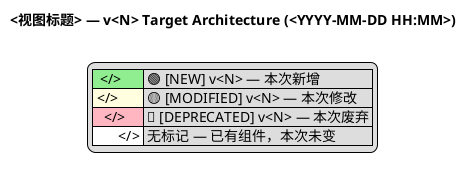

# /1-brainstorming-design-docs — 头脑风暴

Invoke the Superpowers `brainstorming` skill: explore user intent, requirements, and design. Present a design and get user approval before any implementation.

## 架构交付物清单（设计阶段须向用户明确）

涉及架构变更的设计（见下文「判断是否需要更新架构」）批准时，**每个视图**须交付四类伴生文件，**不可只写 `.puml`**：

| 格式 | 扩展名 | 用途 |
|------|--------|------|
| PlantUML 源 | `.puml` | 架构图源（Markdown Viewer / PlantUML 渲染） |
| ArchiMate XML（增量） | `.diff.archimate` | **增量模型** — 展示 vN-1 → vN 架构变迁（本次 🟢/🟡/🔴 变更元素 + Plateau/Gap/WP 迁移链），含 `sourceConnection` 连线 |
| ArchiMate XML（全量） | `.full.archimate` | **全量模型** — 变迁后完整架构拓扑（全部服务/DB/事件 + 变更标注），Archi 打开可看全量 |
| Mermaid | `.mermaid.md` | GitHub/GitLab 内嵌渲染 |

命名与版本一致：`v<N>-<视图名>-<YYYYMMDD-HHMM>-<作者>.{puml,diff.archimate,full.archimate,mermaid.md}`

> ⚠️ 设计文档（`docs/superpowers/specs/`）、Step 6「架构变更影响」、Step 7 向用户展示时，**必须**列出上述四类文件；`.diff.archimate`（增量变迁）与 `.full.archimate`（全量拓扑）须分别说明其视图要点，不得仅承诺 `.puml`。

**进入本技能时须同时加载**（与写入 `docs/architecture/` 时同等优先级）：

- `.claude/skills/archimate/SKILL.md`
- `.cursor/rules/archimate-architecture-artifacts.mdc`

## Archimate 架构集成 — 读取当前架构

在进入头脑风暴主流程之前，**必须**读取项目的 Archimate 架构设计稿，理解当前系统架构。架构设计稿是设计决策的依据 — 新功能不应与当前架构冲突，重构决策需要基于现有架构视图。

### 1. 定位架构文件

读取 `docs/architecture/` 目录，列出所有 `.puml` 文件及其元数据；对每个 current/target 视图，**同时确认**是否存在同名伴生 `.diff.archimate` / `.full.archimate` / `.mermaid.md`（上一版本有则本次 target 也须生成）。

对每个 `.puml` 文件，解析头部注释元数据：

```plantuml
' @title: <架构视图标题>
' @view: <视图类型>
' @status: current | target | archived
' @version: <版本号>
' @author: <变更人>
' @based_on: <基于哪个版本>
' @updated: <日期时间 YYYY-MM-DD HH:MM>
' @description: <说明>
```

- **`@status: current`** — 已交付的当前架构基线（每个视图只有一个 current 文件）
- **`@status: target`** — 已设计但尚未交付的目标架构
- **`@status: archived`** — 已被新版本替代的历史架构（只读，永不修改）

文件名格式: **`v<N>-<视图名>-<YYYYMMDD-HHMM>-<作者>.puml`**，如 `v1-enterprise-landscape-20260701-1630-claude.puml`

> 💡 版本号前置，确保 `ls` 时同一次版本变更的所有视图文件自然聚合在一起。

### 2. 读取 current 架构

用 Read 工具读取所有 `@status: current` 的 `.puml` 文件。提取并内化以下信息：

| 维度 | 提取内容 |
|------|---------|
| 分层结构 | Business / Application / Technology 各有哪些元素 |
| 组件拓扑 | 有哪些 Application_Component、Technology_Node，它们之间的依赖关系 |
| 数据流向 | Rel_Flow、Rel_Serving 关系，哪些服务读写哪些数据 |
| 外部系统 | 与外部系统的接口、认证方式 |
| 关键约束 | Motivation_Constraint、Motivation_Principle 标记的架构原则 |

### 3. 理解当前架构

读完后，在开始设计前，**口头向用户确认**你对当前架构的理解：

> "根据当前架构设计稿，我理解的系统现状是：
> - 共有 N 个架构视图：[列出标题]
> - 业务层有：[关键 element]
> - 应用层有：[关键 component]
> - 技术层有：[关键 node/service]
> - 上次更新的架构版本是 vX
>
> 本次需求将在此基础上进行设计。"

### 3.5 版本历史与迭代追踪

读取 `docs/architecture/VERSION_HISTORY.md`（如果存在），提取架构演进时间线：

| 字段 | 说明 |
|------|------|
| 版本号 | 每次架构变更的版本标识 |
| 迭代/功能 | 对应的头脑风暴主题（`@iteration` 字段） |
| 变更日期 | 设计和交付日期 |
| 变更摘要 | 新增/移除/修改的组件和关系 |
| 状态 | 🎯 target（已设计）/ ✅ current（已交付） |

向用户展示最近的版本演进，让用户理解"什么时候做了什么变更"：

> "📋 架构版本历史：
> - v1 (2026-07-01 16:30) ✅ current — 初始基线：39 服务组件，18 领域事件消费者
> - v2 (2026-07-03 14:00) 🎯 target — OIDC SSO 认证桥接：新增第4认证方式
>
> 本次迭代将在 v<N> 基础上进行设计。"

如果没有 `VERSION_HISTORY.md`（老项目迁移），根据现有 `.puml` 文件的 `@version` 元数据生成初始版本列表。

### 4. 架构文件不存在时

如果 `docs/architecture/` 目录不存在或没有任何 `.puml` 文件，这是**新项目首次头脑风暴**。执行以下初始化：

1. 创建 `docs/architecture/` 目录
2. 创建空的 `docs/architecture/VERSION_HISTORY.md` 骨架文件
3. 在头脑风暴完成后，根据设计结果创建初始架构文件:
   - 文件名: `v1-<视图名>-<YYYYMMDD-HHMM>-<作者>.puml`
   - 标记为 `@status: current`（首次建立基线）
4. 在 `VERSION_HISTORY.md` 中记录 v1 为当前基线

## Code Review Graph 代码结构图（横切软依赖）

> **细则 SSOT**：[references/code-review-graph.md](./references/code-review-graph.md)

**执行时机**：Archimate current 读取**之后**、方案定稿**之前**；若存在 traceId，**先**走下方日志节再读图。

1. 若 `.code-review-graph/graph.db` 存在且 `code-review-graph status` 正常 → 用 MCP 工具（query/impact/search/communities）或 CLI 查询任务涉及的符号、调用链、爆炸半径与社区归属
2. 图缺失/命令不可用/查询失败 → 记录一行 `CRG unavailable: <原因>` 后继续（软依赖，不阻断设计）
3. 设计文档**必须**包含 `## 🕸️ Code Review Graph 分析` 节（非代码任务可写 `skipped_non_code` + 一行理由；模板见 reference）

## TraceId 驱动的 Grafana 日志分析

> **横切硬门禁（短规范）**：[references/traceid-log-first-diagnosis.md](./references/traceid-log-first-diagnosis.md)  
> 其他排障技能（`pua`、diagnose、`ce-debug`、`webapp-testing` 等）遇 `data-traceId` 时同样适用，不必仅在头脑风暴中执行。

当用户的任务描述、粘贴快照或 DOM 摘录中出现 **traceId**（及其大小写/分隔符变体，含 `data-traceId` / `data-traceid` 等，见 §1）时，**必须自动** 将 Grafana / Loki 中的关联日志和链路追踪数据纳入分析。此步骤在头脑风暴主流程之前执行，确保设计决策有运行时数据支撑。

### 0. 错误带 data-traceId：日志优先（强制）

若上下文是**前端/请求报错**且错误节点（或用户粘贴）带有 **`data-traceId`**（或等价可提取的 traceId）：

1. **立刻**提取 ID → 查 Loki（本节 §2–§5），按时间线重建**整条错误发生路径**（跨服务、首错点、上下游）
2. **禁止**在未完成日志检索（或已确认 Loki 不可达并记录）之前，仅凭错误文案猜根因或直接改代码
3. 日志路径理解之后，再进入架构阅读 / 设计 / 修复假设

有 `data-traceId` = 已有全链路钥匙；**先日志、后源码**。

### 1. 检测 traceId

从用户输入、粘贴的 HTML/DOM 快照、以及 Playwright/DevTools 摘录中扫描符合以下条件的 token。

#### 1a. 键名 / 标注：大小写不敏感（强制）

匹配标注名时**必须忽略大小写**（等价于正则 `(?i)` / `re.IGNORECASE`），不得因用户写成 `traceid`、`TraceId`、`Traceid`、`TRACEID` 等而漏检。

须识别的标注族（归一化后去掉分隔符再比，或直接用大小写不敏感匹配）：

| 族 | 示例（任一大小写均有效） | 说明 |
|----|--------------------------|------|
| camelCase | `traceId`、`traceid`、`TraceId`、`Traceid`、`TRACEID` | 用户口语 / JSON 键 / 文案前缀 |
| snake_case | `trace_id`、`TRACE_ID`、`Trace_Id` | 日志字段 / JSON |
| 连字符 | `trace-id`、`x-trace-id`、`X-Trace-Id` | HTTP 头与部分配置 |
| DOM data-* | `data-traceId`、`data-traceid`、`data-TraceId`、`data-trace-id` | 前端报错节点（元规则约定写 `data-traceId`；HTML 序列化/快照常呈全小写 `data-traceid`） |

Golden fixtures (CI): `db/scripts/ci/trace_id_detection_fixtures.yaml` — run `python3 db/scripts/ci/check_trace_id_detection_fixtures.py`.

#### 1b. 值格式与常见载体

- **值格式**: `^[A-Za-z0-9._:-]{8,256}$`（字母、数字、点、下划线、冒号、连字符，8-256 字符）
- **键值 / 文案前缀**（键名大小写不敏感）: `traceId: <值>`、`traceid=<值>`、`trace_id: <值>` 等
- **JSON**: `{"trace_id": "<值>"}`、`{"traceId": "<值>"}`，以及任意大小写变体键名
- **括号**: `[trace_id=<值>]`、`[traceId=<值>]` 等（键名大小写不敏感）
- **DOM / HTML**: `data-traceId="<值>"`、`data-traceid='<值>'`，以及快照里的 `data-traceId=...`（无引号）形态
- **HTTP 头摘录**: `X-Trace-Id: <值>` / `x-trace-id: <值>`
- **裸 UUID/类 trace 串**: 用户直接粘贴且符合值格式、且上下文暗示为链路 ID 时亦可采纳

提取到值后，用该**值**（保持原样，不对值做大小写折叠）查 Loki；后续 LogQL 字段名仍按服务约定优先 `trace_id`，必要时再试 `traceId` 等变体（见下文 D3）。

检测到 traceId 后，**明确告知用户正在拉取日志**，然后执行以下步骤。

### 2. 读取 Loki 配置

读取 `conf/runAll.yaml`，提取：

```yaml
loki_url: "http://${INFRA_HOST}:3100"
grafana_url: "http://${INFRA_HOST}:3000"
trace_dashboard_uid: "distributed-trace-view"
```

- `${INFRA_HOST}` 默认解析为 `localhost`；若环境变量 `INFRA_HOST` 已设置则使用其值
- 若 `runAll.yaml` 不可读，fallback 为 `loki_url=http://localhost:3100`、`grafana_url=http://localhost:3000`

### 3. 查询 Loki 日志

使用 Loki HTTP API 拉取该 traceId 的所有关联日志。

**重要**: traceId 关联的日志**可能分布在多个服务的 job 标签下**（如 `git-service`、`taskService`、`taskAuth` 等），**禁止**将查询限定为单一 job。使用 `{job=~".+"}` 匹配所有 job 标签。

#### 3a. 发现可用 job 标签（可选，用于细化后续查询）

```bash
curl -s "${LOKI_URL}/loki/api/v1/label/job/values" | python3 -c "import sys,json; [print(j) for j in json.load(sys.stdin)['data']]"
```

#### 3b. 主查询（结构化 JSON 日志，过去 1 小时，跨所有 job）

```bash
curl -s -G "${LOKI_URL}/loki/api/v1/query_range" \
  --data-urlencode 'query={job=~".+"} | json | trace_id="<TRACE_ID>"' \
  --data-urlencode 'limit=500' \
  --data-urlencode 'start=$(date -u -d "1 hour ago" +%s)000000000' \
  --data-urlencode 'end=$(date -u +%s)000000000'
```

> `{job=~".+"}` 使用正则匹配所有非空 job 标签。限定 job 是日志查询为空的首要原因。

#### 3c. 回退查询 1（无结果时扩大为 24 小时 + 全文搜索，跨所有 job）

```bash
curl -s -G "${LOKI_URL}/loki/api/v1/query_range" \
  --data-urlencode 'query={job=~".+"} |= "<TRACE_ID>"' \
  --data-urlencode 'limit=500' \
  --data-urlencode 'start=$(date -u -d "24 hours ago" +%s)000000000' \
  --data-urlencode 'end=$(date -u +%s)000000000'
```

#### 3d. 回退查询 2（无结果时尝试 logfmt 格式）

```bash
curl -s -G "${LOKI_URL}/loki/api/v1/query_range" \
  --data-urlencode 'query={job=~".+"} | logfmt | trace_id="<TRACE_ID>"' \
  --data-urlencode 'limit=500' \
  --data-urlencode 'start=$(date -u -d "24 hours ago" +%s)000000000' \
  --data-urlencode 'end=$(date -u +%s)000000000'
```

**解析响应**：Loki 返回 `{"data": {"result": [{"stream": {...}, "values": [["<ts_ns>", "<log_line>"], ...]}]}}`。提取 `values` 数组中的日志行，按时间戳排序。

**若 Loki 不可达**（连接拒绝/超时），不阻塞流程，记录"日志服务不可达"并继续。

#### 3e. 空结果诊断与根因分析

当主查询和所有回退查询**均返回空结果**时，**不得**静默跳过。必须逐层排查日志缺失原因，并制定对应解决方案。

**Step 1 — 确认空结果并告知用户**：

> ⚠️ **Loki 日志查询返回空结果**
> - 主查询（1h, `{job=~".+"} | json | trace_id`）: 0 条
> - 回退查询 1（24h, `{job=~".+"} |= "<ID>"`）: 0 条
> - 回退查询 2（24h, `{job=~".+"} | logfmt`）: 0 条
> 正在诊断日志缺失原因...

**Step 2 — 逐层诊断（实际执行 curl 命令验证，不可仅凭推测）**：

##### D1. 扩大时间范围（7 天）

traceId 对应的事件可能在 24 小时之前：

```bash
curl -s -G "${LOKI_URL}/loki/api/v1/query_range" \
  --data-urlencode 'query={job=~".+"} |= "<TRACE_ID>"' \
  --data-urlencode 'limit=500' \
  --data-urlencode 'start=$(date -u -d "7 days ago" +%s)000000000' \
  --data-urlencode 'end=$(date -u +%s)000000000'
```

- **有结果** → 根因: **时间窗口不足**，事件发生时间超出 24 小时范围。
  - **解决方案**: 更新默认时间范围为 7 天；在设计中注明日志的实际时间跨度。

##### D2. 检查 Loki 数据可用性

排除 Loki 采集管道整体中断的可能：

```bash
# 确认 Loki 中是否有任何日志写入
curl -s -G "${LOKI_URL}/loki/api/v1/query_range" \
  --data-urlencode 'query={job=~".+"}' \
  --data-urlencode 'limit=1' \
  --data-urlencode 'start=$(date -u -d "1 hour ago" +%s)000000000' \
  --data-urlencode 'end=$(date -u +%s)000000000'

# 检查 Loki 健康状态
curl -s "${LOKI_URL}/ready"
```

- **无任何日志** → 根因: **Loki 数据管道中断**（promtail/fluent-bit 未运行或采集配置错误）。
  - **解决方案**: 检查日志采集 agent 状态；在设计中添加采集管道健康检查。
- **有其他日志但无此 traceId** → 根因: **该 traceId 对应的请求未产生日志**，继续 D3-D7 诊断。

##### D3. 检查 traceId 格式变体

不同服务/框架对 traceId 的序列化方式可能不同：

```bash
# 大小写不敏感
curl -s -G "${LOKI_URL}/loki/api/v1/query_range" \
  --data-urlencode 'query={job=~".+"} |~ "(?i)<TRACE_ID>"' \
  --data-urlencode 'limit=500' \
  --data-urlencode 'start=$(date -u -d "7 days ago" +%s)000000000' \
  --data-urlencode 'end=$(date -u +%s)000000000'

# 字段名变体: traceId (camelCase) vs trace_id (snake_case)
curl -s -G "${LOKI_URL}/loki/api/v1/query_range" \
  --data-urlencode 'query={job=~".+"} | json | traceId="<TRACE_ID>"' \
  --data-urlencode 'limit=500' \
  --data-urlencode 'start=$(date -u -d "7 days ago" +%s)000000000' \
  --data-urlencode 'end=$(date -u +%s)000000000'
```

常见变体:
| 变体 | 示例 |
|------|------|
| 大小写差异 | `ABC123` vs `abc123` |
| 字段名差异 | `traceId` (camelCase) vs `trace_id` (snake_case) vs `x-trace-id` |
| UUID 连字符 | `550e8400-e29b-...` vs `550e8400e29b...` |
| 嵌套路径 | `trace.trace_id`、`context.trace_id`、`resource.trace_id` |
| 前缀/后缀 | `trace-<ID>` vs `<ID>` |

- **有结果** → 根因: **traceId 格式/字段名不一致**。
  - **解决方案**: 记录各服务的 traceId 格式映射；后续查询使用对应格式。

##### D4. 检查日志级别过滤

相关日志可能以 DEBUG/TRACE 级别输出，被采集规则丢弃：

```bash
curl -s -G "${LOKI_URL}/loki/api/v1/query_range" \
  --data-urlencode 'query={job=~".+"} | logfmt | level=~"(?i)(debug|trace)" |~ "(?i)<TRACE_ID>"' \
  --data-urlencode 'limit=500' \
  --data-urlencode 'start=$(date -u -d "7 days ago" +%s)000000000' \
  --data-urlencode 'end=$(date -u +%s)000000000'
```

- **有结果** → 根因: **日志级别过滤**。相关日志为 DEBUG/TRACE 级别被过滤。
  - **解决方案**: 临时提升目标服务日志级别为 DEBUG；或调整采集规则。

##### D5. 验证服务原始日志输出

绕过 Loki，直接检查服务原始日志：

```bash
# Docker 部署
docker logs <service_container> --since 7d 2>&1 | grep -i "<TRACE_ID>"

# 日志文件
grep -r "<TRACE_ID>" /var/log/<service>/ --include="*.log"
```

- **有结果** → 根因: **采集规则未覆盖该日志路径**。服务正确输出了日志但未推送至 Loki。
  - **解决方案**: 修复 promtail/fluent-bit 的 scrape_configs 路径匹配规则。
- **无结果** → 根因: **服务未输出该 traceId 的日志**。继续 D6。

##### D6. 查看日志 JSON 实际结构

主查询假设字段名为 `trace_id` 在 JSON 顶层，但实际上可能在嵌套结构中：

```bash
# 取任意一条日志查看 JSON 结构
curl -s -G "${LOKI_URL}/loki/api/v1/query_range" \
  --data-urlencode 'query={job=~".+"}' \
  --data-urlencode 'limit=1' \
  --data-urlencode 'start=$(date -u -d "1 hour ago" +%s)000000000' \
  --data-urlencode 'end=$(date -u +%s)000000000' | \
  python3 -c "import sys,json; d=json.load(sys.stdin); \
    vals=d['data']['result'][0]['values'] if d['data']['result'] else []; \
    print(vals[0][1] if vals else 'NO_LOGS_FOUND')" | python3 -m json.tool 2>/dev/null || cat
```

检查 JSON 中 traceId 的实际字段路径（可能是 `trace.trace_id`、`context.trace_id` 等嵌套路径）。

- **解决方案**: 根据实际 JSON 结构调整 LogQL 查询中的字段路径，如 `| json | trace_trace_id="<ID>"`。

##### D7. 检查 traceId 前缀截断

某些中间件（如 APISIX、Nginx）可能对 traceId 做了截断或转换：

```bash
# 用 traceId 的前 8 位或后 8 位搜索
TRACE_PREFIX="${TRACE_ID:0:8}"
curl -s -G "${LOKI_URL}/loki/api/v1/query_range" \
  --data-urlencode "query={job=~\"+.+\"} |~ \"${TRACE_PREFIX}\"" \
  --data-urlencode 'limit=500' \
  --data-urlencode 'start=$(date -u -d "7 days ago" +%s)000000000' \
  --data-urlencode 'end=$(date -u +%s)000000000'
```

**Step 3 — 汇总诊断报告**：

```markdown
## 🔍 TraceId 日志缺失诊断报告 (traceId: `<ID>`)

### 查询尝试
| 步骤 | 查询条件 | 时间范围 | 结果 |
|------|---------|---------|------|
| 主查询 | `{job=~".+"} \| json \| trace_id` | 1h | 0 条 |
| 回退 1 | `{job=~".+"} \|= "<ID>"` | 24h | 0 条 |
| 回退 2 | `{job=~".+"} \| logfmt \| trace_id` | 24h | 0 条 |
| D1 扩大时间 | `{job=~".+"} \|= "<ID>"` | 7d | <N> 条 |
| D3 格式变体 | `<变体条件>` | 7d | <N> 条 |
| D4 日志级别 | `level=~"(?i)(debug\|trace)"` | 7d | <N> 条 |
| D5 原始日志 | `grep` | 7d | <N> 条 |

### 根因判定
- **根因**: <最可能的原因>
- **证据**: <支撑判定的事实>

### 解决方案
1. **短期**（本次可执行）: <立即可操作的修复>
2. **长期**（建议纳入迭代）: <系统性改进>

### 对本次设计的影响
- <日志缺失对设计决策的影响，哪些假设需标注为"待验证">
```

**Step 4 — 建议替代数据源**：

若所有 Loki 查询均无结果，尝试以下替代途径：

| 替代数据源 | 用途 | 操作 |
|-----------|------|------|
| **Tempo 链路追踪** | 查看 span 级别调用链 | `${GRAFANA_URL}/explore?left={"datasource":"tempo","queries":[{"refId":"A","queryType":"traceId","query":"<ID>"}]}` |
| **服务 Metrics** | 请求量/延迟/错误率 | Grafana dashboard 按 traceId 过滤 |
| **Sentry / 错误追踪** | 关联异常事件 | Sentry UI 搜索 traceId |
| **应用日志文件** | 绕过采集管道直接读 | `grep -r "<ID>" /var/log/` |
| **Docker 容器日志** | 容器原始 stdout/stderr | `docker logs <container> --since 7d \| grep "<ID>"` |
| **数据库审计日志** | DB 层面操作记录 | `SELECT * FROM audit_log WHERE trace_id = '<ID>'` |

> 💡 若以上所有途径均无结果，该 traceId 可能来自外部系统（客户端生成但请求未到达服务端），或 traceId 格式有误。此时应在设计文档中标注"运行时数据缺失"，基于代码逻辑和静态分析进行设计，并在后续部署后补充日志验证。

**约束**:
- 诊断过程中的敏感信息（token、password、secret）脱敏为 `***`
- 若 Loki 不可达（D2 确认），跳过后续 Loki 诊断步骤，直接进入 Step 4
- 诊断结果辅助设计决策，不可替代与用户的沟通确认

### 4. 生成 Grafana 深度链接

构造以下可点击的 Grafana 链接，嵌入分析报告：

- **Trace Dashboard（推荐）**:
  ```
  ${GRAFANA_URL}/d/${TRACE_DASHBOARD_UID}?var-trace_id=<TRACE_ID>&var-tempo_trace_id=<TRACE_ID>
  ```

- **Loki Explore（日志搜索）**:
  ```
  ${GRAFANA_URL}/explore?orgId=1&left={"datasource":"loki","queries":[{"refId":"A","expr":"{job=~\".+\"} |= \"<TRACE_ID>\"","queryType":"range"}]}
  ```

### 5. 分析并融入设计文档

从日志中提取以下结构化信息，写入设计文档的 **问题分析** 部分：

| 维度 | 提取内容 |
|------|---------|
| 时间线 | 请求开始/结束时间、各阶段耗时 |
| 错误定位 | ERROR/CRITICAL 日志行、异常堆栈、HTTP 4xx/5xx |
| 服务拓扑 | 涉及哪些服务（从 `service_name` 或日志来源标签识别） |
| 关键事件 | 数据库查询、外部 API 调用、状态变更 |
| 根因假设 | 基于日志模式初步推断问题根因 |

**输出格式** — 在设计中新增一节:

```markdown
## 🔍 Trace 日志分析 (traceId: `<ID>`)

- **Grafana Trace Dashboard**: [打开](<dashboard_link>)
- **Grafana 日志搜索**: [打开](<loki_explore_link>)
- **时间范围**: <最早日志> → <最晚日志>
- **涉及服务**: <逗号分隔的服务列表>

### 日志摘要
<按时间线整理的日志摘要，突出 ERROR/WARN>

### 关键发现
- <基于日志的关键发现 1>
- <基于日志的关键发现 2>

### 根因假设（如有异常）
<基于日志模式的初步推断>
```

**约束**:
- 日志分析结果用于**辅助设计决策**，不可替代用户对业务意图的描述
- 若日志量过大（>500 条），仅展示 ERROR/WARN 级别 + 首尾各 10 条 INFO
- 敏感信息（token、password、secret）在输出中脱敏为 `***`

## Domain Concept Inventory

For any backend/server-side task, identify domain concepts during brainstorming
and record them in the design doc. These serve as input to `/6-ddd`:

- **Bounded Contexts** — candidate business boundaries (e.g., auth, workspace, task)
- **Key Entities** — objects with identity and lifecycle (e.g., User, Project, Task)
- **Candidate Aggregates** — consistency boundaries and their roots
- **Domain Events** — cross-context communication points
- **业务意图 → 事件对照（强制）** — 每个会改变系统事实或触发跨边界副作用的业务意图，必须列出对应业务/领域事件名、发布点与（若已知）消费者；设计文档须含表格，并同步写入 `docs/intents/*.intent.md`

### 业务意图 → 业务事件 → 消息队列（设计硬门禁）

服务端设计**不得**出现「有业务意图、无对应 MQ 事件」：

| 要求 | 说明 |
|------|------|
| 映射 | 业务意图 : 业务事件 ≥ 1:1（复合意图可拆多个事件） |
| 投递 | 意图被接受后经事件总线端口投递到消息队列（开发模式可为内存队列） |
| 例外 | 纯查询/只读、纯前端无服务端状态变更；须在设计/意图文档写明「无对应事件」及理由 |
| 禁止 | 同步路径直接完成跨聚合/跨服务副作用（邮件、SSE、下游写）而不发事件 |

细则：`.ai/08_prompt_management/01_intent_driven_development.md`、`.ai/03_technical_implementation/09_domain_driven_design.md`。

设计文档推荐章节：

```markdown
## 业务意图 → 事件对照
| 业务意图 | 事件名（过去式） | 发布点 | 消费者/副作用 | 例外理由 |
|---------|----------------|--------|--------------|---------|
| 用户注册成功 | UserRegistered | RegisterUserAppService | 发欢迎邮件 Handler | — |
```

This is a lightweight inventory, not full DDD modeling. Record concepts at the level
of "we'll need a User entity in the auth context" — the `/6-ddd` step will produce
the complete domain model.

## Python 服务新增接口 — 额外审批门

当设计涉及在 **Python 服务** 中**新增 HTTP 接口**（含公网与 internal-only）时，除常规设计审批外，**必须**经过本节额外审批。**未获批准前不得**写入架构 target 文件、不得进入「下一步」工作流。

> **架构背景**：task2app 主站 runAll 下为单线程 WSGI（`runserver --noreload`），Python 侧车存在锁重入/持锁 I/O 假死风险；项目持续将公网入口与长耗时路径迁 Go（见 `docs/superpowers/specs/2026-07-05-task2app-api-go-split-brainstorm-design.md` 与 `docs/architecture/` 最新 target）。新增 Python 接口会扩大拥塞面与回退成本，故设计阶段强制二次确认。

> **元规则**：新增服务/接口的默认落点是 Go（先扩展现有 Go 服务，否则新建）。见 `.ai/01_project_constraints/20_go_service_first_apis.md` 与 `.cursor/rules/go-service-first-apis.mdc`。本节门禁仅适用于**仍选择 Python 例外**的情形。

**进入本技能时若涉及后端/API，须加载**：

- `.ai/01_project_constraints/20_go_service_first_apis.md`（新增接口默认落 Go）
- `.ai/03_technical_implementation/10_python_sidecar_web_concurrency.md`（Python 侧车并发约束）
- `.cursor/rules/swagger-api-governance.mdc`（Swagger 同步要求）

### 1. 触发条件检测

在设计过程中持续扫描，满足**任一**即触发额外审批：

| 类别 | 判定条件 | 典型路径/信号 |
|------|----------|---------------|
| **Django 公网 API** | 新增 `urls.py` 路由、`@api_view` / 函数视图、DRF 路由注册 | `task2app/Saas_project/**/urls.py`、`views*.py` |
| **Django internal API** | 新增 `/api/internal/` 或仅服务间调用的 endpoint | `internal_*` 视图、taskAuth/taskAgentSupport 回调 |
| **Django 子进程 API** | （已迁 Go）原 ai-provider Django 已由 `taskAiProvider/` 承接；禁止再在已删除的 Python 树新增接口 | `taskAiProvider/` |
| **Python 侧车 API** | Flask/FastAPI 新增 route | `mock_run_container/server.py`、历史 `relayToTrae/` 模式 |
| **网关后仍落 Django** | APISIX/Go 网关转发后**首次**在 Python 实现的新 handler | 设计中出现「网关 → Django 新视图」 |

**不触发**（仍走常规设计审批即可）：

- 仅修改已有 Python 接口的请求/响应/逻辑（无新 path + method）
- 仅在 Go/Node 服务新增接口
- 纯前端、纯配置、纯文档变更
- Django 内**删除**或**废弃**接口（须在 Swagger 标记 deprecated，见 swagger 元规则）

检测时机：**需求澄清后**、**方案定稿前**先判定；定稿后若方案变更引入新 Python endpoint，须**重新**走本节审批。

### 2. Python 服务清单（设计文档须标注归属）

| 服务 | 进程/端口 | 技术栈 | 备注 |
|------|-----------|--------|------|
| saas-backend | :8001 | Django | 主 SaaS；target 方向为 internal 真源 + accounts/company |
| ai-provider | :8010 | Go taskAiProvider | AI Provider marketplace |
| ~~git-oauth~~ | :8002 | **Go `taskGitOauth`** | 已迁出 Django；见架构 v29 |
| mock_run_container 等 | 侧车 | Flask | 须遵守 `10_python_sidecar_web_concurrency.md` |

设计文档中每个拟新增接口须标明 **归属上表中的哪一服务**。

### 3. 设计文档必含章节

触发额外审批时，设计文档（`docs/superpowers/specs/`）**必须**增加独立章节 `## 🐍 Python 新增接口清单与 Go 替代评估`，至少包含：

```markdown
## 🐍 Python 新增接口清单与 Go 替代评估

### 拟新增接口

| # | 方法 | 路径 | 归属服务 | 公网/internal | 流量特征 | 说明 |
|---|------|------|----------|---------------|----------|------|
| 1 | POST | /api/... | saas-backend | 公网 | 短/长/流式 | ... |

### Go 替代方案（每项必填）

| # | 方案 | 目标服务/组件 | 优点 | 缺点 | 推荐 |
|---|------|---------------|------|------|------|
| 1 | 新增 Go 微服务 | taskXxxService | 无单线程拥塞 | 迁移成本 | ⭐ |
| 2 | 扩展现有 Go 网关 | taskContainerGateway | 已有 L0 代理 | 领域逻辑仍要落库 | |
| 3 | Django internal only | saas-backend | 实现快 | 扩大 Python 面 | |
| 4 | 复用已有 Django 接口 | — | 零新 endpoint | 可能语义不匹配 | |

### 选型结论与理由

- **最终选择**: <Go 方案 / Django 公网 / Django internal>
- **若仍选 Python**: <必须说明为何 Go 不可行，以及拥塞/锁/self-call 风险缓解措施>
- **Swagger**: 新接口 path/method/schema/4xx 清单（交付阶段须可见，见 swagger 元规则）
```

参考既有接口归属与 Go 化优先级：`docs/superpowers/specs/2026-07-05-task2app-api-go-split-brainstorm-design.md`。

### 4. 额外审批流程（强制 AskQuestion）

完成上述章节并向用户展示设计要点后，**在总体设计审批之前**，使用 `AskUserQuestion` 发起 **Python 接口专项审批**（不可与总体审批合并为一步）：

```
header: "Python 接口专项审批"
question: "本设计拟在 Python 服务中新增 <N> 个接口（见设计文档 🐍 章节）。请确认是否批准在 Python 侧落地？"
multiSelect: false
options:
  1. label: "批准 — 维持 Python 方案（推荐仅 internal/低频）"
     description: "已阅读 Go 替代评估，接受 Python 拥塞与架构回退成本；继续总体设计审批"
  2. label: "改选 Go 方案"
     description: "退回修订设计，将接口迁至 Go/现有网关，修订后再审"
  3. label: "缩小范围 — 不新增 Python 接口"
     description: "通过复用已有 API、改前端或改调用链消除新 endpoint"
  4. label: "暂缓 — 需架构/业务方确认"
     description: "暂停后续步骤，待人工决策后再继续头脑风暴"
```

**处理规则**：

| 用户选择 | 后续动作 |
|----------|----------|
| 批准 Python | 在设计文档记录 `python_api_approval: approved` 与日期；**然后**进入总体设计审批与架构写入 |
| 改选 Go | 修订 `🐍` 章节与接口清单，**重新**发起本 AskUserQuestion，直至不再新增 Python endpoint 或获批准 |
| 缩小范围 | 更新设计移除拟新增 Python 接口；若清单为空则**跳过**本节，直接总体审批 |
| 暂缓 | **停止**架构写入与下一步工作流；文档标注 `python_api_approval: pending` |

向用户展示审批结果时须明确：

> "🐍 **Python 接口专项审批**: <approved / revised-to-go / scoped-down / pending>  
> 拟新增 <N> 个 Python 接口于 <服务列表>。  
> Go 替代评估摘要: <一句话>。"

### 5. 与总体设计审批的关系

审批顺序**固定为两阶段**，不可跳过或合并：

1. **阶段 A** — Python 接口专项审批（本节；仅当触发条件满足时）
2. **阶段 B** — 总体设计审批（用户确认完整设计文档 + 架构变更）

阶段 A 未 `approved` 且未 `scoped-down` 时，**禁止**：

- 写入 `docs/architecture/` target 文件
- 调用「完成后 — 下一步选择」
- 进入 `/3-worktrees` 或 `/4-value-stream`

阶段 A 为 `scoped-down`（无新增 Python 接口）时，视同未触发，直接进入阶段 B。

### 6. 架构与设计文档联动

若用户批准 Python 方案且涉及**公网**新 endpoint：

- 架构变更影响中须 🟡 标注对应 Django 组件为 `[MODIFIED]` 或 🟢 新增 Application_Interface
- 若与 target 方向（Django 瘦身为 internal 真源）冲突，须在 `VERSION_HISTORY.md` 变更明细中**显式记录例外理由**

若最终改选 Go，按常规架构规则新增/修改 Go 组件，**删除**设计文档中已废弃的 Python 新接口行。

## Value Stream Impact Analysis

Before finalizing the design, read the project's value stream configuration to understand
how the current requirement interacts with existing value flows.

### 1. Load the Value Stream Map

Read `value-stream.yaml` (or `value-stream.yaml` / `value-stream.yml`) from the project
root. This file defines the existing value streams, their domains, steps, test files, and
data fields. Parse it to build a mental model of:

- **Domains** (e.g., 用户与认证, 组织与成员, 云平台与资源, 项目与工作空间, 任务协作)
- **Streams** within each domain and their steps
- **Status** of each step (`active` vs `planned`)
- **Fields** touched by each step (`<service>.<table>.<field>`)
- **Test files** that validate each step

### 2. Analyze Impact

For the current requirement, think through these questions and note the answers in the design doc:

| Question | What to Assess |
|----------|---------------|
| Which existing streams are affected? | Map the requirement to specific streams/steps in `value-stream.yaml`. Does it touch user-auth? company-management? task-management? |
| New stream needed? | Would this requirement justify a new value stream entry? What domain would it belong to? |
| Fields impact | Which `<service>.<table>.<field>` entries would change? Are new fields introduced? Existing fields modified? |
| Test impact | Which existing test files need updating? What new test files are expected? |
| Status changes | Should any `planned` steps become `active`? Any `active` steps that need to be deprecated? |
| Cross-stream dependencies | Does this requirement create new dependencies between streams or change the sequencing? |

**Skip this section if the change is a greenfield feature with no existing value stream impact.**

Record affected streams as a brief list in the design doc. Full value stream mapping
(slicing into increments, ordering by value, YAML config generation) is the responsibility
of `/4-value-stream`. This section provides the raw input that step 4 consumes —
step 1 identifies *which* streams are affected, step 4 decides *how* to slice and ship them.

**Field naming in design docs:** When listing `fields[].name` in YAML examples, use exactly three segments (`<service>.<table>.<column>`). For JSON nested keys (e.g. `providers[].budget_enabled`), flatten to `providers_budget_enabled` in the column segment and document the JSON path in `description`. Never copy four-segment paths — see `value-stream.yaml.ai.md`.

### 3. Reference During Design Presentation

When presenting the design to the user, explicitly call out the value stream impact.
Example:

> "Looking at the existing value streams, this change affects the `user-auth` stream
> (adds a new `wechat-login` step) and creates a cross-stream dependency on
> `company-management` for org-bound login. Full value stream mapping will be done
> in step 3."

To proceed, invoke the **brainstorming** skill via the Skill tool.

## Archimate 架构集成 — 写入目标架构（文件级版本管理）

头脑风暴完成、设计文档已产出并获得用户批准后，**必须**将设计成果以**新文件**的形式写入架构设计稿。核心原则：

> **每个版本一个独立文件。老文件永不修改 — 要看历史架构直接打开老文件即可。**

### 1. 判断是否需要更新架构

并非每次头脑风暴都需要更新架构。以下情况**必须**创建新版本架构文件：

| 场景 | 需要更新的架构视图 |
|------|-------------------|
| 新增/移除服务组件 | `enterprise-landscape` — Application Layer、Technology Layer |
| 修改服务间调用关系 | `application-integration` — Rel_Flow、Rel_Serving |
| 修改数据流/数据所有权 | `data-architecture` — Rel_Access_* |
| 新增/修改基础设施 | `technology-infrastructure` — Technology_* |
| 修改业务流程 | `business-capability` — Business_* |
| 安全策略变更 | `security-architecture` — Motivation_* + Technology_* |
| 纯 Bug 修复、文案调整、配置微调 | **不需要**更新架构 |

**判断原则：如果变更涉及组件、服务、数据流、基础设施的增删改，则必须创建新版本架构文件。**

### 2. 确定版本号

扫描 `docs/architecture/` 中所有 `.puml` 文件的 `@version` 元数据，取最大值 +1：

```bash
grep -rh "@version:" docs/architecture/*.puml 2>/dev/null | sed 's/.*@version: *//' | sort -n | tail -1
```

- 首次架构设计 → 版本号从 **1** 开始
- 已有 target 版本积压 → 警告用户建议先交付或合并设计

### 3. 创建新版本文件（核心流程）

**关键原则：绝不修改老文件。从 current 文件复制 → 新文件 → 仅修改新文件。**

#### Step 3a — 确定文件命名

新文件命名格式: **`v<N>-<视图名>-<YYYYMMDD-HHMM>-<作者>.puml`**

```
示例:
  v2-enterprise-landscape-20260705-1430-claude.puml
  v3-application-integration-20260705-1430-claude.puml
```

- `<视图名>`: 从 current 文件的 `@view` 元数据或文件名提取
- `<N>`: 新版本号
- `<YYYYMMDD-HHMM>`: 当前时间戳（精确到分钟）
- `<作者>`: 变更人标识（本次为 `claude`，可从 git config user.name 或直接写 `claude`）

#### Step 3b — 复制 current 文件到新文件

```bash
# 找到所有 current 版本的文件，逐个复制
for f in $(grep -rl "@status: current" docs/architecture/*.puml); do
  VIEW=$(grep "@view:" "$f" | sed "s/.*@view: *//")
  cp "$f" "docs/architecture/v<N>-${VIEW}-<YYYYMMDD-HHMM>-<作者>.puml"
done
```

> ⚠️ **每个视图的 current 文件都要复制一份**。如果有 `enterprise-landscape` 和 `application-integration` 两个视图，就生成两个新文件。

#### Step 3c — 更新新文件的元数据头

用 Edit 工具修改新文件的头部注释，**老文件完全不动**：

```
' @title: <标题>
' @view: <视图类型>
' @status: target
' @version: <N>
' @iteration: <本次头脑风暴/功能名称>
' @author: <变更人>
' @based_on: v<N-1> (<旧文件名，不含路径>)
' @updated: <今日日期时间 YYYY-MM-DD HH:MM>
' @description: <本次设计变更的摘要>
```

关键字段说明：
| 字段 | 说明 | 示例 |
|------|------|------|
| `@status` | **target** — 标记为尚未交付的目标架构 | `target` |
| `@version` | 本次版本号 | `2` |
| `@iteration` | 关联的头脑风暴主题，用于追溯 | `OIDC SSO 认证桥接` |
| `@author` | 变更人，用于追溯 | `claude` |
| `@based_on` | 基于哪个版本修改 | `v1 (v1-enterprise-landscape-20260701-1630.puml)` |
| `@description` | 本次变更摘要 | `新增第4认证方式, 修改 gateway forward-auth 链路` |

#### Step 3d — 在新文件中应用架构变更

在新文件中进行架构修改（增删改组件、关系等）。所有修改都在新文件上进行，**老文件保持不动**。

#### Step 3e — 生成伴生格式文件（.diff.archimate + .full.archimate + .mermaid.md）

> ⚠️ **每个版本的每个视图都必须生成伴生格式文件**，不可遗漏。若上一个版本有 `.archimate` / `.mermaid.md`，新版本也必须生成。

`.puml` 是 PlantUML 源文件（可渲染为架构图），此外每个视图还需要三种伴生格式：

| 格式 | 扩展名 | 用途 | 生成方式 |
|------|--------|------|---------|
| ArchiMate XML（增量） | `.diff.archimate` | **增量模型** — 仅展示 vN-1 → vN 变迁：本次 🟢/🟡/🔴 变更元素 + 参与变更数据流的既有元素 + Plateau/Gap/WP 迁移链 | `mcp__archimate__export_archimate_xml` |
| ArchiMate XML（全量） | `.full.archimate` | **全量模型** — 变迁后完整架构拓扑（全部服务/DB/事件 + 变更标注），Archi 打开可看全量架构 | `mcp__archimate__export_archimate_xml` |
| Mermaid | `.mermaid.md` | Markdown 嵌入图表，GitHub/GitLab 直接渲染 | `mcp__archimate__generate_archimate_diagram` (format: mermaid) |

命名与 `.puml` 保持一致: **`v<N>-<视图名>-<YYYYMMDD-HHMM>-<作者>.diff.archimate`** / **`.full.archimate`** / **`.mermaid.md`**

> 同一版本两个 `.archimate` 职责分工：`.diff` 回答「这版改了什么」，`.full` 回答「改完的完整架构长什么样」。**两者缺一不可**。

**Step 3e-1 — 导出增量模型（.diff.archimate）**

从新 `.puml` 文件中提取**本次变更相关**的 element 和 relationship：
- 🟢 [NEW vN] / 🟡 [MODIFIED vN] / 🔴 [DEPRECATED vN] 标记的元素及其关系
- 连线上带 🟢/🟡 标注的关系（两端元素即使自身未标记也一并纳入）
- Implementation 层：Plateau(vN-1) / Plateau(vN) + Gap × N + WorkPackage 链

调用：
- `mcp__archimate__export_archimate_xml`（`elements` + `relationships` + `options.modelName`）
- 写入 `docs/architecture/v<N>-<视图名>-<YYYYMMDD-HHMM>-<作者>.diff.archimate`
- 模型名建议：`<视图名> v<N> 变迁 (v<N-1>→v<N>)`

**Step 3e-2 — 导出全量模型（.full.archimate）— 必须继承上一版 Views**

> ⚠️ **反模式（禁止，v126–v132 已踩坑）**：从零手写 `.full`，或把本迭代 `.diff.archimate` / 局部 `.puml` **改名复制**成 `.full`。这会导致 Archi `Views` 目录只有本迭代 2 张图，丢失历史拓扑与变迁视图。设计依据：`docs/superpowers/specs/2026-09-04-archimate-full-view-inheritance-design.md`。

**强制算法（不可跳过）**：

1. **定位基线**：同 `<视图名>` 的上一版 `.full.archimate`（先 `docs/architecture/`，再 `docs/architecture/archive/`；取版本号最大且 `< N` 的文件）
2. **`cp` 基线 →** `docs/architecture/v<N>-<视图名>-<YYYYMMDD-HHMM>-<作者>.full.archimate`
3. **稳定 id**：保留基线中全部既有 `element` / `relationship` / `DiagramObject` / `Connection` 的 **id 不变**；仅为本版 🟢 `[NEW]` 元素与新关系签发新 id（禁止整文件 `id-vNf-` 换号）
4. **语义 merge**：把本版 `.diff.archimate`（或 `.puml` 🟢/🟡/🔴）合并进各 layer + `Relations`（🟡 更新 name/端点；🔴 按交付规则删除或标注）
5. **Views 累积（核心）**：
   - **保留**上一版 `Views` 下全部 `ArchimateDiagramModel`（含历史「全量拓扑」与「架构变迁」）
   - **追加**（不替换、不清空）：`架构变迁 v<N-1>→v<N> — <迭代>` + `v<N> 全量拓扑 — <迭代>`
6. 更新 model `name` 为 `<视图名> v<N> 全量 (post-change)`
7. 工具辅助（推荐）：`docs/architecture/scripts/migrate-legacy-archimate.py` 中的 `merge_full(base_xml, diff_xml, …)`（依赖稳定 id）

MCP `export_archimate_xml` **仅可**用于生成本版 `.diff` 或「待 merge 的增量片段」；**不得**用 MCP 导出结果直接覆盖 `.full` 而丢掉基线 Views。

**最低视图要求（修订）**：

| 文件 | 必含视图 |
|------|----------|
| `.diff.archimate` | ① 架构变迁 vN-1→vN ② 本迭代目标拓扑（可仅变更切片） |
| `.full.archimate` | ① **上一版全部 Views（继承）** ② 追加本版变迁视图 ③ 追加本版全量拓扑视图 |

**Step 3e-3 — 生成 Mermaid 图表**

同上参数，调用：
- `mcp__archimate__generate_archimate_diagram`（format: `"mermaid"`）
- 写入 `docs/architecture/v<N>-<视图名>-<YYYYMMDD-HHMM>-<作者>.mermaid.md`

**Step 3e-4 — `.archimate` 视图连线（不可跳过，`.diff` 与 `.full` 均须完成）**

> ⚠️ 完整规则见 **`.claude/skills/archimate/SKILL.md`**「语义模型 vs 视图布局」章节。此处为头脑风暴交付的强制摘要。

两个 `.archimate` 除 `Relations` 语义层外，**必须**在 `Views` 中为每个 `ArchimateDiagramModel` 编写 `sourceConnection`，否则 Archi 打开后只有方框、**看不出关系变化**。

**最低视图要求（每个 target 版本，两个文件分别满足）**：

| 文件 | 必含视图 |
|------|----------|
| `.diff.archimate` | ① 架构变迁视图：Plateau(vN-1) → Gap × N；WorkPackage → Gap（关闭）；WorkPackage → Plateau(vN) ② 目标拓扑视图：与 `.puml` 中 🟢/🟡 数据流一致（变更数据流） |
| `.full.archimate` | ① **继承**上一版全部 `ArchimateDiagramModel` ② 追加本版全量拓扑 ③ 追加本版架构变迁（Plateau/Gap/WP）— 禁止只留本迭代 2 张图 |

**连线模板**（每个 DiagramObject 对）：

```xml
<sourceConnection xsi:type="archimate:Connection" id="conn-<unique>"
  source="<diagramObjectId>" target="<diagramObjectId>"
  archimateRelationship="<relationshipId-in-Relations-folder>"/>
```

目标节点加 `targetConnections="<conn-id> ..."`。`diagramObjectId` ≠ `archimateElement` id。

**MCP 不可用时的 fallback**：手工编写 XML 时，`.diff.archimate` 以 `docs/architecture/v66-application-integration-20260806-0040-claude.diff.archimate`（增量样板）、`.full.archimate` 以 `docs/architecture/v63-application-integration-20260805-0238-claude.archimate`（全量样板）为参照；写完后对照 3f-2b 清单逐项勾选。

#### Step 3f — 验证架构文件（自动检测 + 修正）

> ⚠️ **所有文件生成后必须逐文件验证**，发现错误立即修正，不得遗留语法错误。

**3f-1. PlantUML 语法检查**

对每个新 `.puml` 文件检查：
- `@startuml` 和 `@enduml` 成对出现
- `!include <archimate/Archimate>` 已声明
- 所有 element alias 在引用前已定义（relationship 的 source/target 指向存在的 alias）
- 分层 `rectangle` 正确闭合

发现语法问题 → 用 Edit 工具修正后重新检查，直至通过。

**3f-2. ArchiMate 模型验证**

对每个新 `.puml` 文件，提取其中的 element 和 relationship，调用 `mcp__archimate__validate_archimate_model`：
- element 的 `type` 是合法的 ArchiMate 3.2 元素类型
- relationship 的 `type` 是合法的关系类型
- relationship 的 source→target 跨层关系符合 ArchiMate 规范（如 Business→Application 允许，Technology→Business 受限）

发现验证错误 → 修正 `.puml` 中对应的元素/关系定义，重新调用验证直至通过。同步更新 `.diff.archimate` / `.full.archimate` 和 `.mermaid.md`。

**3f-2b. `.archimate` 视图连线完整性（强制）**

对每个新 `.diff.archimate` / `.full.archimate` 文件（两个都须通过）：

1. 列出 `Relations` 文件夹中所有 relationship id
2. 列出每个 `ArchimateDiagramModel` 中所有 `archimateRelationship` 引用
3. **失败条件**：存在应在图上展示的关系，但任一视图中无对应 `sourceConnection`
4. **失败条件**：`DiagramObject` 仅有 `<bounds>`、参与数据流但无任何 `sourceConnection`/`targetConnections`
5. 架构变迁类迭代：`.diff.archimate` 必须存在架构变迁视图，且 Plateau→Gap→WorkPackage→Plateau 链路可追踪（有连线）
6. **`.full` 视图继承（强制）**：上一版同视图 `.full` 的每个 `ArchimateDiagramModel/@name` 必须仍出现在本版 `.full`（允许额外新增）；视图数须 `≥` 上一版。失败 = 未执行 Step 3e-2 继承算法
7. **禁止 full≈diff 切片**：若上一版 Views ≥ 3，本版 `.full` 不得与同 stem 的 `.diff` 在「元素数 + 视图数」上实质等同

修正方式：补全 `sourceConnection` + `targetConnections`，勿仅改 Relations 层。继承失败则丢弃错误 `.full`，从上一版 `.full` 重新 `cp` + merge。

门禁脚本（须通过）：

```bash
python3 db/scripts/ci/check_archimate_full_inherits_views.py
python3 db/scripts/ci/test_check_archimate_full_inherits_views.py
```

**3f-2c. Archi 加载验证（`.diff` 与 `.full` 两个文件都必须通过）**

在仓库根目录执行（详见 `archimate/SKILL.md`）。**`--loadModel` 参数必须带 `.archimate` 后缀**（Archi 不会自动补；漏后缀会 `Could not load model`，且常仍 exit 0）：

```bash
xvfb-run -a ./docs/architecture/Archi/Archi -application com.archimatetool.commandline.app \
  -consoleLog -nosplash \
  --loadModel docs/architecture/v<N>-<视图名>-<YYYYMMDD-HHMM>-<作者>.diff.archimate
# 再对 .full.archimate 重复执行一次，两个文件均须出现 Loaded model:
```

**通过判据**：控制台出现 `Loaded model:`，且无 `Could not load model`。勿仅凭退出码判断。失败则先核路径后缀，再修正 XML 后重试。
**3f-3. 验证报告**

验证全部通过后，输出简要报告：

```
🔍 架构验证通过 — v<N>
  ✅ enterprise-landscape.puml — PlantUML 语法 OK, ArchiMate 模型 OK
  ✅ application-integration.puml — PlantUML 语法 OK, ArchiMate 模型 OK
  ✅ enterprise-landscape.diff.archimate — 已同步, 变迁视图连线 OK, Archi load OK
  ✅ enterprise-landscape.full.archimate — 已同步, 继承上版 Views OK, 全量拓扑连线 OK, Archi load OK
  ✅ enterprise-landscape.mermaid.md — 已同步
  ✅ application-integration.diff.archimate — 已同步, 变迁视图连线 OK, Archi load OK
  ✅ application-integration.full.archimate — 已同步, 继承上版 Views OK, 全量拓扑连线 OK, Archi load OK
  ✅ application-integration.mermaid.md — 已同步
  ✅ 架构变迁视图 — Plateau/Gap/WP 链路可追踪 (diff)
  ✅ 全量拓扑视图 — 继承 + 本版追加完整 (full)；CI inherit 通过
```

### 4. 在 PlantUML 中标记变更（可视化区分新旧）

在新版本文件中，必须让读者**一眼看出哪些是本次新增/修改/废弃的**。

#### 4a — 添加变更图例

在新文件的 `@startuml` 之后、架构内容之前，插入变更图例：



#### 4b — 标注变更元素

对每个变更的元素用 note 标注：

```plantuml
' 新增元素
Application_Component(newSvc, "New Service")
note right of newSvc
  [NEW v2] 新增 xxx Service
  @author: claude @2026-07-05 14:30
end note

' 修改的元素
note top of modifiedSvc
  [MODIFIED v2] 接口变更: REST → gRPC
  @author: claude @2026-07-05 14:30
end note

' 废弃的元素（保留在图中供对比，交付后删除）
note top of oldSvc
  [DEPRECATED v2] 迁移至新服务，交付后移除
  @author: claude @2026-07-05 14:30
end note
```

标记规范：

| 标记 | 含义 | 视觉建议 | 交付后（step 10）处理 |
|------|------|---------|----------------------|
| `[NEW vN]` | 本次新增的元素 | 🟢 绿色 note | 移除标记，保留元素 |
| `[MODIFIED vN]` | 已有元素的变更 | 🟡 黄色 note | 移除标记，保留元素 |
| `[DEPRECATED vN]` | 本次废弃，交付后移除 | 🔴 红色 note | **删除**该元素及关系 |
| 无标记 | 已有组件，本次未变 | 正常渲染 | 无需处理 |

### 5. 更新 VERSION_HISTORY.md

追加本次迭代条目到 `docs/architecture/VERSION_HISTORY.md`。新增 `@author` 字段：

```markdown
## v<N> 🎯 target — <迭代/功能名称>

- **状态**: 🎯 target（已设计，待交付）
- **迭代**: <本次头脑风暴标题>
- **作者**: <变更人>
- **设计日期**: <今日日期时间 YYYY-MM-DD HH:MM>
- **交付日期**: —
- **变更文件**:
  - 🆕 `v<N>-enterprise-landscape-<YYYYMMDD-HHMM>-<作者>.puml` (基于 v<N-1>)
  - 🆕 `v<N>-application-integration-<YYYYMMDD-HHMM>-<作者>.puml` (基于 v<N-1>)
  - 🆕 伴生格式: `.diff.archimate` (增量变迁) + `.full.archimate` (全量拓扑) + `.mermaid.md` (每个视图)
- **变更明细**:
  - 🟢 [NEW] <新增元素列表>
  - 🟡 [MODIFIED] <修改元素列表>
  - 🔴 [DEPRECATED] <废弃元素列表>
```

### 6. 在设计中关联架构

```markdown
## 🏛️ 架构变更影响

- **迭代版本**: v<N> 🎯 target
- **迭代名称**: <本次头脑风暴标题>
- **作者**: <变更人>
- **设计日期**: <YYYY-MM-DD HH:MM>
- **新增文件**（每个视图四类伴生格式，**缺一不可**）:
  - 🆕 `docs/architecture/v<N>-enterprise-landscape-<YYYYMMDD-HHMM>-<作者>.puml`
  - 🆕 `docs/architecture/v<N>-application-integration-<YYYYMMDD-HHMM>-<作者>.puml`
  - 🆕 `docs/architecture/v<N>-enterprise-landscape-<YYYYMMDD-HHMM>-<作者>.diff.archimate`（增量变迁：v<N-1>→v<N> 变更元素 + Plateau/Gap/WP 链）
  - 🆕 `docs/architecture/v<N>-application-integration-<YYYYMMDD-HHMM>-<作者>.diff.archimate`（增量变迁视图）
  - 🆕 `docs/architecture/v<N>-enterprise-landscape-<YYYYMMDD-HHMM>-<作者>.full.archimate`（全量拓扑：变迁后完整架构）
  - 🆕 `docs/architecture/v<N>-application-integration-<YYYYMMDD-HHMM>-<作者>.full.archimate`（全量拓扑视图）
  - 🆕 伴生 `.mermaid.md`（每个视图）
- **已有文件（未修改）**:
  - `docs/architecture/v<N-1>-*-*.puml` (current)
- **变更明细**: 🟢 新增 xxx / 🟡 修改 xxx / 🔴 废弃 xxx

### .archimate 架构变迁要点

| 文件 | 内容 |
|------|------|
| **`.diff.archimate`** | 增量模型 — Plateau v<N-1>（Current 基线）+ Plateau v<N>（Target）+ Gap + WorkPackage 链 + 本次 🟢/🟡/🔴 变更元素；视图 `架构变迁 v<N-1>→v<N> — <迭代名>` + 变更目标拓扑（须含 `sourceConnection` 连线） |
| **`.full.archimate`** | 全量模型 — 变迁后完整架构（全部服务/DB/事件 + 变更标注）；视图 `v<N> 全量拓扑 — <迭代名>`（可导入 Archi 打开看全量；须含 `sourceConnection` 连线） |

> 若本次仅变更部分视图（如仅 `application-integration`），仍须为该视图生成完整四类伴生文件；未变更视图的 current 文件保持不动，但在「已有文件」中列出。

### 7. 向用户展示

> "设计已完成，目标架构已生成为新文件（每个视图 **.puml + .diff.archimate + .full.archimate + .mermaid.md**）：
> - 当前架构 (current，未修改): `docs/architecture/v<N-1>-<视图>-<日期>-<作者>.puml`（及伴生 `.diff.archimate` / `.full.archimate`）
> - 🆕 目标架构 (target，新文件):
>   - `docs/architecture/v<N>-<视图>-<日期>-<作者>.puml`
>   - `docs/architecture/v<N>-<视图>-<日期>-<作者>.diff.archimate`（增量变迁：本次改了什么，含 Plateau/Gap/WP 链）
>   - `docs/architecture/v<N>-<视图>-<日期>-<作者>.full.archimate`（全量拓扑：改完的完整架构，Archi 打开可看全量）
>   - `docs/architecture/v<N>-<视图>-<日期>-<作者>.mermaid.md`
> - 迭代: <标题> | 作者: <变更人>
>
> 📋 架构版本历史已记录在 `docs/architecture/VERSION_HISTORY.md`
>
> ⚠️ 老文件未被修改。目标架构将在 `/10-ship` 执行时切换为 current。"

## 完成后 — 下一步选择

**前置条件**：若触发了「Python 服务新增接口 — 额外审批门」，须阶段 A 为 `approved` 或 `scoped-down`，且阶段 B 总体设计已获用户批准，方可进入本步骤。

设计文档已产出并获得用户批准后，使用 `AskUserQuestion` 工具让用户一键选择下一步：

```
header: "下一步"
question: "设计文档已完成。下一步做什么？"
multiSelect: false
options:
  1. label: "工作空间隔离 (推荐)"
     description: "创建 Git Worktree 隔离本次变更，适合中大型功能"
  2. label: "价值流映射"
     description: "跳过 Worktree，直接进入价值流映射（小改动可跳过隔离）"
  3. label: "重新头脑风暴"
     description: "调整设计方向或补充遗漏的需求"
```

- 用户选 1 → 调用 `/3-worktrees`
- 用户选 2 → 调用 `/4-value-stream`（小改可再跳过 worktree；全自动编排常在 role-permission 之后进入本步）
- 用户选 3 → 重新执行本技能（头脑风暴）
