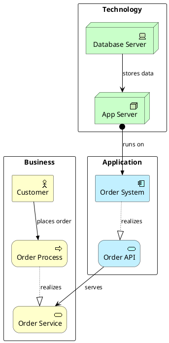

# Enterprise Architecture Diagram Generator (ArchiMate)

## `.archimate` 文件编辑与验证

适用于 `docs/architecture/*.archimate` 等 ArchiMate XML 标准交换格式文件的创建与修改。

### 编辑要点

- 根元素为 `<archimate:model>`，命名空间 `http://www.archimatetool.com/archimate`
- **禁止**在 `<archimate:model>` 下使用 `<properties>` / `<property>` — Archi GUI 会报 `Feature 'properties' not found`；版本/迭代等元数据写在 `docs/architecture/VERSION_HISTORY.md` 或各 diagram 的 `<documentation>` 中
- 元素放在对应 layer 的 `<folder type="...">` 下，使用 `xsi:type="archimate:<ElementType>"`（如 `DataObject` 而非 `ApplicationDataObject`，`Node` 而非 `TechnologyNode`）
- 关系使用 `<element xsi:type="archimate:Relationship">` 或 Archi 导出的 `<relationship>` 节点，source/target 须引用已存在的 element id
- 新增 element/relationship 时生成唯一 id（如 `id-<uuid>`），保持与伴生 `.puml` 语义一致
- 文件命名遵循：`v<N>-<视图名>-<YYYYMMDD-HHMM>-<作者>.diff.archimate`（增量模型）与 `v<N>-<视图名>-<YYYYMMDD-HHMM>-<作者>.full.archimate`（全量模型）——**每个架构版本须同时生成两者**：
  - `.diff.archimate`：仅含 vN-1 → vN 变迁元素（🟢/🟡/🔴 变更 + Plateau/Gap/WP 迁移链 + 变更数据流两端元素），回答「这版改了什么」
  - `.full.archimate`：变迁后完整架构拓扑（全部服务/DB/事件 + 变更标注），回答「改完的完整架构长什么样」，供 Archi 打开看全量
  - **Views 继承（强制）**：新版 `.full` **必须** `cp` 上一版同视图 `.full` 再 merge；保留全部既有 `ArchimateDiagramModel`，仅追加本版变迁/全量拓扑；**禁止**把 `.diff` 改名当 `.full`（见 `docs/superpowers/specs/2026-09-04-archimate-full-view-inheritance-design.md`）
  - **稳定 id（强制）**：既有 element/relationship/DiagramObject id 跨版本保持不变；仅 🟢 NEW 签发新 id（否则 `merge_full` 与视图引用会断链）

### 语义模型 vs 视图布局（两层结构 — 必须同时完成）

ArchiMate XML **不是**「写了 Relations 就会自动画线」。模型分两层，**缺一不可**：

| 层级 | XML 位置 | 作用 | 常见遗漏后果 |
|------|----------|------|--------------|
| **语义模型** | 各 layer 的 `<element>` + `Relations` 文件夹 | 声明元素及元素间存在何种关系 | 关系在模型树可见，但画布无连线 |
| **视图布局** | `Views` → `ArchimateDiagramModel` → `DiagramObject` + **`sourceConnection`** | 在画布上放置节点并**渲染**关系为箭头/连线 | 打开 Archi 只见孤立方框，**看不出拓扑与架构变迁** |

> ⚠️ **反模式（禁止）**：仅在 `Relations` 文件夹定义 `FlowRelationship` / `RealizationRelationship` 等，却在 `ArchimateDiagramModel` 里只写 `<bounds>` 而不写 `sourceConnection`。这会导致视图里**没有任何关系变化可见**——即使语义层关系已正确声明。

#### 视图连线规则（`sourceConnection`）

每个出现在视图中的 `DiagramObject` 若与其它节点有语义关系，**必须**在源节点下添加 `sourceConnection`，并在目标节点上添加对应的 `targetConnections`：

```xml
<!-- 源节点：发出连线 -->
<child xsi:type="archimate:DiagramObject" id="do-vue" archimateElement="app-taskFE">
  <bounds x="48" y="360" width="120" height="55"/>
  <sourceConnection xsi:type="archimate:Connection" id="conn-vue-cgw"
    source="do-vue" target="do-cgw"
    archimateRelationship="rel-v4-vue-cgw"/>
</child>
<!-- 目标节点：登记入站连线 id（空格分隔） -->
<child xsi:type="archimate:DiagramObject" id="do-cgw" archimateElement="app-container-gw"
  targetConnections="conn-vue-cgw">
  <bounds x="240" y="360" width="160" height="55"/>
</child>
```

字段说明：

| 属性 | 要求 |
|------|------|
| `source` / `target` | 必须为**同一视图内** `DiagramObject` 的 `id`（不是 element id） |
| `archimateRelationship` | 必须指向 `Relations` 文件夹中已声明的关系 id |
| `targetConnections` | 目标节点列出所有指向它的 `Connection` id，便于 Archi 正确布局 |

**参考样板**：`docs/architecture/v1-application-integration-20260701-1630-claude.archimate` 中「服务---在云平台运行AI容器服务」等视图——每个有关系的节点均含 `sourceConnection`。

#### 架构变迁视图（Implementation & Migration）

涉及 Plateau / Gap / WorkPackage 的 target 架构，`.archimate` **至少**应包含下列视图（均须带 `sourceConnection`）：

| 视图名（建议） | 必须连线的关系链 |
|----------------|------------------|
| `架构变迁 v<N-1>→v<N> — <迭代名>` | Plateau(vN-1) → Gap；WorkPackage → Gap（Realization 关闭）；WorkPackage → Plateau(vN) |
| `v<N> Target — <核心数据流名>` | 与 `.puml` 中 🟢/🟡 标注的新增/修改数据流一致（如 Vue→CGW→OSJS） |
| （可选）`关系变更 diff — v<N-1> vs v<N>` | 废弃关系（连到 `[DEPRECATED]` 元素）+ 新增关系并列展示 |

Implementation 层元素类型：`Plateau`、`Gap`、`WorkPackage`、`Deliverable` 放在 `folder type="implementation_migration"`。

#### 手工编写 / MCP 导出后的必检清单

完成 `.diff.archimate` / `.full.archimate` 写入后（**两个文件均须通过**），**逐视图**自检：

1. [ ] `Relations` 中每条应在图上可见的关系，在至少一个 `ArchimateDiagramModel` 中有对应 `sourceConnection`
2. [ ] 无「仅有 `<bounds>`、无 `sourceConnection`」的连通节点（除非刻意孤立展示）
3. [ ] `archimateRelationship` 的 id 在 `Relations` 文件夹中存在且 source/target element 正确
4. [ ] `.diff.archimate` 架构变迁视图：Plateau → Gap → WP → Plateau 链路完整；且仅含本次变更元素（🟢/🟡/🔴 + 迁移链），不含未变更的全量拓扑
5. [ ] `.full.archimate` 全量拓扑视图：变迁后完整服务/DB/事件齐全，含 🟢/🟡 变更标注与 `[DEPRECATED vN]` 废弃标注
5b. [ ] `.full.archimate` **Views 继承**：上一版同视图全部 `ArchimateDiagramModel` 名称仍在；视图数 ≥ 上一版；非「仅本迭代 2 图」
5c. [ ] 既有元素 id 未整文件换号（与上一版 `.full` 有实质 id 交集，除非首版）
6. [ ] 与伴生 `.puml` 中标注的 🟢新增 / 🟡修改 / 🔴废弃 关系一致
7. [ ] 执行 Archi `--loadModel` 验证（见下；`.diff` 与 `.full` 两个文件都须通过）
8. [ ] `python3 db/scripts/ci/check_archimate_full_inherits_views.py` 通过

### 编辑后必须验证（Archi CLI）

**每次**完成 `.archimate` 文件编辑后，**必须**在仓库根目录执行以下命令验证模型可被 Archi 正常加载——**`.diff.archimate` 与 `.full.archimate` 两个文件都须验证**：

```bash
for m in \
  docs/architecture/v<N>-<视图名>-<YYYYMMDD-HHMM>-<作者>.diff.archimate \
  docs/architecture/v<N>-<视图名>-<YYYYMMDD-HHMM>-<作者>.full.archimate; do
  xvfb-run -a ./docs/architecture/Archi/Archi -application com.archimatetool.commandline.app \
    -consoleLog -nosplash \
    --loadModel "$m"
done
```

- `${model_file}`：**必须是完整文件路径且以 `.archimate` 结尾**（相对仓库根或绝对路径均可）。Archi **不会**自动补后缀。
- ✅ 正确：`--loadModel docs/architecture/v68-application-integration-20260808-1732-claude.diff.archimate`
- ❌ 错误：`--loadModel docs/architecture/v68-application-integration-20260808-1732-claude.diff`（漏后缀 → `java.io.IOException: Could not load model: …`，且进程仍可能以 exit `0` 结束）
- **通过判据**（须同时满足）：
  1. 控制台出现 `[Core] Loaded model: '…'`（或等价 `Loaded model:` 行）
  2. 无 `Could not load model`、`Application error`、XML 解析异常
  3. 退出码可为参考，但**不可单独作为成功判据**（漏路径/漏后缀时常见「有 IOException 但 exit 0」）
- **失败处理**：若报 `Could not load model`，先确认路径存在且带 `.archimate`；再按 Archi 报错修正 XML（非法 xsi:type、断链的 source/target、格式错误等），修正后**重新执行**上述命令直至通过
- 无图形显示环境时必须用 `xvfb-run -a`（见上）；有显示环境时可去掉该前缀

> ⚠️ **不得跳过验证**：未出现 `Loaded model:` 的 `.archimate` 文件视为未完成编辑。
---

## PlantUML 图表（`.puml`）

**Quick Start:** Add `!include <archimate/Archimate>` → Declare typed elements → Connect with `Rel_*` macros → Group into layers with `rectangle` → Wrap in ` ```plantuml ` fence.

> ⚠️ **IMPORTANT:** Always use ` ```plantuml ` or ` ```puml ` code fence. NEVER use ` ```text ` — it will NOT render as a diagram.

## Critical Rules

- Every diagram starts with `@startuml` and ends with `@enduml`
- Must include `!include <archimate/Archimate>` before using any macros
- Element syntax: `Layer_Type(alias, "Label")`
- Relationship syntax: `Rel_Type(fromAlias, toAlias, "label")`
- Use `rectangle "Layer" { ... }` to group elements into ArchiMate layers
- Directional suffixes `_Up`, `_Down`, `_Left`, `_Right` control relationship direction

## Element Macros

### Business Layer

| Macro | ArchiMate Element |
|-------|-------------------|
| `Business_Actor(id, "Label")` | Business Actor |
| `Business_Role(id, "Label")` | Business Role |
| `Business_Process(id, "Label")` | Business Process |
| `Business_Function(id, "Label")` | Business Function |
| `Business_Service(id, "Label")` | Business Service |
| `Business_Event(id, "Label")` | Business Event |
| `Business_Interface(id, "Label")` | Business Interface |
| `Business_Collaboration(id, "Label")` | Business Collaboration |
| `Business_Object(id, "Label")` | Business Object |
| `Business_Product(id, "Label")` | Business Product |
| `Business_Contract(id, "Label")` | Business Contract |
| `Business_Representation(id, "Label")` | Business Representation |

### Application Layer

| Macro | ArchiMate Element |
|-------|-------------------|
| `Application_Component(id, "Label")` | Application Component |
| `Application_Service(id, "Label")` | Application Service |
| `Application_Function(id, "Label")` | Application Function |
| `Application_Interface(id, "Label")` | Application Interface |
| `Application_Process(id, "Label")` | Application Process |
| `Application_Interaction(id, "Label")` | Application Interaction |
| `Application_Event(id, "Label")` | Application Event |
| `Application_Collaboration(id, "Label")` | Application Collaboration |
| `Application_DataObject(id, "Label")` | Application Data Object |

### Technology Layer

| Macro | ArchiMate Element |
|-------|-------------------|
| `Technology_Device(id, "Label")` | Technology Device |
| `Technology_Node(id, "Label")` | Technology Node |
| `Technology_SystemSoftware(id, "Label")` | System Software |
| `Technology_Artifact(id, "Label")` | Technology Artifact |
| `Technology_CommunicationNetwork(id, "Label")` | Communication Network |
| `Technology_Path(id, "Label")` | Technology Path |
| `Technology_Service(id, "Label")` | Technology Service |
| `Technology_Process(id, "Label")` | Technology Process |
| `Technology_Function(id, "Label")` | Technology Function |
| `Technology_Interface(id, "Label")` | Technology Interface |

### Motivation Layer

| Macro | ArchiMate Element |
|-------|-------------------|
| `Motivation_Stakeholder(id, "Label")` | Stakeholder |
| `Motivation_Driver(id, "Label")` | Driver |
| `Motivation_Assessment(id, "Label")` | Assessment |
| `Motivation_Goal(id, "Label")` | Goal |
| `Motivation_Outcome(id, "Label")` | Outcome |
| `Motivation_Principle(id, "Label")` | Principle |
| `Motivation_Requirement(id, "Label")` | Requirement |
| `Motivation_Constraint(id, "Label")` | Constraint |
| `Motivation_Value(id, "Label")` | Value |

### Strategy Layer

| Macro | ArchiMate Element |
|-------|-------------------|
| `Strategy_Capability(id, "Label")` | Capability |
| `Strategy_Resource(id, "Label")` | Resource |
| `Strategy_CourseOfAction(id, "Label")` | Course of Action |
| `Strategy_ValueStream(id, "Label")` | Value Stream |

### Implementation Layer

| Macro | ArchiMate Element |
|-------|-------------------|
| `Implementation_WorkPackage(id, "Label")` | Work Package |
| `Implementation_Deliverable(id, "Label")` | Deliverable |
| `Implementation_Plateau(id, "Label")` | Plateau |
| `Implementation_Gap(id, "Label")` | Gap |
| `Implementation_Event(id, "Label")` | Implementation Event |

## Relationship Macros

All relationships support directional suffixes: `_Up`, `_Down`, `_Left`, `_Right`.

| Macro | ArchiMate Relationship | Line Style |
|-------|------------------------|------------|
| `Rel_Composition(from, to, "label")` | Composition | Solid + filled diamond |
| `Rel_Aggregation(from, to, "label")` | Aggregation | Solid + open diamond |
| `Rel_Assignment(from, to, "label")` | Assignment | Solid + circle→triangle |
| `Rel_Realization(from, to, "label")` | Realization | Dotted + hollow triangle |
| `Rel_Serving(from, to, "label")` | Serving | Solid + arrow |
| `Rel_Triggering(from, to, "label")` | Triggering | Solid + filled triangle |
| `Rel_Flow(from, to, "label")` | Flow | Dashed + filled triangle |
| `Rel_Access(from, to, "label")` | Access | Dotted line |
| `Rel_Access_r(from, to, "label")` | Access (read) | Dotted + arrow |
| `Rel_Access_w(from, to, "label")` | Access (write) | Dotted + reverse arrow |
| `Rel_Influence(from, to, "label")` | Influence | Dashed + arrow |
| `Rel_Association(from, to, "label")` | Association | Solid line |
| `Rel_Specialization(from, to, "label")` | Specialization | Solid + hollow triangle |

## Quick Example



## Diagram Types

| Type | Purpose | Key Macros | Example |
|------|---------|------------|---------|
| Enterprise Landscape | Full B/A/T layered view | All layers | [enterprise-landscape.md](examples/enterprise-landscape.md) |
| Application Integration | App-to-app data flows | `Application_*` | [application-integration.md](examples/application-integration.md) |
| Technology Infrastructure | Infrastructure stack | `Technology_*` | [technology-infrastructure.md](examples/technology-infrastructure.md) |
| Business Capability | Capability map | `Strategy_*`, `Business_*` | [business-capability.md](examples/business-capability.md) |
| Migration Planning | Plateau-based roadmap | `Implementation_*` | [migration-planning.md](examples/migration-planning.md) |
| Security Architecture | Security controls | `Technology_*`, `Motivation_*` | [security-architecture.md](examples/security-architecture.md) |
| Data Architecture | Data flow & ownership | `Application_DataObject`, `Rel_Access_*` | [data-architecture.md](examples/data-architecture.md) |
| DevOps Pipeline | CI/CD delivery chain | `Technology_*`, `Application_*` | [devops-pipeline.md](examples/devops-pipeline.md) |
