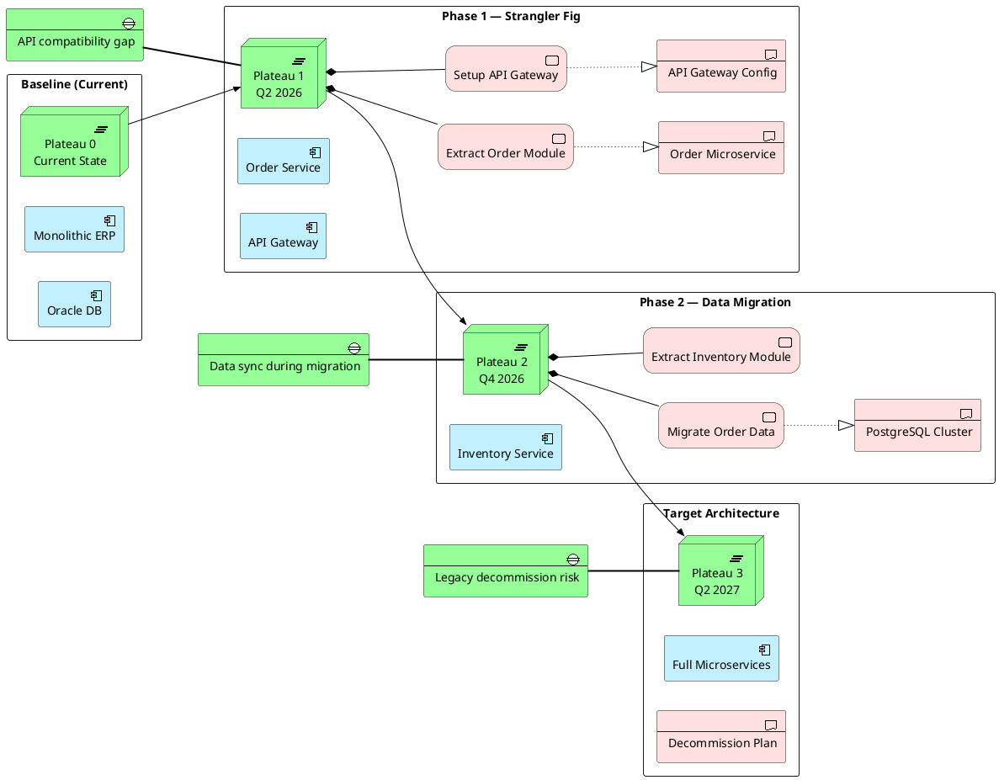

# Migration Planning

Plateau-based migration roadmap: baseline → intermediate → target architecture with work packages and gaps.

## Key Elements

| Layer | Macros Used |
|-------|-------------|
| Implementation | `Implementation_Plateau`, `Implementation_Gap`, `Implementation_WorkPackage`, `Implementation_Deliverable` |
| Application | `Application_Component` |

## Example

Legacy ERP migration: monolith → microservices over three plateaus with identified gaps:

## Pattern Notes

1. **Plateau sequence** — `Implementation_Plateau` represents architecture states at specific milestones; `Rel_Triggering` chains them in order
2. **Work Packages** — `Implementation_WorkPackage` are the actionable tasks within each plateau; `Rel_Composition` groups them under the plateau
3. **Deliverables** — `Implementation_Deliverable` are the outputs of work packages; `Rel_Realization` links work → deliverable
4. **Gaps** — `Implementation_Gap` identifies risks and incompatibilities between plateaus
5. **Left-to-right** — `left to right direction` reads the timeline naturally: Baseline → Phase 1 → Phase 2 → Target
6. **Mixed layers** — Application Components appear alongside Implementation elements to show what changes at each phase

## `.archimate` 伴生文件（迁移视图必做）

每个版本须同时导出**两份**（见 `SKILL.md`「文件命名」）：
- `*.diff.archimate` — 增量模型：仅本次变更元素 + Plateau/Gap/WP 迁移链（回答「这版改了什么」）
- `*.full.archimate` — 全量模型：变迁后完整架构拓扑（回答「改完的完整架构长什么样」）

两份文件中 Plateau/Gap/WorkPackage **不仅**写入 `Relations` 语义层，还须在 `Views` 中用 `sourceConnection` 连线，否则 Archi 画布上看不到变迁链路。详见 `SKILL.md`「语义模型 vs 视图布局」。

迁移视图最低连线：

- `Plateau(baseline)` → `Gap`（Association）
- `WorkPackage` → `Gap`（Realization，表示关闭 gap）
- `WorkPackage` → `Plateau(target)`（Realization）
- 目标态 Application 组件间的 Flow/Serving（与 `.puml` 一致）

**参考**：`docs/architecture/v4-*-20260705-1531-claude.archimate` 中「架构变迁 v1→v4」视图。
