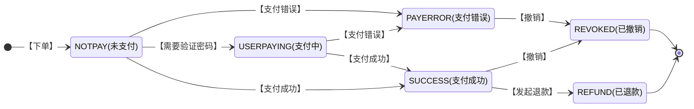

>更新时间：2026.06.10

## 应用场景

收银员使用扫码设备读取微信用户付款码以后，二维码或条码信息会传送至商户收银台，由商户收银台或者商户后台调用该接口发起支付。

注意

1、提交支付请求后微信会同步返回支付结果。当返回结果为“系统错误”时，商户系统等待5秒后调用【[查询订单API](https://pay.weixin.qq.com/doc/v2/merchant/4011937320.md)】，查询支付实际交易结果；当返回结果为“USERPAYING”时，商户系统可设置间隔时间(建议10秒)重新查询支付结果，直到支付成功或超时(建议45秒)；

2、在调用查询接口返回后，如果交易状况不明晰，请调用【[撤销订单API](https://pay.weixin.qq.com/doc/v2/merchant/4011937361.md)】，此时如果交易失败则关闭订单，该单不能再支付成功；如果交易成功，则将扣款退回到用户账户。当撤销无返回或错误时，请再次调用。注意：请勿扣款后立即调用【[撤销订单API](https://pay.weixin.qq.com/doc/v2/merchant/4011937361.md)】,建议至少15秒后再调用。撤销订单API需要双向证书。

## 状态机

支付状态转变如下：



## 接口地址【[SDK下载](https://pay.weixin.qq.com/doc/v2/merchant/4011985389.md)】

URL地址：https://api.mch.weixin.qq.com/pay/micropay

URL地址：https://api2.mch.weixin.qq.com/pay/micropay(备用域名)[见跨城冗灾方案](https://pay.weixin.qq.com/doc/v2/merchant/4011984887.md)

## 是否需要证书

不需要。

## 输入参数

| 名称 | 变量名 | 必填 | 类型 | 示例值 | 描述 |
| :-- | :-- | :-- | :-- | :-- | :-- |
| 公众账号ID | appid | 是 | String(32) | wx8888888888888888 | appid(开发者ID)是商户在微信[开放平台](https://open.weixin.qq.com/)(移动应用)或[企业号corpid](https://open.work.weixin.qq.com/help2/pc/21445)(即为appid)或[公众平台](https://mp.weixin.qq.com/)(服务号/政府或媒体类型的公众号/小程序)上的账号开发识别码，该 `appid` 必须与商户号mchid进行[绑定](https://pay.weixin.qq.com/doc/v3/merchant/4013287010.md)。 |
| 商户号 | mch\_id | 是 | String(32) | 1900000109 | 微信支付分配的商户号 |
| 设备号 | device\_info | 否 | String(32) | 013467007045764 | 终端设备号(商户自定义，如门店编号) |
| 随机字符串 | nonce\_str | 是 | String(32) | 5K8264ILTKCH16CQ2502SI8ZNMTM67VS | 随机字符串，不长于32位。推荐[随机数生成算法](https://pay.weixin.qq.com/doc/v2/merchant/4011985891.md) |
| 签名 | sign | 是 | String(32) | C380BEC2BFD727A4B6845133519F3AD6 | 签名，[详见签名生成算法](https://pay.weixin.qq.com/doc/v2/merchant/4011985891.md) |
| 签名类型 | sign\_type | 否 | String(32) | HMAC-SHA256 | 签名类型，目前支持HMAC-SHA256和MD5，默认为MD5 |
| 商品描述 | body | 是 | String(127) | image形象店-深圳腾大- QQ公仔 | 商品简单描述，该字段须严格按照规范传递，具体请见[参数规定](https://pay.weixin.qq.com/doc/v2/merchant/4011941162.md) |
| 商品详情 | detail | 否 | String(6000) | \[{<br>"goods\_detail":\[<br>{<br>"goods\_id":"iphone6s\_16G",<br>"wxpay\_goods\_id":"1001",<br>"goods\_name":"iPhone6s 16G",<br>"quantity":1,<br>"price":528800,<br>"goods\_category":"123456",<br>"body":"苹果手机"<br>},<br>{<br>"goods\_id":"iphone6s\_32G",<br>"wxpay\_goods\_id":"1002",<br>"goods\_name":"iPhone6s 32G",<br>"quantity":1,<br>"price":608800,<br>"goods\_category":"123789",<br>"body":"苹果手机"<br>}<br>\]<br>}\] | 单品优惠功能字段，需要接入详见[单品优惠详细说明](https://pay.weixin.qq.com/doc/v2/partner/4011983208.md) |
| 附加数据 | attach | 否 | String(127) | 说明 | 附加数据，在查询API和支付通知中原样返回，该字段主要用于商户携带订单的自定义数据 |
| 订单金额 | total\_fee | 是 | int | 888 | 订单总金额，单位为分，只能为整数，详见[支付金额](https://pay.weixin.qq.com/doc/v2/merchant/4011941162.md) |
| 货币类型 | fee\_type | 否 | String(16) | CNY | 符合ISO4217标准的三位字母代码，默认人民币：CNY，详见[货币类型](https://pay.weixin.qq.com/doc/v2/merchant/4011941162.md) |
| 终端IP | spbill\_create\_ip | 是 | String(64) | 8.8.8.8 | 支持IPV4和IPV6两种格式的IP地址。调用微信支付API的机器IP |
| 订单优惠标记 | goods\_tag | 否 | String(32) | WXG | 订单优惠标记，代金券或立减优惠功能的参数，详见[代金券或立减优惠](https://pay.weixin.qq.com/doc/v3/merchant/4012084133.md) |
| 交易起始时间 | time\_start | 否 | String(14) | 20091225091010 | 订单生成时间，格式为yyyyMMddHHmmss，如2009年12月25日9点10分10秒表示为20091225091010。其他详见[时间规则](https://pay.weixin.qq.com/doc/v2/merchant/4011941162.md) |
| 交易结束时间 | time\_expire | 否 | String(14) | 20091227091010 | 订单失效时间，格式为yyyyMMddHHmmss，如2009年12月27日9点10分10秒表示为20091227091010。 |
| 电子发票入口开放标识 | receipt | 否 | String(8) | Y | Y，传入Y时，支付成功消息和支付详情页将出现开票入口。需要在微信支付商户平台或微信公众平台开通电子发票功能，传此字段才可生效 |
| 付款码 | auth\_code | 是 | String(128) | 120061098828009406 | 扫码支付付款码，设备读取用户微信中的条码或者二维码信息<br>（用户付款码规则：18位纯数字，前缀以10、11、12、13、14、15开头） |
| 是否需要分账 | profit\_sharing | 否 | String(16) | Y | Y-是，需要分账<br>N-否，不分账<br>字母要求大写，不传默认不分账 |
| 场景信息 | scene\_info | 否 | String(256) | {"store\_info" : {<br>"id": "SZTX001",<br>"name": "腾大餐厅",<br>"area\_code": "440305",<br>"address": "科技园中一路腾讯大厦" }} | 该字段用于上报场景信息，目前支持上报实际门店信息。该字段为JSON对象数据，对象格式为{"store\_info":{"id": "门店ID","name": "名称","area\_code": "编码","address": "地址" }} ，字段详细说明请点击下行的>展开 |

| 字段名 | 变量名 | 必填 | 类型 | 示例值 | 描述 |
| --- | --- | --- | --- | --- | --- |
| 门店id | id | 是 | String(32) | SZTX001 | 门店唯一标识 |
| 门店名称 | name | 否 | String(64) | 腾讯大厦腾大餐厅 | 门店名称 |
| 门店行政区划码 | area\_code | 否 | String(6) | 440305 | 门店所在地行政区划码，详细见[最新县及县以上行政区划代码.csv](https://gtimg.wechatpay.cn/resource/xres/mmpaydoc/static/attachment/17a9438011c67265a06eb7f914fd0305/最新县及县以上行政区划代码.csv) |
| 门店详细地址 | address | 否 | String(128) | 科技园中一路腾讯大厦 | 门店详细地址 |

举例如下：

```
<xml>
   <appid>wx2421b1c4370ec43b</appid>
   <attach>订单额外描述</attach>
   <auth_code>120269300684844649</auth_code>
   <body>付款码支付测试</body>
   <device_info>1000</device_info>
   <goods_tag></goods_tag>
   <mch_id>10000100</mch_id>
   <nonce_str>8aaee146b1dee7cec9100add9b96cbe2</nonce_str>
   <out_trade_no>1415757673</out_trade_no>
   <spbill_create_ip>14.17.22.52</spbill_create_ip>
   <time_expire></time_expire>
   <total_fee>1</total_fee>
   <sign>C29DB7DB1FD4136B84AE35604756362C</sign>
</xml>
```

注：参数值用XML转义即可，CDATA标签用于说明数据不被XML解析器解析。

## 返回结果

| 名称 | 变量名 | 必填 | 类型 | 示例值 | 描述 |
| --- | --- | --- | --- | --- | --- |
| 返回状态码 | return\_code | 是 | String(16) | SUCCESS | SUCCESS/FAIL<br>此字段是接口通信情况标识，非交易成功与否的标识 |
| 返回信息 | return\_msg | 是 | String(128) | OK | 当return\_code为FAIL时返回信息为错误原因 ，例如<br>签名失败<br>参数格式校验错误 |

当return\_code为SUCCESS的时候，还会包括以下字段：

| 名称 | 变量名 | 必填 | 类型 | 示例值 | 描述 |
| --- | --- | --- | --- | --- | --- |
| 公众账号ID | appid | 是 | String(32) | wx8888888888888888 | 调用接口提交的公众账号ID |
| 商户号 | mch\_id | 是 | String(32) | 1900000109 | 调用接口提交的商户号 |
| 设备号 | device\_info | 否 | String(32) | 013467007045764 | 调用接口提交的终端设备号， |
| 随机字符串 | nonce\_str | 是 | String(32) | 5K8264ILTKCH16CQ2502SI8ZNMTM67VS | 微信返回的随机字符串 |
| 签名 | sign | 是 | String(32) | C380BEC2BFD727A4B6845133519F3AD6 | 微信返回的签名，详见[签名生成算法](https://pay.weixin.qq.com/doc/v2/merchant/4011985891.md) |
| 业务结果 | result\_code | 是 | String(16) | SUCCESS | SUCCESS/FAIL |
| 错误代码 | err\_code | 否 | String(32) | SYSTEMERROR | 详细参见错误列表 |
| 错误代码描述 | err\_code\_des | 否 | String(128) | 系统错误 | 错误返回的信息描述 |

当return\_code 和result\_code都为SUCCESS的时，还会包括以下字段：

交易成功判断条件：return\_code和result\_code都为SUCCESS且trade\_type为MICROPAY

| 名称 | 变量名 | 必填 | 类型 | 示例值 | 描述 |
| --- | --- | --- | --- | --- | --- |
| 用户标识 | openid | 是 | String(128) | Y | 用户在商户appid 下的唯一标识 |
| 该字段已废弃 | is\_subscribe | 是 | String(1) | N | 已废弃，默认统一返回N |
| 交易类型 | trade\_type | 是 | String(16) | MICROPAY | MICROPAY 付款码支付 |
| 付款银行 | bank\_type | 是 | String(32) | CMC | 银行类型，采用字符串类型的银行标识，详见[银行类型](https://pay.weixin.qq.com/doc/v2/merchant/4011941162.md) |
| 货币类型 | fee\_type | 否 | String(16) | CNY | 符合ISO 4217标准的三位字母代码，默认人民币：CNY，详见[货币类型](https://pay.weixin.qq.com/doc/v2/merchant/4011941162.md) |
| 订单金额 | total\_fee | 是 | int | 888 | 订单总金额，单位为分，只能为整数，详见[支付金额](https://pay.weixin.qq.com/doc/v2/merchant/4011941162.md) |
| 应结订单金额 | settlement\_total\_fee | 否 | int | 100 | 当订单使用了免充值型优惠券后返回该参数，应结订单金额=订单金额-免充值优惠券金额。 |
| 代金券金额 | coupon\_fee | 否 | int | 100 | “代金券”金额<=订单金额，订单金额-“代金券”金额=现金支付金额，详见[支付金额](https://pay.weixin.qq.com/doc/v2/merchant/4011941162.md) |
| 现金支付货币类型 | cash\_fee\_type | 否 | String(16) | CNY | 符合ISO 4217标准的三位字母代码，默认人民币：CNY，其他值列表详见[货币类型](https://pay.weixin.qq.com/doc/v2/merchant/4011941162.md) |
| 现金支付金额 | cash\_fee | 是 | int | 100 | 订单现金支付金额，详见[支付金额](https://pay.weixin.qq.com/doc/v2/merchant/4011941162.md) |
| 微信支付订单号 | transaction\_id | 是 | String(32) | 1217752501201407033233368018 | 微信支付订单号 |
| 商家数据包 | attach | 否 | String(127) | 123456 | 商家数据包，原样返回 |
| 支付完成时间 | time\_end | 是 | String(14) | 20141030133525 | 订单生成时间，格式为yyyyMMddHHmmss，如2009年12月25日9点10分10秒表示为20091225091010。详见[时间规则](https://pay.weixin.qq.com/doc/v2/merchant/4011941162.md) |
| 营销详情 | promotion\_detail | 否 | String(6000) | 示例见下文 | 新增返回，单品优惠功能字段，需要接入请见[详细说明](https://pay.weixin.qq.com/doc/v2/partner/4011983208.md) |

举例如下：

```
<xml>
   <return_code><![CDATA[SUCCESS]]></return_code>
   <return_msg><![CDATA[OK]]></return_msg>
   <appid><![CDATA[wx2421b1c4370ec43b]]></appid>
   <mch_id><![CDATA[10000100]]></mch_id>
   <device_info><![CDATA[1000]]></device_info>
   <nonce_str><![CDATA[GOp3TRyMXzbMlkun]]></nonce_str>
   <sign><![CDATA[D6C76CB785F07992CDE05494BB7DF7FD]]></sign>
   <result_code><![CDATA[SUCCESS]]></result_code>
   <openid><![CDATA[oUpF8uN95-Ptaags6E_roPHg7AG0]]></openid>
   <is_subscribe><![CDATA[N]]></is_subscribe>
   <trade_type><![CDATA[MICROPAY]]></trade_type>
   <bank_type><![CDATA[CCB_DEBIT]]></bank_type>
   <total_fee>1</total_fee>
   <coupon_fee>0</coupon_fee>
   <fee_type><![CDATA[CNY]]></fee_type>
   <transaction_id><![CDATA[1008450740201411110005820873]]></transaction_id>
   <out_trade_no><![CDATA[1415757673]]></out_trade_no>
   <attach><![CDATA[订单额外描述]]></attach>
   <time_end><![CDATA[20141111170043]]></time_end>
</xml>
```

## 错误码

注意：

如果当前交易返回的支付状态是明确的错误原因造成的支付失败（支付确认失败），请重新下单支付；如果当前交易返回的支付状态是不明错误（支付结果未知），请调用查询订单接口确认状态，如果长时间（建议30秒）都得不到明确状态请调用撤销订单接口。

| 名称 | 描述 | 支付状态 | 原因 | 解决方案 |
| --- | --- | --- | --- | --- |
| SYSTEMERROR | 接口返回错误 | 支付结果未知 | 系统超时 | 请立即调用被扫订单结果查询API，查询当前订单状态，并根据订单的状态决定下一步的操作。 |
| PARAM\_ERROR | 参数错误 | 支付确认失败 | 请求参数未按指引进行填写 | 请根据接口返回的详细信息检查您的程序 |
| ORDERPAID | 订单已支付 | 支付确认失败 | 订单号重复 | 请确认该订单号是否重复支付，如果是新订单，请使用新订单号提交 |
| NOAUTH | 商户无权限 | 支付确认失败 | 商户没有开通被扫支付权限 | 请开通商户号权限。请联系产品或商务申请 |
| AUTHCODEEXPIRE | 二维码已过期，请用户在微信上刷新后再试 | 支付确认失败 | 用户的条码已经过期 | 请收银员提示用户，请用户在微信上刷新条码，然后请收银员重新扫码。 直接将错误展示给收银员 |
| NOTENOUGH | 余额不足 | 支付确认失败 | 用户的零钱余额不足 | 请收银员提示用户更换当前支付的卡，然后请收银员重新扫码。建议：商户系统返回给收银台的提示为“用户余额不足.提示用户换卡支付” |
| NOTSUPORTCARD | 不支持卡类型 | 支付确认失败 | 用户使用卡种不支持当前支付形式 | 请用户重新选择卡种 建议：商户系统返回给收银台的提示为“该卡不支持当前支付，提示用户换卡支付或绑新卡支付” |
| ORDERCLOSED | 订单已关闭 | 支付确认失败 | 该订单已关 | 商户订单号异常，请重新下单支付 |
| ORDERREVERSED | 订单已撤销 | 支付确认失败 | 当前订单已经被撤销 | 当前订单状态为“订单已撤销”，请提示用户重新支付 |
| BANKERROR | 银行系统异常 | 支付结果未知 | 银行端超时 | 请立即调用被扫订单结果查询API，查询当前订单的不同状态，决定下一步的操作。 |
| USERPAYING | 用户支付中，需要输入密码 | 支付结果未知 | 该笔交易因为业务规则要求，需要用户输入支付密码。 | 等待5秒，然后调用被扫订单结果查询API，查询当前订单的不同状态，决定下一步的操作。 |
| AUTH\_CODE\_ERROR | 付款码参数错误 | 支付确认失败 | 请求参数未按指引进行填写 | 每个二维码仅限使用一次，请刷新再试 |
| AUTH\_CODE\_INVALID | 付款码检验错误 | 支付确认失败 | 收银员扫描的不是微信支付的条码 | 请扫描微信支付被扫条码/二维码 |
| XML\_FORMAT\_ERROR | XML格式错误 | 支付确认失败 | XML格式错误 | 请检查XML参数格式是否正确 |
| REQUIRE\_POST\_METHOD | 请使用post方法 | 支付确认失败 | 未使用post传递参数 | 请检查请求参数是否通过post方法提交 |
| SIGNERROR | 签名错误 | 支付确认失败 | 参数签名结果不正确 | 请检查签名参数和方法是否都符合签名算法要求 |
| LACK\_PARAMS | 缺少参数 | 支付确认失败 | 缺少必要的请求参数 | 请检查参数是否齐全 |
| NOT\_UTF8 | 编码格式错误 | 支付确认失败 | 未使用指定编码格式 | 请使用UTF-8编码格式 |
| BUYER\_MISMATCH | 支付账号错误 | 支付确认失败 | 暂不支持同一笔订单更换支付方 | 请确认支付方是否相同 |
| APPID\_NOT\_EXIST | APPID不存在 | 支付确认失败 | 参数中缺少APPID | 请检查APPID是否正确 |
| MCHID\_NOT\_EXIST | MCHID不存在 | 支付确认失败 | 参数中缺少MCHID | 请检查MCHID是否正确 |
| OUT\_TRADE\_NO\_USED | 商户订单号重复 | 支付确认失败 | 同一笔交易不能多次提交 | 请核实商户订单号是否重复提交 |
| APPID\_MCHID\_NOT\_MATCH | appid和mch\_id不匹配 | 支付确认失败 | appid和mch\_id不匹配 | 请确认appid和mch\_id是否匹配 |
| INVALID\_REQUEST | 无效请求 | 支付确认失败 | 商户系统异常导致，商户权限异常、重复请求支付、证书错误、频率限制等 | 请确认商户系统是否正常，是否具有相应支付权限，确认证书是否正确，控制频率 |
| TRADE\_ERROR | 交易错误 | 支付确认失败 | 业务错误导致交易失败、用户账号异常、风控、规则限制等 | 请确认账号是否存在异常 |