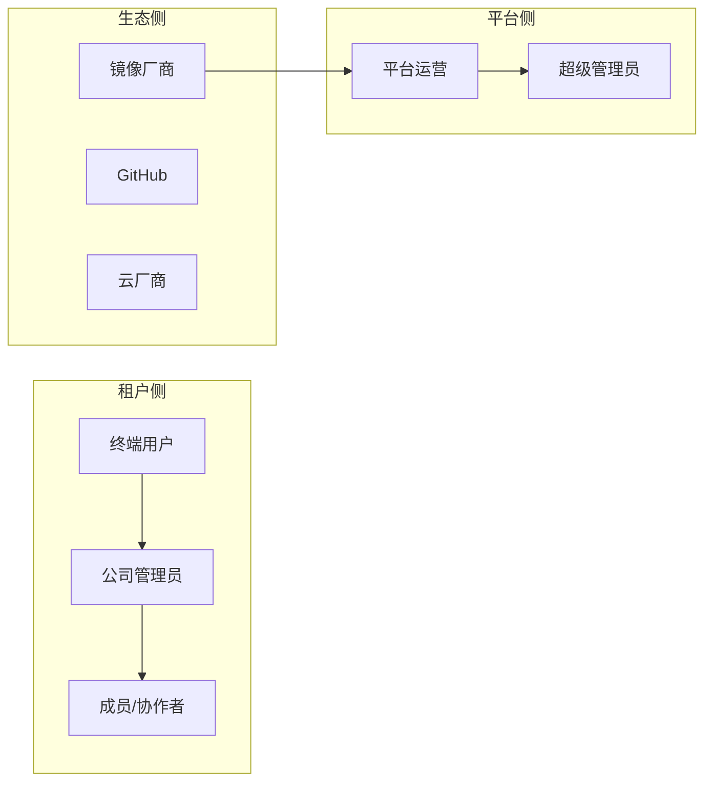
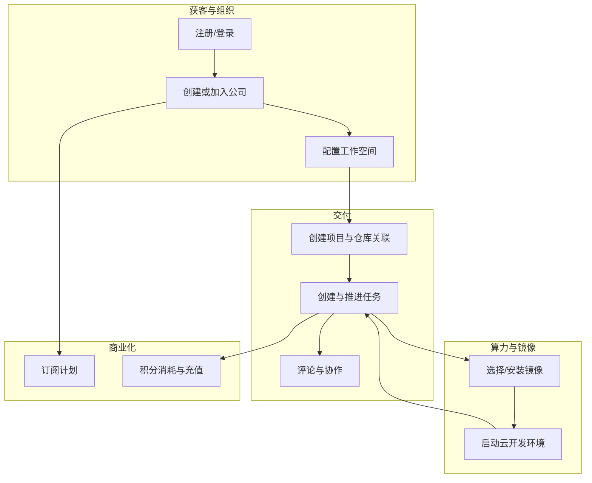
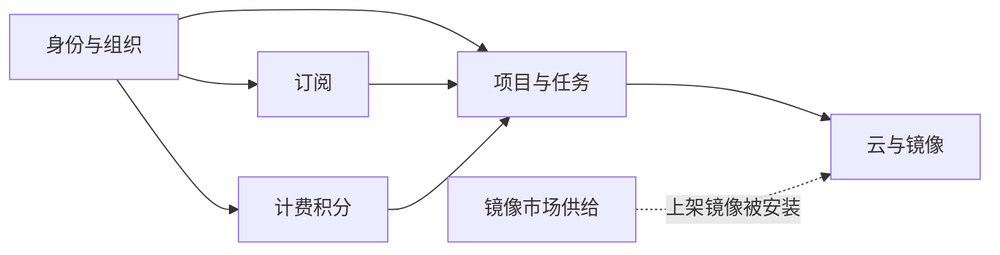

# task2app 业务架构

本文描述 task2app 仓库所承载产品的**业务边界、参与方与价值流**，与具体技术栈解耦，便于产品、实施与研发对齐语言。

## 1. 文档范围

task2app 为多仓/多应用组合，典型包含：

| 组成部分 | 业务角色 |
|---------|---------|
| **Saas_project** | 主站：租户、项目与任务协作、云算力与镜像编排、计费与订阅等 |
| **Saas_Ai_Provider** | 镜像市场：厂商上架容器镜像、平台审核与分发；与主站 SSO 联动 |
| **taskEvents/notifications** | 出站通知：消费 `EMAIL_SENT`、`INVITATION_CREATED`、`USER_ACTIVATED` 等领域事件，在 Go 进程内 SMTP/短信投递 |
| **front_project（Vue）** | 主站 Web 控制台与租户端工作流界面 |
| **trae-agent 等** | 与容器/在线开发链路相关的辅助服务（按部署接入） |

下文以主站（Saas_project）为核心描述业务域，镜像市场与出站通知为**卫星域**。

## 2. 参与方（Stakeholders）

- **终端用户**：注册、登录、加入公司；在授权范围内使用项目与任务能力。
- **公司管理员**：公司信息、成员与分组、邀请、工作空间与云平台授权、计费充值等。
- **成员/协作者**：在项目/工作空间下创建与推进任务、评论、与云环境交互（权限受控）。
- **镜像厂商**（Saas_Ai_Provider）：维护镜像产品与版本、提交上架审核。
- **平台/超管**：订阅计划、系统参数、跨租户运维与合规类能力。
- **外部系统**：GitHub（仓库访问、App 授权）、云厂商（ECS/镜像 API）、支付（如 PayPal  webhook）、消息通道（Kafka/Redis 等支撑事件与实时推送）。

## 3. 业务域划分

### 3.1 身份与组织（accounts）

- 用户生命周期：手机/邮箱注册、登录、密码与邮箱验证、GitHub 等登录方式扩展。
- **公司（租户）**：多租户隔离的基本单位；成员、角色、分组、邀请。
- **鉴权客体**：自定义 Token、验证码、GitHub App 用户授权与审计等。

### 3.2 协作与交付（projects + column_systems）

- **项目**：归属公司，可关联多个**工作空间**；与代码仓库、容器镜像等配置绑定。
- **工作空间**：交付与看板配置的载体（交付物体系、状态列、任务面板等）。
- **任务（Todo）**：进度列、优先级、父子与子任务、指派与 Owner、与交付物对象关联。
- **评论 / AI 任务评论**：协作沟通与智能化扩展入口。
- **Git 集成**：公司级仓库 OAuth、任务级凭据审批与审计等。

### 3.3 云与运行时（cloud + cloudSystemAdmin）

- 云平台授权（如阿里云 OAuth / AccessKey 等模式）、地域与规格。
- **云服务器配置与事件**：启动/停止、状态事件、与任务 UI 的 SSE/Redis 推送衔接。
- **租户已安装镜像**：项目/任务可选用的容器镜像实例。
- **系统管理侧**：平台级云探测、默认配置等（与租户控制台互补）。

### 3.4 商业化（billing + subscriptions）

- **订阅计划**：套餐、成员上限、功能开关等（与租户签约周期相关）。
- **积分计费**：价格套餐快照、租户计费账户、按「发帖/服务器启动/续存」等维度的流水与充值（含第三方支付回调）。

### 3.5 合规与静态政策（privacy_policy、license_agreement）

- 隐私政策、许可协议等内容版本与用户侧展示/同意流（与主体业务解耦为独立子域）。

### 3.6 镜像市场（Saas_Ai_Provider / marketplace）

- 厂商、平台管理员、容器镜像组与版本、上架审核状态机。
- 与主站用户通过 `saas_user_id` 等字段**逻辑关联**，业务上形成「主站消费 ↔ 市场供给」闭环。

### 3.7 通知与异步（taskEvents notifications）

- 注册激活、邀请、用户激活等场景由主站 **Producer** 发布领域事件（`EMAIL_SENT`、`INVITATION_CREATED`、`USER_ACTIVATED` 等）。
- **task-events-notifications**（Go，monorepo 根 `taskEvents/`）订阅 Redis Stream / Kafka，在进程内完成模板渲染与 SMTP/短信出站，与主站 API 事务解耦。

## 4. 核心价值链（简图）

## 5. 域间依赖（业务视角）

主站内部各域并非正交独立，典型依赖如下（箭头表示「前者依赖后者提供的能力或数据」）。

- **协作域**依赖 **账户域**：成员、Owner、指派、工作空间访问均以 `Company` / `CompanyMember` 为前提。  
- **计费域**挂靠在 **租户**：扣费与充值账户与 `Company` 绑定；任务创建、服务器启动等触发消费规则。  
- **订阅域**常作为 **功能开关**（成员上限、特性包）约束项目与任务能力。  
- **云域**为任务提供运行时；**租户已安装镜像**连接「市场/平台镜像」与「项目/任务选用」两端。  
- **镜像市场**在主站之外维护镜像元数据与审核生命周期，主站侧通过安装记录与云 API 消费镜像。

## 6. 与实现文档的关系

- 功能清单级结构见仓库根下 `docs/ProjectFeature.opml` 与 `Saas_project/docs/development/` 中相关说明。
- 集成细节见 `Saas_project/docs/integration/`（Kafka、GitHub App、SSO 等）。
- **应用拆分与部署形态**见同目录 `02_应用架构.md`；**持久化实体与表归属**见 `03_数据架构.md`；**集成与安全**见 `04_跨系统集成与安全约束.md`。  
- **按场景查阅业务步骤与库表/消息对应**见 `05_业务流与数据流对照.md`。

## 7. 修订记录

| 日期 | 说明 |
|------|------|
| 2026-05-13 | 初版：按当前代码仓模块归纳业务域与价值流 |
| 2026-06-01 | 出站通知改为 taskEvents notifications；移除 Saas_email |
