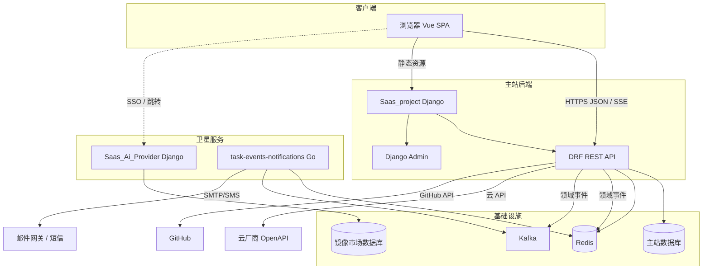
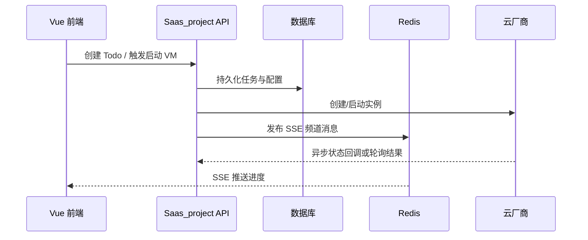

# task2app 应用架构

本文描述 **进程/应用边界、对外接口、关键中间件与典型请求路径**，对应仓库内可部署单元与依赖关系。

## 1. 逻辑部署视图

说明：

- **主站**为单体 Django 应用，按 `INSTALLED_APPS` 划分模块边界（非独立进程）：`accounts`、`projects`、`cloud`、`billing`、`subscriptions`、`core`、`column_systems` 等。
- **Saas_Ai_Provider** 为独立 Django 工程，可单独域名部署（如 `provider.*`），与主站通过 SSO 与用户 ID 映射集成（见 `Saas_project/docs/integration/SSO_SAAS_AI_PROVIDER.md`）。
- **task-events-notifications**（`taskEvents/cmd/notifications`）为长期运行的 Go 消费者，经 `domainEvents` 传输层（默认 Redis Streams）订阅出站相关事件，在进程内 SMTP/短信投递，与主站 API 解耦。详见 `Saas_project/docs/integration/DOMAIN_EVENTS.md`。

## 2. 主站 Django 应用职责速查

| App | 职责摘要 |
|-----|---------|
| `core` | Kafka 生产者/消费者封装、Redis、SSE 连接管理、雪花 ID、租户工具、HTTP 追踪等横切能力 |
| `accounts` | 用户/公司/成员/分组/邀请/Token/验证码/GitHub App 授权等 |
| `projects` | 项目、工作空间、任务、评论、交付物体系、Git 集成、容器 AI 指令与 Mock 流式接口等 |
| `cloud` | 云平台授权、实例与镜像、userdata、租户安装镜像、运行时 Token 等 |
| `cloudSystemAdmin` | 云侧系统管理/探测类能力 |
| `billing` | 计费账户、套餐、流水、PayPal webhook 等 |
| `subscriptions` | 订阅计划与订阅关系 |
| `column_systems` | 全局进度体系 + 租户级进度列配置 |
| `frontend_app` | 服务端渲染或模板上下文等与前端耦合的轻量逻辑 |
| `privacy_policy` / `license_agreement` | 政策文案与版本模型 |

完整目录约定见 `Saas_project/docs/architecture/FILE_STRUCTURE.md`。

## 3. 主站 API 路径分层（惯例）

以下摘自 `Saas_project/saas_project/urls.py` 的常见前缀，便于前端与联调统一认知（非全量枚举）。

| 前缀 | 用途 |
|------|------|
| `/api/auth/` | 认证相关 |
| `/api/accounts/`、`/api/tenant/<tenant_id>/accounts/`、`/api/user/<user_id>/accounts/` | 账户与公司维度 API |
| `/api/subscriptions/` | 订阅计划 |
| `/api/cloud/`、`/api/tenant/<tenant_id>/cloud/`、`.../workspace/<ws>/task/<task>/cloud/` | 云与任务运行时 |
| `/api/tenant/<tenant_id>/billing/` | 租户计费 |
| `/api/billing/paypal/webhook/...` | PayPal 回调 |
| `/api/tenant/<tenant_id>/projects/`、`.../workspaces/`、`.../todos/` | 项目与工作空间、任务 |
| `/api/tenant/<tenant_id>/workspace/<ws>/task/<task>/cloud/server-startup-status-sse/` | 云启动状态 SSE |
| `/api/core/`、`/api/public/` | 核心/公共能力 |
| `/callback/cloudplatform/oauth2.0/aliyun` | 阿里云 OAuth 回调 |

OpenAPI 文档由 `drf_yasg` 挂载（见 `urls.py` 中 `schema_view` 与 `swagger`/`redoc` 路径配置）。

## 4. 前端与路由

- **front_project**：Vue 单页应用，路由以租户 `tenant_id`、工作空间 `workspace_id`、任务 `task_id` 等为主键的**多租户 URL**（详见 `Saas_project/docs/development/url_report.md`）。
- 通过 **REST + Token**（及会话相关配置）调用主站 API；部分能力使用 **SSE** 订阅任务云状态等长连接场景。

## 5. 对外接口类型

1. **REST API（DRF）**：业务 CRUD、认证注册、云操作编排等；Swagger 由 `drf_yasg` 暴露（随 `urls.py` 配置）。
2. **SSE**：任务维度服务器状态等推送（内部配合 Redis 频道发布/订阅）。
3. **Webhook**：如 PayPal 支付回调（`billing`）。
4. **OAuth 回调**：云厂商授权回调（如阿里云 OAuth）。
5. **第三方出站**：云厂商 SDK、GitHub REST API、向 Kafka 投递域事件。

## 6. 典型同步路径（示例）

**创建任务并拉起开发机（概念序列）**

## 7. 异步与集成

- **领域事件（domainEvents）**：主站 `core` 发布用户创建、项目更新、云服务器启停、任务完成、`EMAIL_SENT` 等事件；**taskEvents** 各域 Go 消费者处理（含 **notifications** 出站邮件/SMS）。传输层为 Redis Streams 或 Kafka（见 `Saas_project/docs/integration/DOMAIN_EVENTS.md`）。
- **Redis**：缓存、SSE 消息扇出、部分分布式协调（以实际调用为准）。
- **CORS / 中间件**：`corsheaders`、系统管理员中间件、HTTP 追踪等见 `saas_project/settings.py`。  
- **安全与集成约束**（租户校验、Webhook、密钥）：见同目录 [04_跨系统集成与安全约束.md](04_跨系统集成与安全约束.md)。

## 8. 非 Django 组件（仓库内）

- **playwright**：前端 E2E 与回归自动化。
- **trae-agent / onlineServiceJS**：与在线服务、Git 命令封装相关的 Node 侧能力（按环境接入主链路）。

## 9. 环境与配置

- 主站与镜像市场各自 `settings.py`；开发默认 SQLite，生产可切换为 PostgreSQL 等（由部署环境注入）。
- 端口与外部 URL 聚合见仓库 `conf/port_config.json` 及相关 `.yaml` 说明。

## 10. 修订记录

| 日期 | 说明 |
|------|------|
| 2026-05-13 | 初版：基于 `INSTALLED_APPS`、urls 与集成文档归纳 |
| 2026-06-01 | 出站通知改为 task-events-notifications；更新部署视图 |

