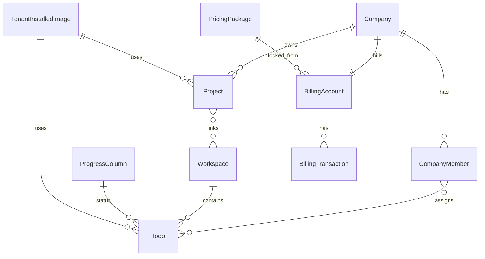

# task2app 数据架构

本文描述 **持久化边界、核心实体关系与多租户数据归属原则**。表名与字段以 Django 模型为准，此处为逻辑视图。

## 1. 数据库边界

| 逻辑库 | 归属应用 | 说明 |
|--------|-----------|------|
| **主站库** | Saas_project | 租户、项目、任务、云配置、计费、订阅、政策文案等统一 schema（`INSTALLED_APPS` 内模型） |
| **镜像市场库** | Saas_Ai_Provider | 厂商、镜像组/版本、审核状态等独立 Django 项目 schema |

出站通知由 **task-events-notifications**（Go）处理，**无独立业务库**；幂等/偏移依赖 Redis Stream consumer group（见 `domainEvents` 配置）。

开发环境常见 **SQLite 单文件**；生产建议 **PostgreSQL/MySQL** 等关系库，由环境变量切换 `DATABASES` 配置。

**Monorepo 表 → owner（强制）**：一库/一表仅由一个服务直连；完整对照与 CI 见仓库根 [`docs/architecture/table-to-owner.md`](../../../docs/architecture/table-to-owner.md) 与 [`db/table_ownership.yaml`](../../../db/table_ownership.yaml)（规范：`.ai/01_project_constraints/19_single_service_data_ownership.md`）。计费表在 **task-bill**，身份表在 **task-auth**，项目/任务/云 SSOT 在对应 Go 服务库，勿再假设「全在主站库」。

## 2. 主站核心主题域与实体

### 2.0 多租户与数据归属

- **隔离键**：主业务以 **Company** 为租户根（URL 中 `tenant_id` 即公司标识场景常见）。  
- **访问控制**：凡带 `tenant_id` 的 API，必须在服务端校验「当前登录用户是否为该公司成员（及角色是否足够）」，禁止仅信任路径参数。  
- **聚合与计费**：`BillingAccount`、订阅、云资源配额等均以公司为汇总单位；任务与项目数据应能稳定回溯到 `Company`，便于对账与合规导出。

### 2.1 身份与组织（accounts）

- **User / LoginMethod**：用户与多种登录方式。
- **Company**：租户根实体；与 `BillingAccount` 1:1 或按业务规则关联。
- **CompanyMember**：用户在公司内的成员身份；任务 `assignees`、`owner` 多指向成员。
- **CompanyGroup / CompanyGroupMember**：分组。
- **Invitation**：邀请入司流程。
- **VerificationCode、CustomToken**：验证码与 API Token。
- **UserGithubAppTokenUseAudit**：已移除；GitHub App access 使用审计在 **gitOauth** 表 `GithubAppAccessTokenUseAudit`。**绑定元数据与 refresh 凭据在 gitOauth** `GithubAppUserCredential`。
- **UserCompanyGitIdentity**：用户在公司维度下的 Git 身份绑定。

### 2.2 协作与项目（projects + column_systems）

- **Project**：归属 `Company`，多对多 **Workspace**；可选 `TenantInstalledImage`。
- **Workspace、WorkspaceAccess**：工作空间及访问控制。
- **Todo**：归属工作空间；关联 `ProgressColumn`、`DeliverableObj`、`TenantInstalledImage`；支持父子任务与 fork；多对多 **CompanyMember** 作为指派人。
- **Comment、AITaskComment**：评论域。
- **DeliverableSystem** 及公司/租户/工作空间级关联表：交付物体系统配置。
- **DeliverableObj**：任务关联的交付物实例类型。
- **ProjectRepo、TaskProject、TaskBranchStrategy、TaskRepoIdentity**：仓库与分支策略、任务级仓库身份。
- **CompanyGithubRepoOAuth**（仓库令牌加密行，不含 OAuth scope 持久化）、**TaskGithubCredentialApproval**：任务上下文 GitHub 凭据批准。**任务级 GitHub 凭据使用审计**在 **gitOauth** 表 `GithubTaskCredentialAudit`（主站经内部 HTTP 上报）。

**column_systems**

- **ProgressSystem、ProgressColumn**：全局进度列定义。
- **TenantProgressSystem、TenantProgressColumn**（`models_tenant`）：租户级覆盖/实例。

### 2.3 云（cloud）

- **CloudPlatformAuthorization** 及 **ActiveMethod**、**OAuthToken**：云平台授权与令牌。
- **CloudServerConfig、CloudServerConfigHistory、CloudServerConfigDefault**：服务器规格与历史默认。
- **CloudServerEvent**：生命周期事件。
- **CloudInstanceType、AccessKeyIamIdAssociation**：规格与 IAM 关联。
- **AIModelAuthorization**：AI 模型侧授权（与云/供应商配置衔接）。
- **TenantInstalledImage**：租户可见的已安装镜像行。
- **UserDataTemplate**：启动模板类数据。
- **CloudServerImageSystemTestInstance**：镜像系统测试实例记录。

### 2.4 计费与订阅（billing + subscriptions）

- **PricingPackage**：全局价格套餐版本（生效期、单价字段）。
- **BillingAccount**：每租户一条；余额、开户时锁价字段、关联套餐。
- **BillingUnit**：计费单元定义（token/发帖/启动等类型）。
- **BillingTransaction**：积分流水（充值/消费/退款及来源子类型）。
- **Plan、Subscription**（subscriptions 包内）：订阅计划与订阅实例。

### 2.5 其他主站模型

- **cloudSystemAdmin**：系统管理员侧云相关模型（见该 app migrations）。
- **frontend_app**：前端耦合的轻量持久化（若有）。
- **privacy_policy、license_agreement**：政策与协议版本实体。

## 3. 主站逻辑 ER（精简）

## 4. 镜像市场（Saas_Ai_Provider）

逻辑上独立于主站库，关键实体包括：

- **Vendor**（`saas_user_id` 与主站用户对应）
- **PlatformStaff**（`saas_superadmin_id` 与主站超管对应）
- **ContainerImageGroup / ContainerImageVersion**（及状态枚举：草稿/待审/上架/驳回）
- 其余上架、审核、可见性字段以 `apps/marketplace/models.py` 为准。

跨系统一致性采用 **外键不可达、ID 映射** 模式：业务上依赖主站用户/超管 ID，数据库层面不建跨库 FK。

## 5. 标识与时间

- 大量业务表主键为 **SnowflakeIDField**（分布式友好 bigint），非自增序列。
- 普遍具备 `created_at` / `updated_at` 审计字段。

## 6. 数据流与事件（非库表）

- **领域事件（domainEvents）**：用户创建、项目更新、云启停、任务完成、`EMAIL_SENT` 等，payload 为 JSON；落库仍在主业务表，消息供 taskEvents 各域与出站通知消费。  
- **Redis**：偏运行时状态与 SSE 扇出，不作为权威业务源。

集成面与安全约束见同目录 [04_跨系统集成与安全约束.md](04_跨系统集成与安全约束.md)。

## 7. 与代码的对应关系

- 主站模型入口：`Saas_project/<app>/models.py` 或 `<app>/models/*.py`。
- 镜像市场：`Saas_Ai_Provider/apps/marketplace/models.py`。
- 历史 ER 草图（可能与当前迁移略有出入）：`Saas_project/docs/flows/.../02_SaaS系统设计.wsd`。

## 8. 修订记录

| 日期 | 说明 |
|------|------|
| 2026-05-13 | 初版：按各 app models 归纳主题域与跨库边界 |
| 2026-06-01 | 移除 Saas_email 独立库；补充 notifications 无库说明 |
