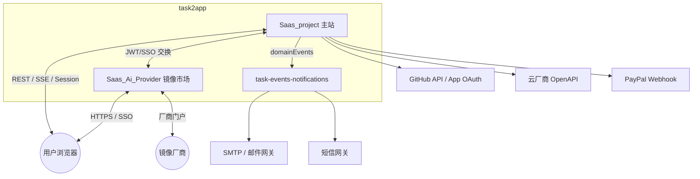

# task2app 跨系统集成与安全约束

> 索引：[architecture/README.md](README.md)

本文汇总 **系统与外部参与方的集成关系** 及 **安全与合规层面的设计约束**，细节仍以各集成专项文档与代码为准。

## 1. 系统上下文（C4 精简）

## 2. 集成矩阵

| 集成对象 | 方向 | 主站能力 | 专项文档 |
|---------|------|----------|----------|
| GitHub | 双向 | 仓库访问校验、OAuth/App 用户授权、PR 等自动化钩子 | `Saas_project/docs/integration/GITHUB_APP_DEPLOYMENT.md` |
| 云厂商（如阿里云） | 出站 + 回调 | ECS/镜像、OAuth 回调 `callback/cloudplatform/oauth2.0/aliyun` | `Saas_project/docs/cloud/` |
| PayPal | 入站 Webhook | 充值回调（沙箱/生产分路径） | `saas_project/urls.py` 中 `paypal_webhook` 与部署说明 |
| 领域事件（domainEvents） | 出站 | `EMAIL_SENT`、`INVITATION_CREATED`、`USER_ACTIVATED` 等 | `Saas_project/docs/integration/DOMAIN_EVENTS.md` |
| Redis | 内部 | SSE 扇出、领域事件 Streams（默认 transport）、缓存与协调 | 应用代码 `core.redis` / `taskEvents` |
| 镜像市场 | 浏览器跳转 + API | 与主站用户 ID 映射、SSO | `Saas_project/docs/integration/SSO_SAAS_AI_PROVIDER.md` |
| task-events-notifications | 消费 domainEvents | 出站邮件（SMTP）、短信（可选）；Go 内模板渲染 | `Saas_project/docs/integration/DOMAIN_EVENTS.md` §出站通知 |

## 3. 认证与授权（约束）

- **租户 API**：大量路径形如 `/api/tenant/<tenant_id>/...`，服务端必须校验「当前登录用户是否属于该公司」，禁止仅凭路径中的 `tenant_id` 信任客户端。  
- **DRF Token / Session**：与 `rest_framework.authtoken` 及业务自定义 Token 并存时，需明确各接口的 `permission_classes` 与认证类，避免敏感操作误设为 `AllowAny`（Swagger 全局 `AllowAny` 仅影响 schema 视图，业务视图仍须单独审查）。  
- **系统管理员路由**：`api/system_admin/` 等前缀应由中间件或权限类限制为超管角色。  
- **镜像市场**：厂商与平台管理员账号独立于主站表，通过 `saas_user_id` / `saas_superadmin_id` 建立逻辑绑定；跨系统调用应校验 JWT 或 SSO 票据签发方与 audience。  
- **Webhook**：PayPal 等回调须校验签名或 idempotency，并只处理白名单事件类型，避免重放与伪造。

## 4. 密钥与凭据

- **云 AccessKey / OAuth refresh_token**：仅存主站库加密或受控字段，禁止写入前端、日志与错误响应正文。  
- **GitHub App**：安装与用户授权状态见专用模型与审计表；令牌使用应可追踪（审计表）。  
- **环境变量**：生产密钥通过部署平台注入，不入库、不进镜像层；本地开发用 `.env` 类文件且勿提交版本控制。

## 5. 传输与暴露面

- 生产环境强制 **HTTPS**；SSE 响应头已含 `Cache-Control: no-cache`、`X-Accel-Buffering: no` 以降低反向代理缓冲导致的延迟与连接异常。  
- **CORS**：`corsheaders` 配置需与前端实际 origin 对齐，避免 `*` 与携带凭证同时使用的不安全组合。  
- **管理后台** `/admin/`：应限制网络可达性（内网/VPN 或 IP 白名单），并启用强密码与 MFA（由部署策略落实）。

## 6. 数据与隐私

- **多租户**：业务数据以 `Company` / `tenant_id` 为隔离边界；导出、报表与后台查询必须带租户过滤。  
- **政策与协议**：`privacy_policy`、`license_agreement` 版本化展示与用户同意记录（若有）需满足法务要求。  
- **跨库**：主站与镜像市场 **不建跨库外键**；同步以事件或显式 API 为准，避免双写不一致。

## 7. 可观测性与运维

- **HTTP 追踪**：`core` 中 trace 与 SSE 日志带 `trace_id` / `task_id` 便于串联请求与推送。  
- **领域事件消费者**：taskEvents 各域（含 notifications）需监控 lag、重试与幂等，避免事件丢失导致「用户已注册但未收到激活邮件」。  
- **依赖升级**：Django、DRF、云 SDK 升级前跑全量测试与迁移 dry-run。

## 8. 相关架构文档

- [01_业务架构.md](01_业务架构.md)  
- [02_应用架构.md](02_应用架构.md)  
- [03_数据架构.md](03_数据架构.md)  
- [05_业务流与数据流对照.md](05_业务流与数据流对照.md) — 场景化业务流与数据落点  

## 9. 修订记录

| 日期 | 说明 |
|------|------|
| 2026-06-01 | Saas_email 替换为 task-events-notifications；集成矩阵对齐 DOMAIN_EVENTS |
