# task2app 业务流与数据流对照

本文用 **业务流**（人/角色在做什么）与 **数据流**（请求落点、库表、消息、外部系统）**成对对照**，便于评审、排障与对数据归属做快速查阅。实现细节以代码与专项集成文档为准。

## 图例与符号

| 符号 / 区域 | 含义 |
|-------------|------|
| **主站库** | Saas_project 默认数据库中的 ORM 实体（逻辑表） |
| **市场库** | Saas_Ai_Provider 独立库 |
| **Redis** | 缓存、SSE 频道等运行时数据（非权威业务源） |
| **Kafka** | 域事件，供异步消费者（如邮件）使用 |
| **外部 API** | 云厂商、GitHub、PayPal 等 |

## 快速索引

| 编号 | 场景 | 跳转 |
|------|------|------|
| A | 注册 / 登录后创建公司（租户） | [A](#sec-a) |
| B | 邀请成员加入公司 | [B](#sec-b) |
| C | 创建工作空间与项目 | [C](#sec-c) |
| D | 创建任务并指派 | [D](#sec-d) |
| E | 云平台授权与租户镜像选用 | [E](#sec-e) |
| F | 启动任务云环境（含 SSE 状态） | [F](#sec-f) |
| G | 积分账户与充值回调 | [G](#sec-g) |
| H | 域事件 → 邮件通知 | [H](#sec-h) |
| I | 镜像市场上架与主站消费关系 | [I](#sec-i) |

## A. 注册与创建公司（租户）

### 业务流

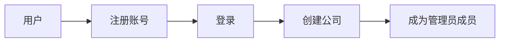

### 数据流

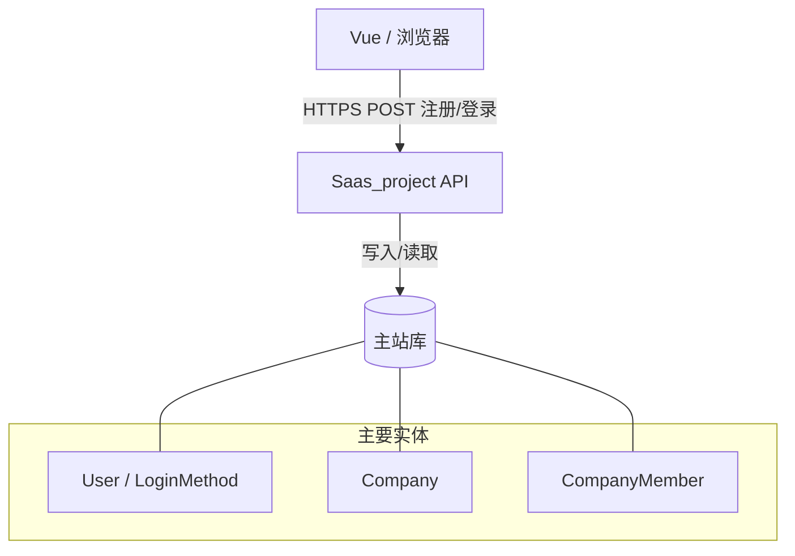

### 步骤与数据落点对照

| 业务步骤 | 数据读写（逻辑） | 说明 |
|---------|------------------|------|
| 手机/邮箱注册 | `User`、`VerificationCode`、可能 `LoginMethod` | 验证码校验后落用户 |
| 登录 | 读 `User`、签发 Session/Token | 见 `accounts` 认证配置 |
| 创建公司 | 写 `Company`、写 `CompanyMember`（管理员） | 租户根与首成员 |
| 可选：初始化计费 | 写 `BillingAccount`、`PricingPackage` 关联 | 见 `billing` 开户逻辑 |

---

## B. 邀请成员加入公司

### 业务流

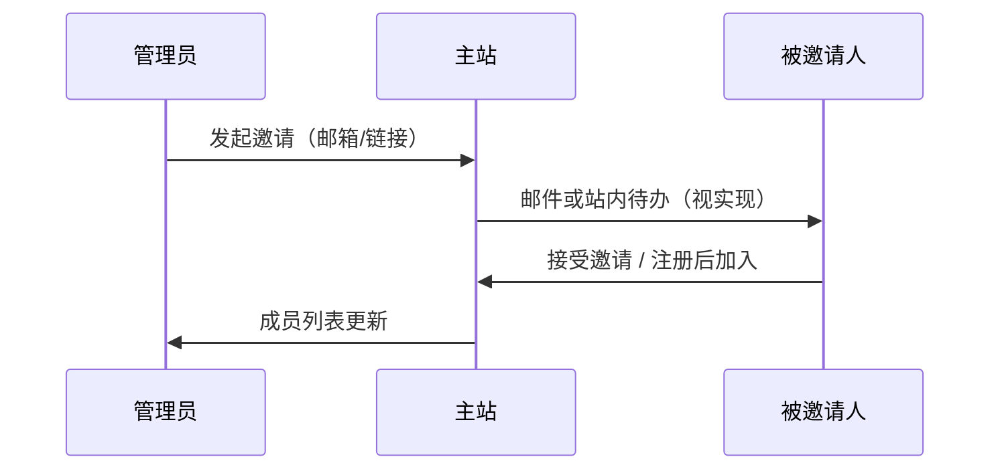

### 数据流

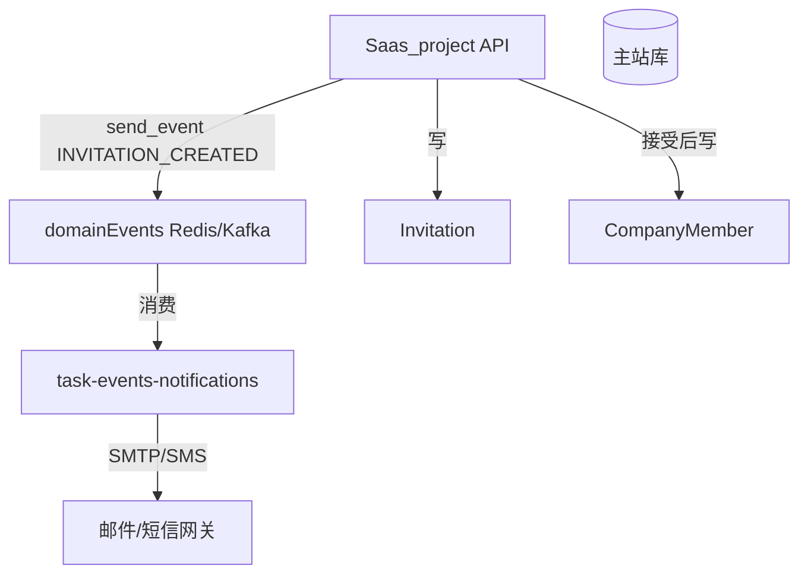

### 步骤与数据落点对照

| 业务步骤 | 数据读写（逻辑） | 说明 |
|---------|------------------|------|
| 创建邀请 | `Invitation` + 关联 `Company` | 令牌/过期策略在模型与视图层 |
| 发送通知 | `INVITATION_CREATED` → task-events-notifications | 见 `DOMAIN_EVENTS.md` |
| 接受邀请 | 写 `CompanyMember`，更新邀请状态 | 需校验令牌与用户身份 |
| 撤销邀请 | 更新 `Invitation` | — |

---

## C. 创建工作空间与项目

### 业务流

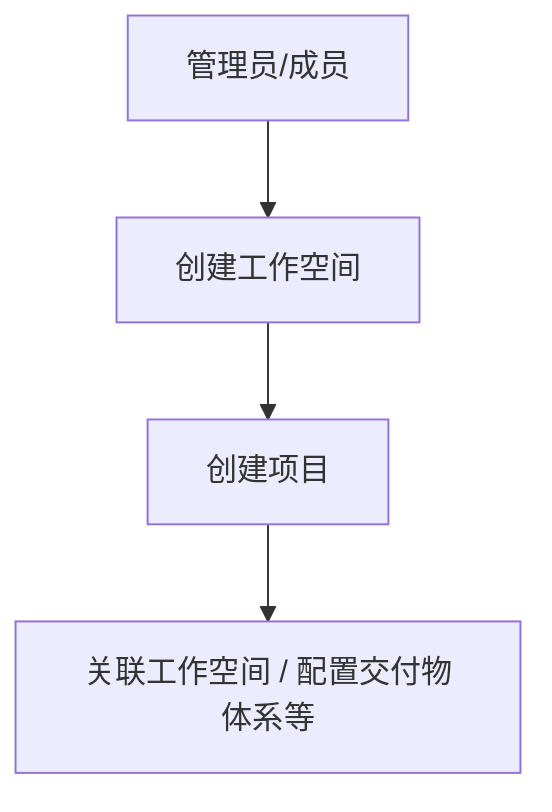

### 数据流

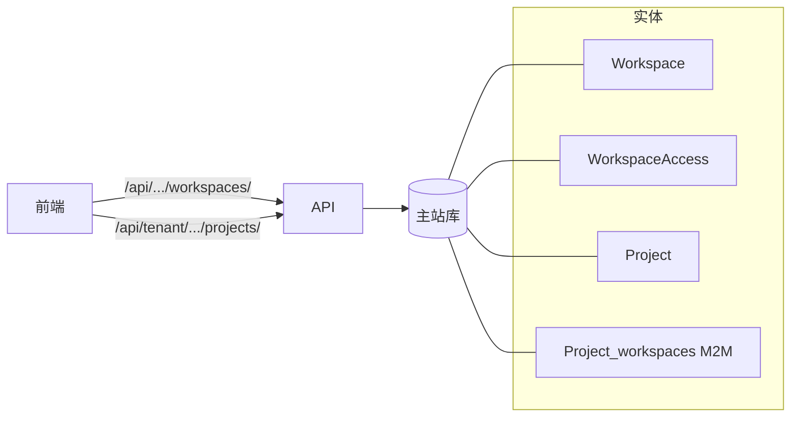

### 步骤与数据落点对照

| 业务步骤 | 数据读写（逻辑） | 说明 |
|---------|------------------|------|
| 创建工作空间 | `Workspace`、`WorkspaceAccess`（若启用） | 租户 ID 与成员权限校验 |
| 创建项目 | `Project`（`company_id`）、多对多关联 `Workspace` | 可选 `TenantInstalledImage` |
| 配置交付物/状态列 | `DeliverableSystem` 系列、`TenantProgressColumn` 等 | 见 `projects` / `column_systems` |

---

## D. 创建任务并指派

### 业务流

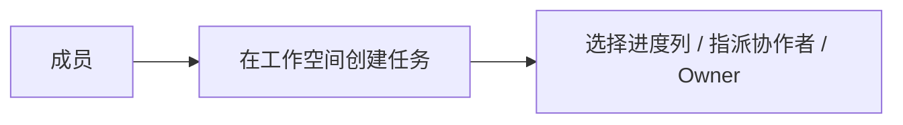

### 数据流

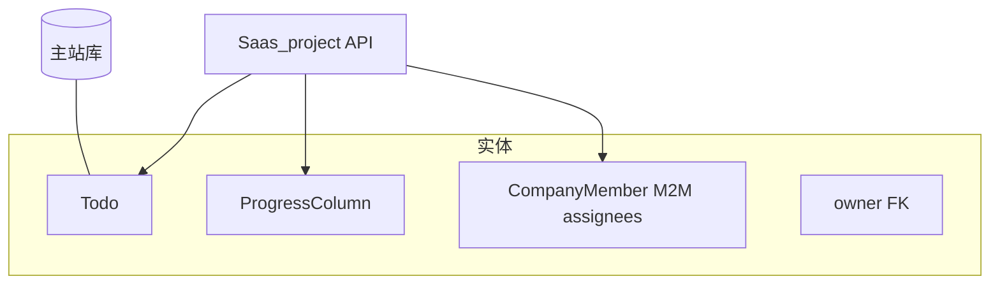

### 步骤与数据落点对照

| 业务步骤 | 数据读写（逻辑） | 说明 |
|---------|------------------|------|
| 创建任务 | 写 `Todo`（`workspace_id`、`progress_column_id` 等） | 可挂 `DeliverableObj`、`TenantInstalledImage` |
| 指派 | 更新 `Todo.assignees` M2M | 目标为 `CompanyMember` |
| 设 Owner | 写 `Todo.owner_id` | API 层常强制业务必填 |
| 扣费（若策略在创建时触发） | 读/写 `BillingAccount`、`BillingTransaction` | 以实际计费服务为准 |

---

## E. 云平台授权与租户镜像选用

### 业务流

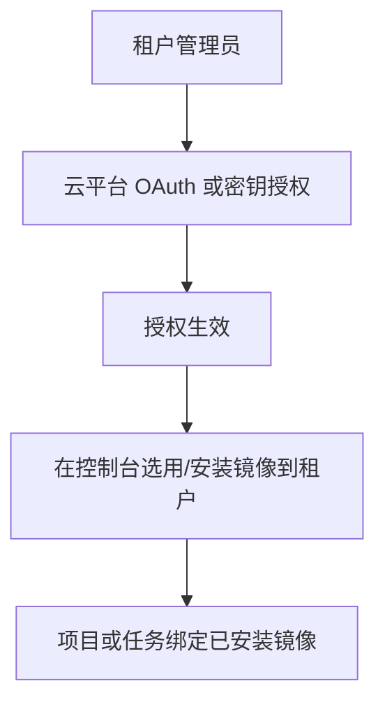

### 数据流

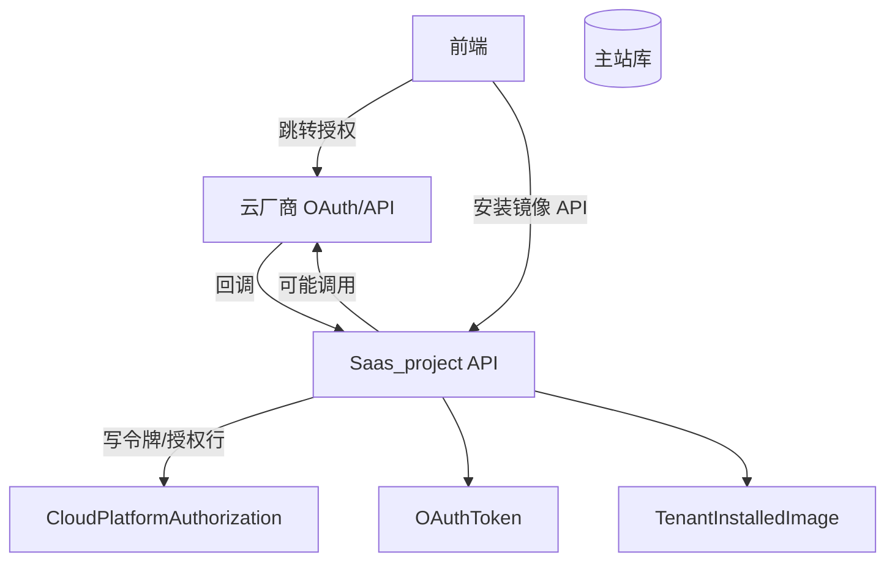

### 步骤与数据落点对照

| 业务步骤 | 数据读写（逻辑） | 说明 |
|---------|------------------|------|
| OAuth 回调 | 写/更新 `OAuthToken`、`CloudPlatformAuthorization` | 回调路径见 `02_应用架构` |
| 安装镜像到租户 | 写 `TenantInstalledImage` | 与 `Project` / `Todo` 可外键关联 |
| 拉取规格/地域 | 读/写 `CloudInstanceType`、配置类表 | 与云 SDK 同步策略因版本而异 |

---

## F. 启动任务云环境（含 SSE 状态）

### 业务流

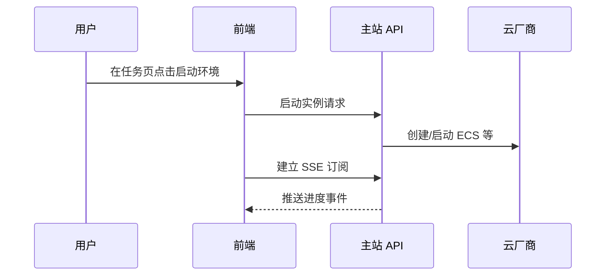

### 数据流

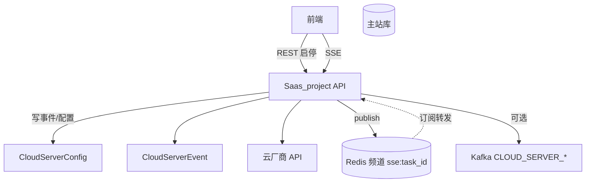

### 步骤与数据落点对照

| 业务步骤 | 数据读写（逻辑） | 说明 |
|---------|------------------|------|
| 请求启动 | 写/更新 `CloudServerConfig`、写 `CloudServerEvent` | 与任务、工作空间 URL 嵌套 |
| SSE 订阅 | 读 Redis `sse:{task_id}`；连接管理在 `core.sse` | 见 `urls.py` 中 SSE 路由 |
| 状态推进 | 云侧回调或轮询结果写库 + `Redis publish` | 前端收到 SSE 更新 UI |
| 计费触发 | 可能写 `BillingTransaction` | 「服务器启动」类单价见 `PricingPackage` / 锁价字段 |
| 异步广播 | `Kafka` 云启停主题 | 见集成文档 |

---

## G. 积分账户与充值回调

### 业务流

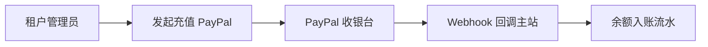

### 数据流

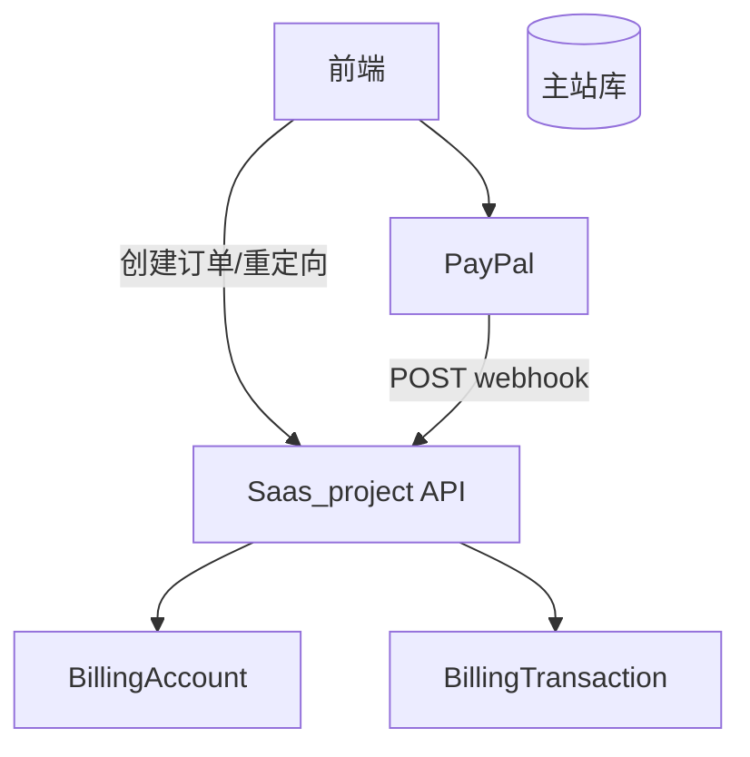

### 步骤与数据落点对照

| 业务步骤 | 数据读写（逻辑） | 说明 |
|---------|------------------|------|
| 展示余额/套餐 | 读 `BillingAccount`、`PricingPackage`（全局） | 锁价字段在账户行上 |
| Webhook 入账 | 写 `BillingTransaction`、更新 `BillingAccount.balance` | 须校验签名/幂等 |
| 消费扣减 | 写 `BillingTransaction`（consumption） | 与任务/Token 等策略绑定 |

---

## H. 域事件 → 出站通知（邮件/短信）

### 业务流

主业务在 **事务内** 落库；**事务外** 通过领域事件触发出站通知，避免阻塞请求。

### 数据流

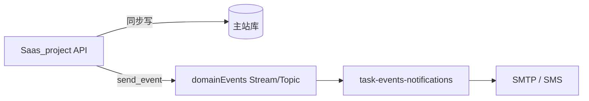

### 典型事件与消费（逻辑）

| 领域事件 | 主站落库（已发生） | notifications 侧 |
|---------|-------------------|------------------|
| `EMAIL_SENT` | 业务实体已提交（如注册、验证码） | 直接 SMTP（Producer 已预渲染 subject/body） |
| `INVITATION_CREATED` | `Invitation` 已存在 | Go 模板渲染 + SMTP/SMS |
| `USER_ACTIVATED` | 用户已激活 | 欢迎邮件/短信（内联文案） |

权威列表见 `Saas_project/docs/integration/DOMAIN_EVENTS.md`。

---

## I. 镜像市场上架与主站消费

### 业务流

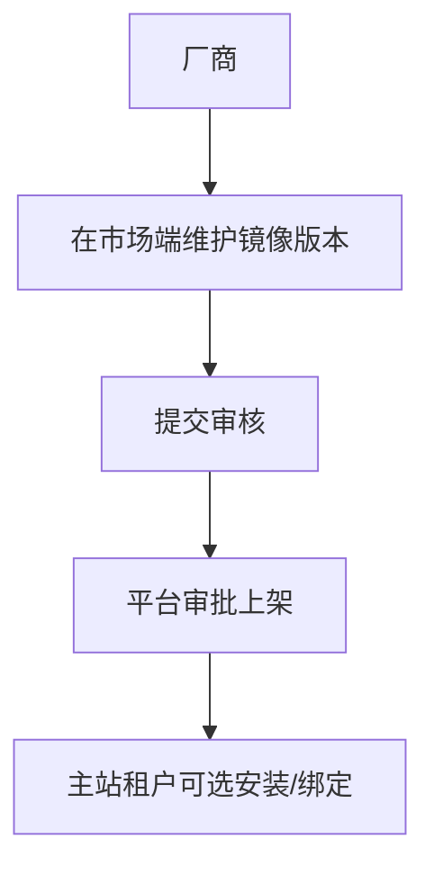

### 数据流（跨库、无 FK）

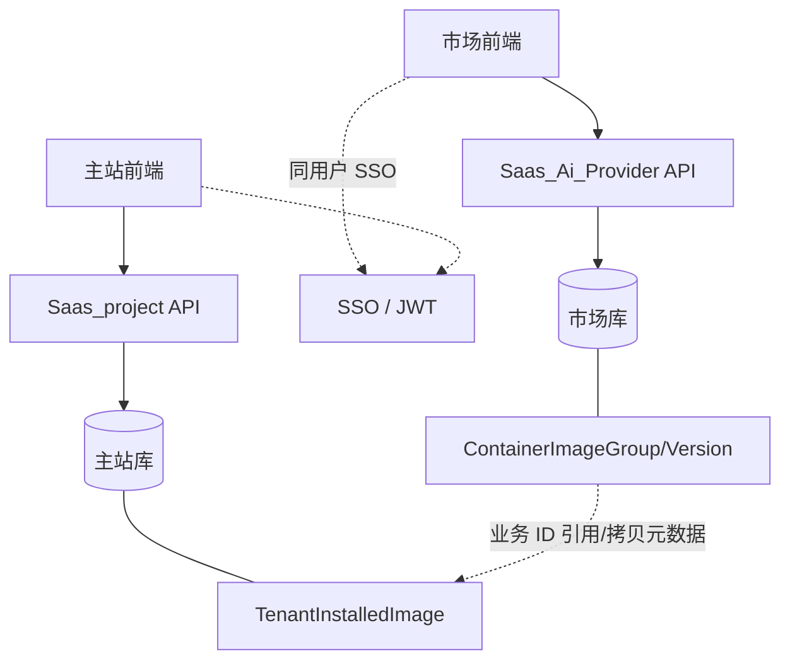

### 步骤与数据落点对照

| 业务步骤 | 数据读写（逻辑） | 说明 |
|---------|------------------|------|
| 厂商维护镜像 | 写市场库 `Vendor`、`ContainerImage*` | 状态机：草稿/待审/上架等 |
| 主站安装镜像 | 写主站 `TenantInstalledImage` | 存主站侧可用镜像行，非跨库外键 |
| 用户身份对齐 | `Vendor.saas_user_id` ↔ 主站 `User.id` | 见 SSO 文档 |

---

## 与架构文档的衔接

| 主题 | 文档 |
|------|------|
| 业务域总览 | [01_业务架构.md](01_业务架构.md) |
| API 前缀与部署 | [02_应用架构.md](02_应用架构.md) |
| 表与主题域 | [03_数据架构.md](03_数据架构.md) |
| 安全与集成矩阵 | [04_跨系统集成与安全约束.md](04_跨系统集成与安全约束.md) |

## 修订记录

| 日期 | 说明 |
|------|------|
| 2026-05-13 | 初版：9 组业务流与数据流对照表 |
| 2026-06-01 | 章节 H/B 对齐 task-events-notifications 与 domainEvents |
