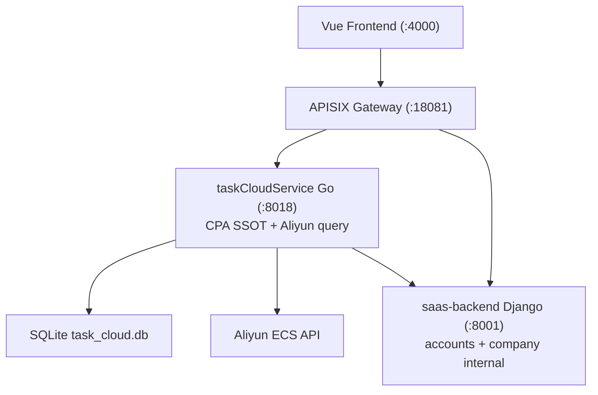

# v10 Application Integration — Mermaid Diagram

> 架构版本: v10 🎯 target | 作者: claude | 日期: 2026-07-07 10:16
> 迭代: Cloud Platform CPA + Aliyun Query API Go SSOT

## v10 数据流变更

| 数据流 | v9 | v10 |
|--------|----|-----|
| GW → TCS `cloud-platform/*/cloud/*` | 误路由 / Django 并行 | ✅ 唯一路径 |
| CPA CRUD | Django ORM | 🟢 task_cloud.db |
| regions/zones/price | Django aliyun SDK | 🟢 taskCloudService aliyun/ |
| BE_ALI 查询 | active | 🔴 DEPRECATED |

## 变更图例

| 标记 | 含义 |
|------|------|
| 🟡 TCS | CPA + Aliyun 查询真源 |
| 🔴 BE_ALI | tenant_cloud_* / providers 查询废弃 |
