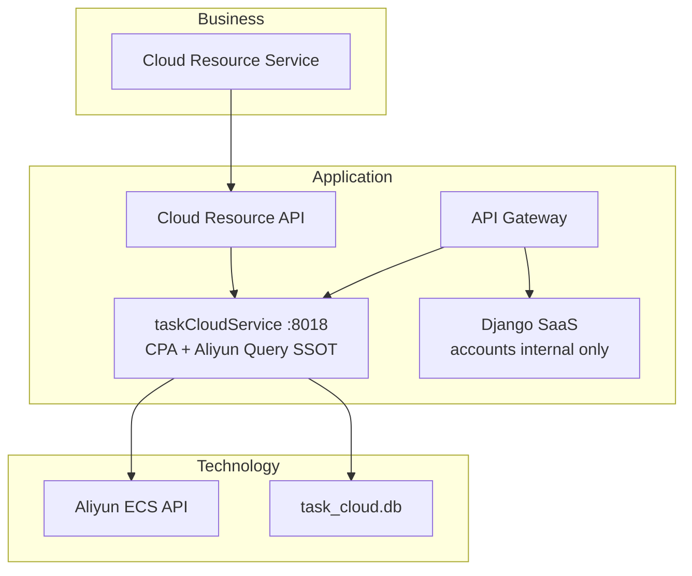

# v10 Enterprise Landscape — Mermaid Diagram

> 架构版本: v10 🎯 target | 作者: claude | 日期: 2026-07-07 10:16
> 迭代: Cloud Platform CPA + Aliyun Query API Go SSOT

## Plateau v9 → v10

- **v9**: CloudServerConfig Go；CPA/查询仍 Django
- **v10**: Cloud 域授权 + 查询统一 taskCloudService
