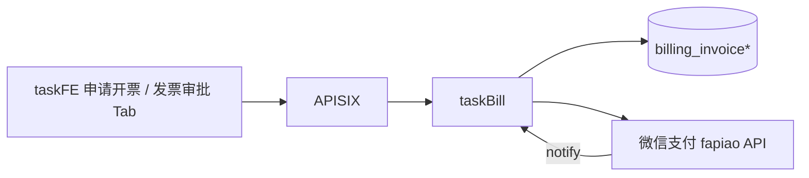

# v100 application-integration

```mermaid
flowchart LR
  FE[taskFE 申请开票 / 发票审批 Tab] --> GW[APISIX]
  GW --> BILL[taskBill]
  BILL --> INV[(billing_invoice*)]
  BILL --> WX[微信支付 fapiao API]
  WX -->|notify| BILL
```
