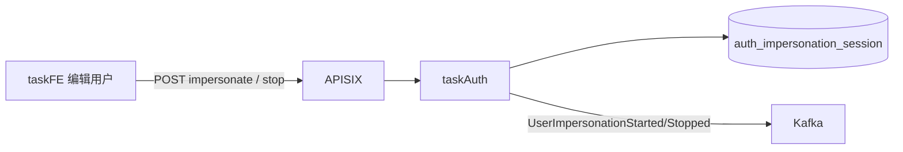

# v102 application-integration

```mermaid
flowchart LR
  FE[taskFE 编辑用户]
  GW[APISIX]
  AUTH[taskAuth]
  T[(auth_impersonation_session)]
  K[Kafka]
  FE -->|"POST impersonate / stop"| GW --> AUTH
  AUTH --> T
  AUTH -->|"UserImpersonationStarted/Stopped"| K
```
