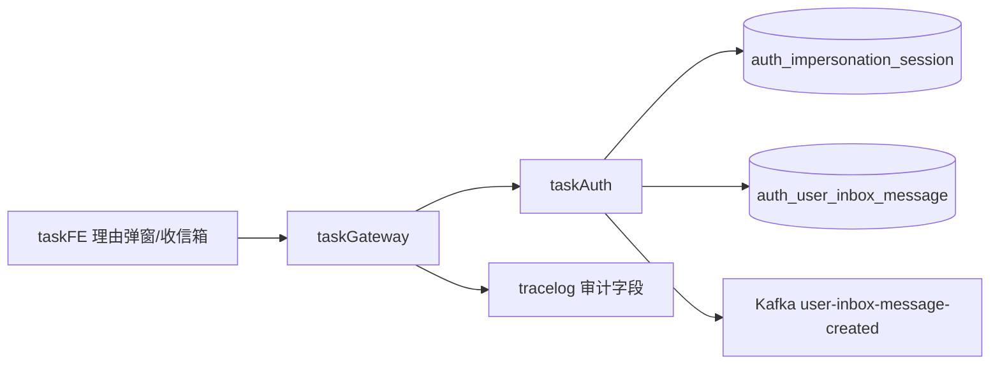

# v103 application-integration — impersonation audit + inbox

```mermaid
flowchart LR
  FE[taskFE 理由弹窗/收信箱] --> GW[taskGateway]
  GW --> AUTH[taskAuth]
  GW --> TL[tracelog 审计字段]
  AUTH --> SESS[(auth_impersonation_session)]
  AUTH --> INBOX[(auth_user_inbox_message)]
  AUTH --> K[Kafka user-inbox-message-created]
```
