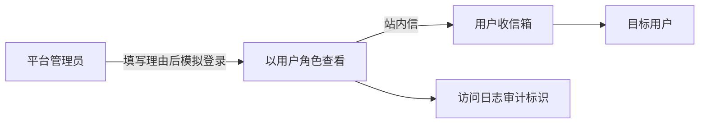

# v103 enterprise-landscape — impersonation audit + inbox

```mermaid
flowchart LR
  Admin[平台管理员] -->|填写理由后模拟登录| Imp[以用户角色查看]
  Imp -->|站内信| Inbox[用户收信箱]
  Inbox --> User[目标用户]
  Imp --> Audit[访问日志审计标识]
```
