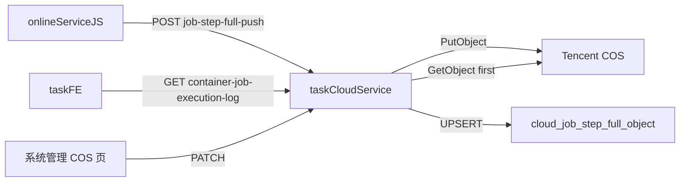

# v104 application-integration mermaid

层图继续 UPSERT `cloud_layer_graph_snapshot`。job 终态 `job-step-full-push` → COS `workspace_{wid}/task_{tid}/comment_{cid}/step_full.json`。GET 执行日志优先 COS。

```mermaid
flowchart LR
  OSJS[onlineServiceJS] -->|POST job-step-full-push| Cloud[taskCloudService]
  Cloud -->|PutObject| COS[Tencent COS]
  Cloud -->|UPSERT| Ptr[cloud_job_step_full_object]
  FE[taskFE] -->|GET container-job-execution-log| Cloud
  Cloud -->|GetObject first| COS
  Admin[系统管理 COS 页] -->|PATCH| Cloud
```
