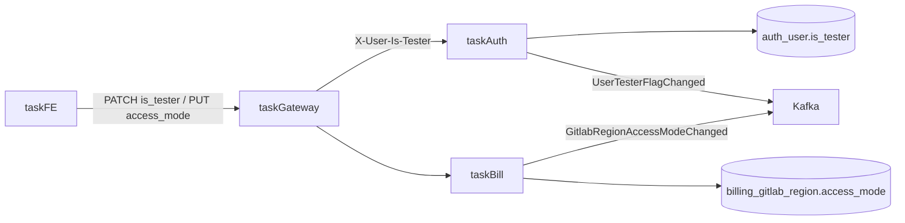

# v105 application-integration mermaid

超管 PATCH `is_tester`；forward-auth 注入 `X-User-Is-Tester`。taskBill 区域 `access_mode`：development 仅测试账号目录可见并可购买。

```mermaid
flowchart LR
  FE[taskFE] -->|PATCH is_tester / PUT access_mode| GW[taskGateway]
  GW -->|X-User-Is-Tester| Auth[taskAuth]
  GW --> Bill[taskBill]
  Auth --> User[(auth_user.is_tester)]
  Bill --> Region[(billing_gitlab_region.access_mode)]
  Auth -->|UserTesterFlagChanged| Kafka[Kafka]
  Bill -->|GitlabRegionAccessModeChanged| Kafka
```
