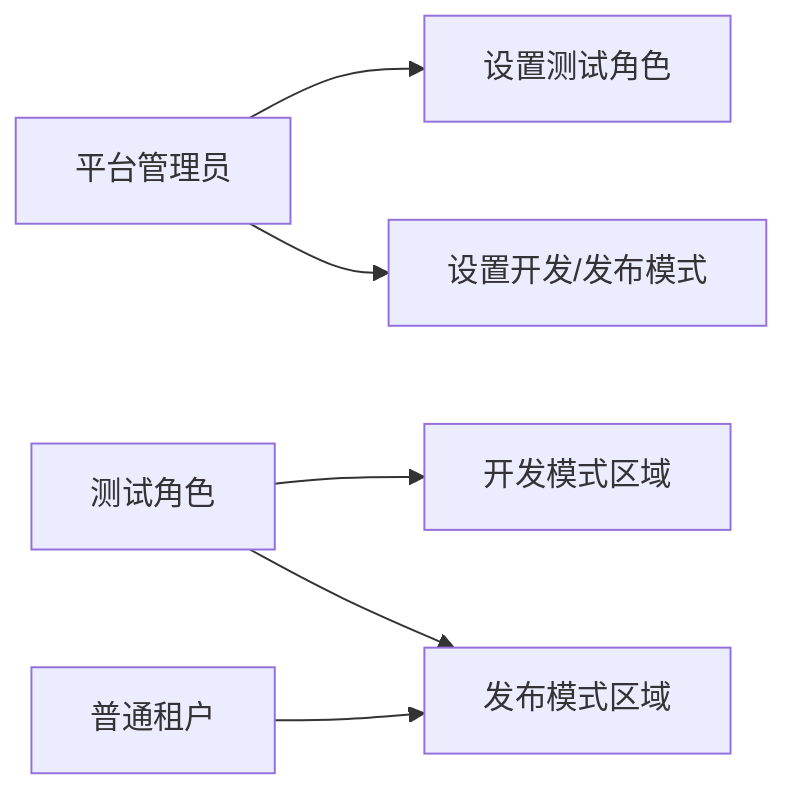

# v105 enterprise-landscape mermaid

平台管理员设置测试角色与区域模式。测试账号可使用开发/发布区；普通租户仅发布区。

```mermaid
flowchart LR
  Admin[平台管理员] --> SetRole[设置测试角色]
  Admin --> SetMode[设置开发/发布模式]
  Tester[测试角色] --> Dev[开发模式区域]
  Tester --> Rel[发布模式区域]
  Tenant[普通租户] --> Rel
```
