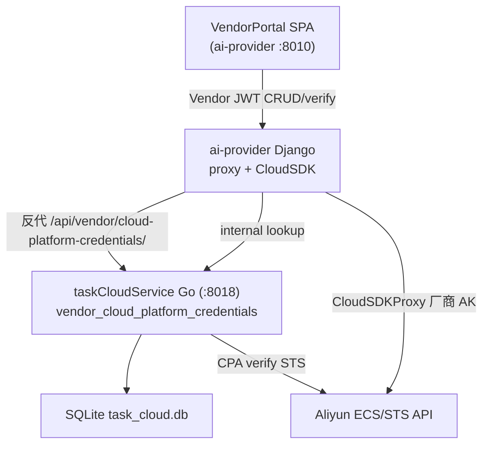

# v11 Application Integration — Mermaid Diagram

> 架构版本: v11 🎯 target | 作者: claude | 日期: 2026-07-07 22:41
> 迭代: Vendor Cloud Test Credentials SSOT

## v10 → v11 数据流变更

| 数据流 | v10 | v11 |
|--------|-----|-----|
| 厂商云镜像登记凭证 | ai-provider 读 env `ALIYUN_ACCESS_KEY` | 🟢 厂商自配 → TCS → internal lookup |
| VendorPortal 测试密钥 | 无 UI | 🟢 新 Tab + CRUD/verify |
| ai-provider → TCS | 无（租户 CPA 走网关） | 🟢 同源反代 + internal lookup |

## 变更图例

| 标记 | 含义 |
|------|------|
| 🟢 NEW | vendor_cloud_platform_credentials + Vendor JWT API |
| 🟡 MODIFIED | ai-provider 凭证解析链 + VendorPortal |
| 🔴 DEPRECATED | 平台 env AK 作为厂商登记唯一来源 |
