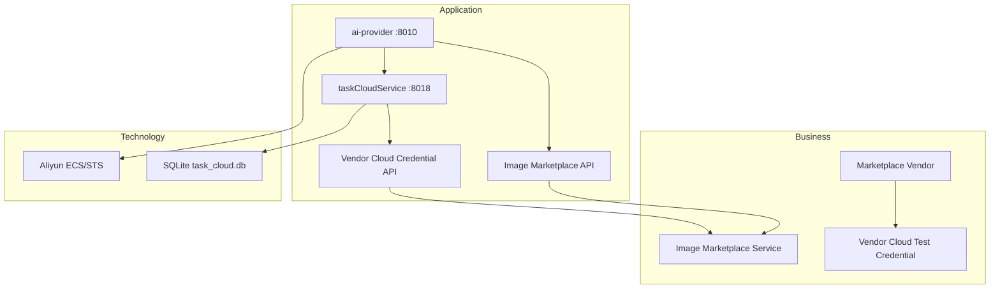

# v11 Enterprise Landscape — Mermaid Diagram

> 架构版本: v11 🎯 target | 作者: claude | 日期: 2026-07-07 22:41
> 迭代: Vendor Cloud Test Credentials SSOT

## Plateau v10 → v11

- **v10**: 厂商门户云查询依赖平台 env AK；CPA/查询已在 taskCloudService
- **v11**: 厂商自管测试凭证 → taskCloudService SQLite → ai-provider internal lookup → CloudSDKProxy
- **Gap closed**: 厂商无法自配云测试密钥（WP-v11-vendor-cloud-credentials）
