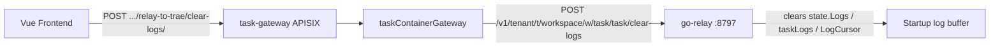

# v12 application-integration — relay clear-logs (path scope)

- Plateau v11 → Gap: server log buffer not cleared on UI clear
- WorkPackage: path-scoped clear-logs
- Plateau v12: clear-logs path contract
