# v12 Enterprise Landscape — Mermaid Diagram

> 架构版本: v12 ✅ current | 作者: claude | 日期: 2026-08-05 18:00
> 迭代: enterprise-landscape 基线回填（v11 → v12 结构变迁）
> 基于: v11 (2026-07-07) + v64 application-integration tip | 端口以 conf/runAll.yaml 为 SSOT

```mermaid
graph TB;
  subgraph Business
    developer["Developer"]
    admin["Platform Admin"]
    enterprise["Enterprise Customer"]
    vendor["Marketplace Vendor"]
    identitySvc["Identity & Access Service (RBAC)"]
    referralSvc["Referral & Growth Service"]
    imageMarket["Image Marketplace Service"]
  end
  subgraph Application
    gateway["API Gateway (APISIX :18081)"]
    authSvc["taskAuth :8003 [PDP + 微信身份]"]
    gitOauthSvc["taskGitOauth :8002"]
    billSvc["taskBill :8004"]
    referralSvcApp["taskReferral :8025"]
    aiProvider["taskAiProvider :8010"]
    aiEndpoint["taskAIEndPoint :8013"]
    containerGW["taskContainerGateway :8014"]
    credSvc["taskCredentialService :8015"]
    taskProjectSvc["taskProjectService :8016"]
    taskTaskSvc["taskTaskService :8017"]
    taskCloudSvc["taskCloudService :8018"]
    taskAICommentSvc["taskAIComment :8019"]
    tenantSvc["taskTenantService :8020"]
    sseSvc["taskSSE :8007"]
    eventsSvc["taskEvents (Kafka intents)"]
    feSvc["taskFE (Vue SPA)"]
    authDB["taskAuth DB (+wechat_identity)"]
    tenantDB["taskTenant DB (+RBAC)"]
    cloudDB["taskCloud DB"]
    billDB["taskBill DB (+payment_pending)"]
  end
  subgraph Technology
    goRuntime["Go Runtime"]
    gitlab["GitLab CE :8012"]
    aliyun["Aliyun ECS/STS"]
    llm["Upstream LLM (DeepSeek/OpenAI)"]
    kafka["Kafka"]
    redis["Redis"]
    sqlite["SQLite (per-service)"]
    djangoRetired["Django saas-backend [RETIRED v57]"]
  end
  gateway --> authSvc
  gateway --> tenantSvc
  gateway --> taskProjectSvc
  gateway --> taskTaskSvc
  gateway --> taskCloudSvc
  gateway --> billSvc
  gateway --> feSvc
  authSvc --> authDB
  tenantSvc --> tenantDB
  taskCloudSvc --> cloudDB
  billSvc --> billDB
  aiProvider --> aliyun
  aiEndpoint --> llm
  eventsSvc --> kafka
  sseSvc --> redis
  authSvc --> identitySvc
  tenantSvc --> identitySvc
  billSvc --> referralSvc
  aiProvider --> imageMarket
  taskCloudSvc --> imageMarket
```

## Plateau v11 → v12

- **v11** (2026-07-07): 7 个应用组件 — 仍含 Django SaaS 平台与 ai-provider Django；厂商测试密钥 SSOT 落地
- **v12** (2026-08-05, 基线回填): 全量 Go 微服务拓扑
  - 🟢 新增服务: taskGitOauth (v29)、taskAiProvider (v32)、taskTenantService (v39)、taskReferral、taskSSE、taskAgentSupport、taskAIEndPoint、taskContainerGateway、taskCredentialService、taskAIComment、taskEvents intents、shareLib/authz (v63)
  - 🟡 演进: taskAuth = PDP 集中授权 (v63) + wechat_identity (v64)；taskBill + billing_payment_pending (v64)
  - 🔴 退役: Django saas-backend 完全移除 (v57, 2026-07-30)
- **Gap closed**: v11 视图与真实拓扑脱节（缺新服务 / Django 未退役）— WP-v12-baseline-backfill
