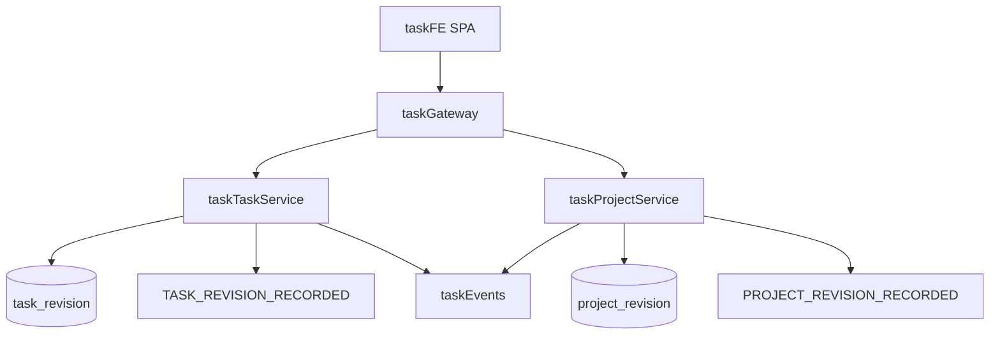
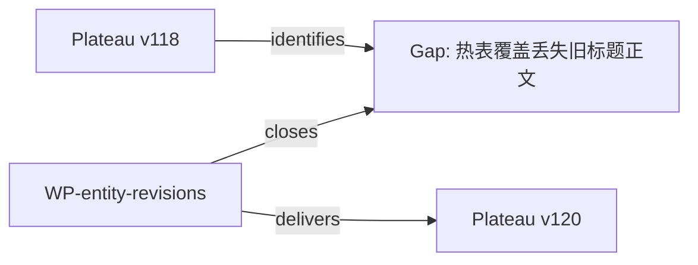

# v120 application-integration — mermaid

```mermaid
flowchart TB
  fe[taskFE SPA]
  gw[taskGateway]
  task[taskTaskService]
  proj[taskProjectService]
  ev[taskEvents]
  tr[(task_revision)]
  pr[(project_revision)]
  evT[TASK_REVISION_RECORDED]
  evP[PROJECT_REVISION_RECORDED]
  fe --> gw
  gw --> task
  gw --> proj
  task --> tr
  proj --> pr
  task --> evT
  proj --> evP
  task --> ev
  proj --> ev
```

# 架构变迁

```mermaid
flowchart LR
  p118[Plateau v118] -->|identifies| gap[Gap: 热表覆盖丢失旧标题正文]
  wp[WP-entity-revisions] -->|closes| gap
  wp -->|delivers| p120[Plateau v120]
```
