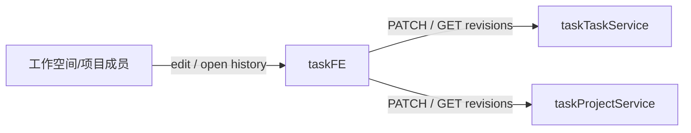
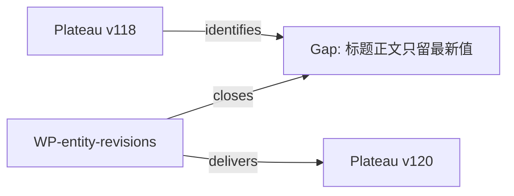

# v120 enterprise-landscape — mermaid

```mermaid
flowchart LR
  editor[工作空间/项目成员]
  fe[taskFE]
  task[taskTaskService]
  proj[taskProjectService]
  editor -->|edit / open history| fe
  fe -->|PATCH / GET revisions| task
  fe -->|PATCH / GET revisions| proj
```

# 架构变迁

```mermaid
flowchart LR
  p118[Plateau v118] -->|identifies| gap[Gap: 标题正文只留最新值]
  wp[WP-entity-revisions] -->|closes| gap
  wp -->|delivers| p120[Plateau v120]
```
