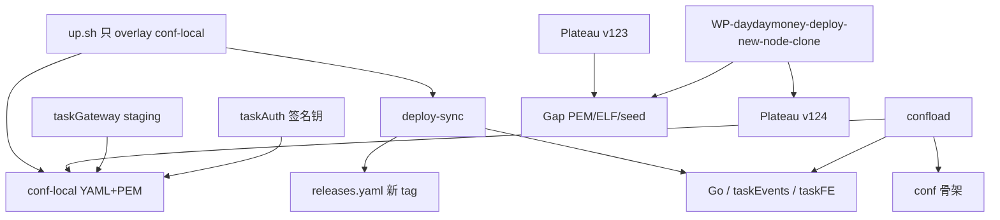

# v124 application-integration — clone-run 加载链 (current)

```mermaid
graph TD;
  upsh["up.sh 只 overlay conf-local"];
  conflocal["conf-local YAML+PEM"];
  pins["releases.yaml 新 tag"];
  sync["deploy-sync"];
  confload["confload"];
  skel["conf 骨架"];
  gw["taskGateway staging"];
  auth["taskAuth 签名钥"];
  svc["Go / taskEvents / taskFE"];
  p123["Plateau v123"];
  gap["Gap PEM/ELF/seed"];
  wp["WP-daydaymoney-deploy-new-node-clone"];
  p124["Plateau v124"];
  upsh --> conflocal;
  upsh --> sync;
  sync --> pins;
  sync --> svc;
  confload --> skel;
  confload --> conflocal;
  confload --> svc;
  gw --> conflocal;
  auth --> conflocal;
  p123 --> gap;
  wp --> gap;
  wp --> p124;
```
