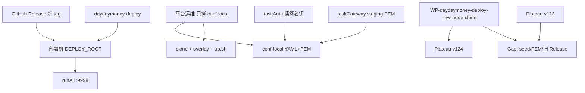

# v124 enterprise-landscape — 新节点 clone-run (current)

```mermaid
graph TD;
  ops["平台运维 只拷 conf-local"];
  cloneRun["clone + overlay + up.sh"];
  cfgRepo["daydaymoney-deploy"];
  ghRel["GitHub Release 新 tag"];
  host["部署机 DEPLOY_ROOT"];
  conflocal["conf-local YAML+PEM"];
  runAll["runAll :9999"];
  gw["taskGateway staging PEM"];
  auth["taskAuth 读签名钥"];
  p123["Plateau v123"];
  gap["Gap: seed/PEM/旧 Release"];
  wp["WP-daydaymoney-deploy-new-node-clone"];
  p124["Plateau v124"];
  ops --> cloneRun;
  ops --> conflocal;
  cfgRepo --> host;
  ghRel --> host;
  host --> runAll;
  gw --> conflocal;
  auth --> conflocal;
  p123 --> gap;
  wp --> gap;
  wp --> p124;
```
