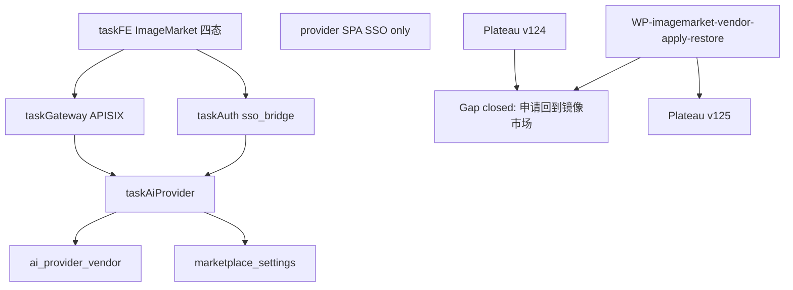

# v125 application-integration — 镜像市场申请与 SSO (current)

```mermaid
graph TD;
  fe["taskFE ImageMarket 四态"];
  gw["taskGateway APISIX"];
  auth["taskAuth sso_bridge"];
  aip["taskAiProvider"];
  vendor["ai_provider_vendor"];
  settings["marketplace_settings"];
  portal["provider SPA SSO only"];
  p124["Plateau v124"];
  gap["Gap closed: 申请回到镜像市场"];
  wp["WP-imagemarket-vendor-apply-restore"];
  p125["Plateau v125"];
  fe --> gw;
  gw --> aip;
  fe --> auth;
  auth --> aip;
  aip --> vendor;
  aip --> settings;
  p124 --> gap;
  wp --> gap;
  wp --> p125;
```
