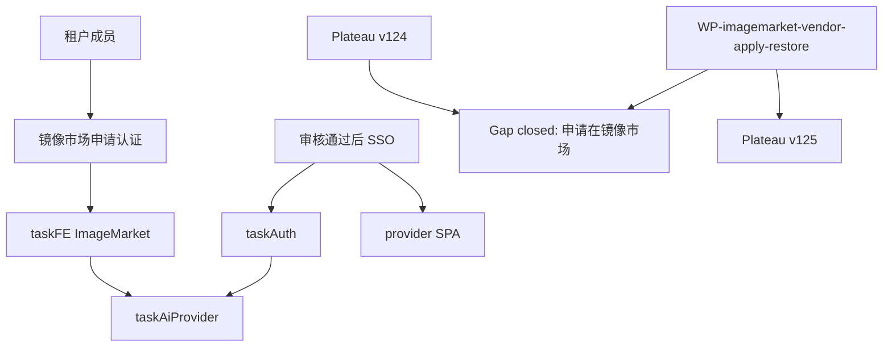

# v125 enterprise-landscape — 申请认证回到租户镜像市场 (current)

```mermaid
graph TD;
  member["租户成员"];
  apply["镜像市场申请认证"];
  sso["审核通过后 SSO"];
  fe["taskFE ImageMarket"];
  aip["taskAiProvider"];
  auth["taskAuth"];
  portal["provider SPA"];
  p124["Plateau v124"];
  gap["Gap closed: 申请在镜像市场"];
  wp["WP-imagemarket-vendor-apply-restore"];
  p125["Plateau v125"];
  member --> apply;
  apply --> fe;
  fe --> aip;
  sso --> auth;
  auth --> aip;
  sso --> portal;
  p124 --> gap;
  wp --> gap;
  wp --> p125;
```
