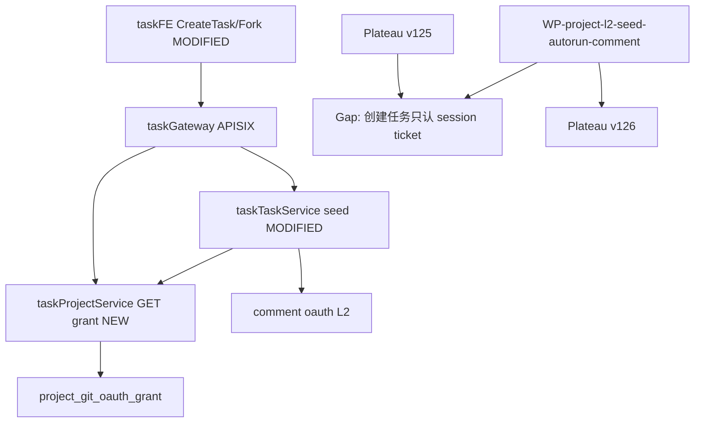

# v126 application-integration — 项目 L2 种下自动运行评论 (current)

```mermaid
graph TD;
  feCreate["taskFE CreateTask/Fork MODIFIED"];
  gw["taskGateway APISIX"];
  proj["taskProjectService GET grant NEW"];
  task["taskTaskService seed MODIFIED"];
  pgrant["project_git_oauth_grant"];
  cgrant["comment oauth L2"];
  p125["Plateau v125"];
  gap["Gap: 创建任务只认 session ticket"];
  wp["WP-project-l2-seed-autorun-comment"];
  p126["Plateau v126"];
  feCreate --> gw;
  gw --> proj;
  gw --> task;
  task --> proj;
  proj --> pgrant;
  task --> cgrant;
  p125 --> gap;
  wp --> gap;
  wp --> p126;
```
