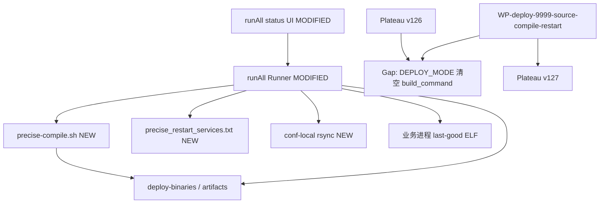

# v127 application-integration — 部署 9999 编排源码编译 (current)

```mermaid
graph TD;
  ui["runAll status UI MODIFIED"];
  runAll["runAll Runner MODIFIED"];
  compile["precise-compile.sh NEW"];
  reg["precise_restart_services.txt NEW"];
  bins["deploy-binaries / artifacts"];
  cl["conf-local rsync NEW"];
  svc["业务进程 last-good ELF"];
  p126["Plateau v126"];
  gap["Gap: DEPLOY_MODE 清空 build_command"];
  wp["WP-deploy-9999-source-compile-restart"];
  p127["Plateau v127"];
  ui --> runAll;
  runAll --> reg;
  runAll --> compile;
  compile --> bins;
  runAll --> cl;
  runAll --> bins;
  runAll --> svc;
  p126 --> gap;
  wp --> gap;
  wp --> p127;
```
