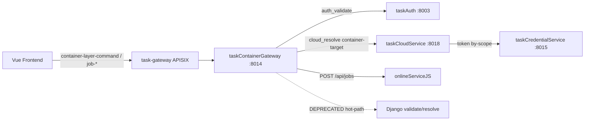
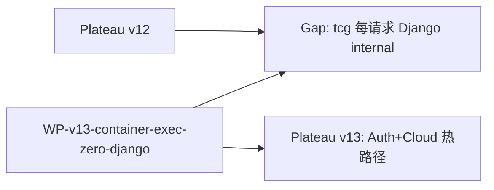

# v13 application-integration — Container Exec Hot-Path Zero-Django

## 架构变迁

- Plateau v12 → Gap: 容器执行仍经 Django `validate-session` / `resolve-container-target`（saas-backend 日志可见；Django 宕则 502）
- WorkPackage: tcg 改接 taskAuth + taskCloudService
- Plateau v13: 执行热路径零 Django
