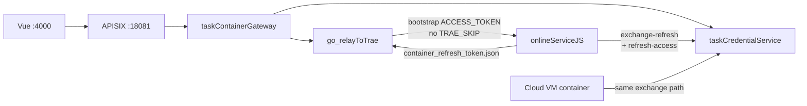

# v14 Application Integration — Mermaid

> relayToTrae Token 生命周期与云主机对齐（2026-07-10）

## 变更摘要

| 标记 | 组件 | 说明 |
|------|------|------|
| 🟡 MODIFIED | go_relayToTrae | 去掉启动前预换票与 TRAE_SKIP；启动后 sync |
| 🟡 MODIFIED | onlineServiceJS | 落盘 access+refresh；模拟路径默认换票 |
| 🔴 DEPRECATED | 父进程首次 exchange + SKIP | 不再作为模拟默认 |
