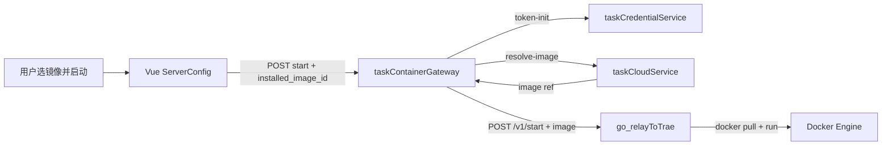

# Application Integration v15 — relay 启动所选镜像

## 变更摘要

- 🟢 Vue → CGW 启动体携带 `installed_image_id`
- 🟢 CGW → Cloud `resolve-image`（复用 mock-run 内部接口）
- 🟡 go_relayToTrae：有 `image` 时 docker pull/run，不再仅跑 host `run.sh`
