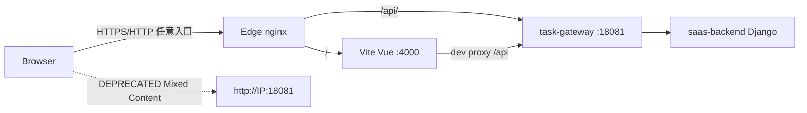

# Application Integration v16 — 多入口同源 API

## 变更摘要

- 🟢 Edge nginx：多域名/IP 入口统一 `/` → Vue、`/api/` → gateway
- 🟡 Vue：`API_BASE_URL` 默认同源相对路径
- 🟡 Vite：恢复 `/api` → gateway 代理
- 🔴 废弃浏览器默认绝对 `http://IP:18081` API 基址（HTTPS Mixed Content）
