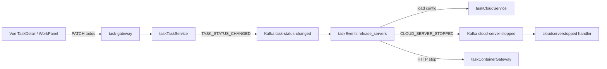

# Application Integration v17 — 任务终态自动释放服务器

## 变更摘要

- 🟢 Kafka topic `task-status-changed` + 事件 `TASK_STATUS_CHANGED`
- 🟢 taskEvents intent：终态时释放 ECS / relay / mock
- 🟡 taskTaskService：状态字段变化后发事件
- 复用既有 `CLOUD_SERVER_STOPPED` 与 container stop 路径
