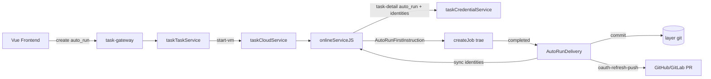

# Application Integration v18 — auto_run 首指令与自动交付

## 变更摘要

- 🟡 taskCredentialService：`auto_run`、`repo_git_identities`
- 🟡 onlineServiceJS：首指令 + 完成后交付
- 🟢 AutoRunFirstInstruction / AutoRunDelivery 应用功能
