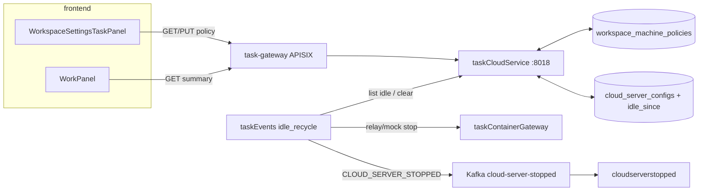

# Application Integration v19 — 工作空间机器节点闲置策略

```mermaid
flowchart LR
  subgraph frontend
    VS[WorkspaceSettingsTaskPanel]
    WP[WorkPanel]
  end
  GW[task-gateway APISIX]
  TCS[taskCloudService :8018]
  TEV[taskEvents idle_recycle]
  CGW[taskContainerGateway]
  CSS[cloudserverstopped]
  POL[(workspace_machine_policies)]
  CSC[(cloud_server_configs + idle_since)]
  KSTOP[Kafka cloud-server-stopped]

  VS -->|GET/PUT policy| GW
  WP -->|GET summary| GW
  GW --> TCS
  TCS <--> POL
  TCS <--> CSC
  TEV -->|list idle / clear| TCS
  TEV -->|CLOUD_SERVER_STOPPED| KSTOP
  KSTOP --> CSS
  TEV -->|relay/mock stop| CGW
```

## 变更摘要

- 🟢 `workspace_machine_policies` + idle recycle intent
- 🟡 taskCloudService start-vm 门禁与闲置复用
- 🟡 Vue 设置页策略 + work-panel 汇总
