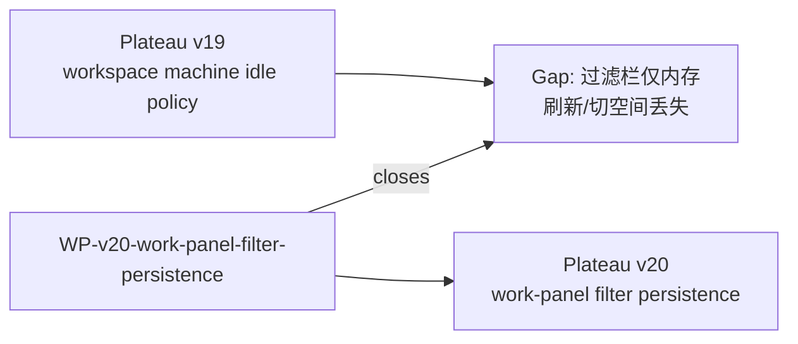
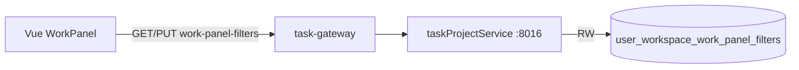

# Application Integration v20 — Mermaid

## 架构变迁 v19 → v20

```mermaid
flowchart LR
  P19[Plateau v19<br/>workspace machine idle policy] --> G[Gap: 过滤栏仅内存<br/>刷新/切空间丢失]
  WP[WP-v20-work-panel-filter-persistence] -->|closes| G
  WP --> P20[Plateau v20<br/>work-panel filter persistence]
```

## 目标拓扑 — 过滤偏好数据流

```mermaid
flowchart LR
  Vue[Vue WorkPanel] -->|GET/PUT work-panel-filters| GW[task-gateway]
  GW --> TPS[taskProjectService :8016]
  TPS -->|RW| TBL[(user_workspace_work_panel_filters)]
```
