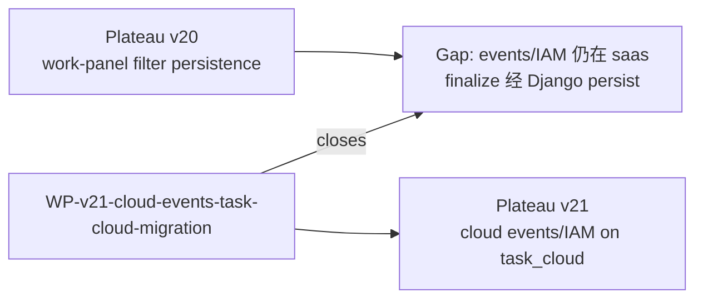
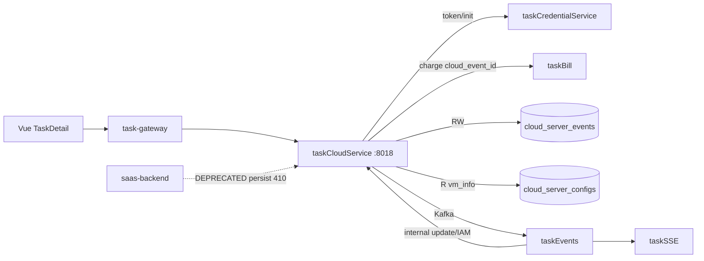
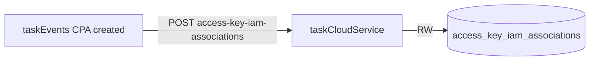

# Application Integration v21 — Mermaid

## 架构变迁 v20 → v21

```mermaid
flowchart LR
  P20[Plateau v20<br/>work-panel filter persistence] --> G[Gap: events/IAM 仍在 saas<br/>finalize 经 Django persist]
  WP[WP-v21-cloud-events-task-cloud-migration] -->|closes| G
  WP --> P21[Plateau v21<br/>cloud events/IAM on task_cloud]
```

## 目标拓扑 — start-vm 事件 SSOT

```mermaid
flowchart LR
  Vue[Vue TaskDetail] --> GW[task-gateway]
  GW --> Cloud[taskCloudService :8018]
  Cloud -->|token/init| Cred[taskCredentialService]
  Cloud -->|charge cloud_event_id| Bill[taskBill]
  Cloud -->|RW| EV[(cloud_server_events)]
  Cloud -->|R vm_info| CFG[(cloud_server_configs)]
  Cloud -->|Kafka| TE[taskEvents]
  TE -->|internal update/IAM| Cloud
  TE --> SSE[taskSSE]
  Django[saas-backend] -.->|DEPRECATED persist 410| Cloud
```

## 刀 A — IAM

```mermaid
flowchart LR
  TE2[taskEvents CPA created] -->|POST access-key-iam-associations| Cloud2[taskCloudService]
  Cloud2 -->|RW| IAM[(access_key_iam_associations)]
```
