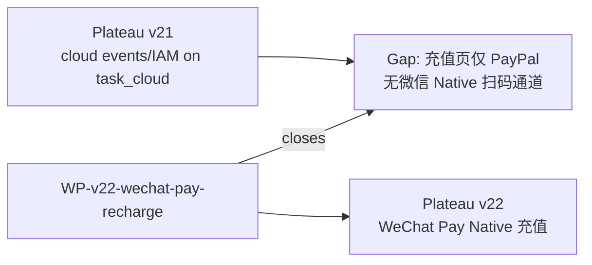
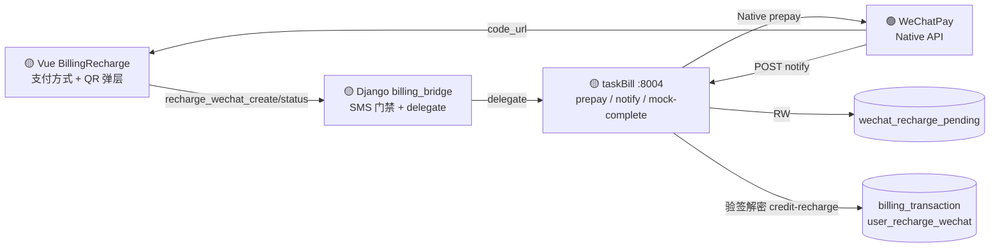
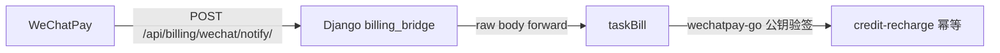
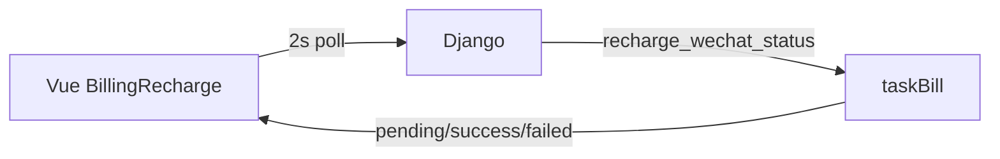

# Application Integration v22 — Mermaid

## 架构变迁 v21 → v22

```mermaid
flowchart LR
  P21[Plateau v21<br/>cloud events/IAM on task_cloud] --> G[Gap: 充值页仅 PayPal<br/>无微信 Native 扫码通道]
  WP[WP-v22-wechat-pay-recharge] -->|closes| G
  WP --> P22[Plateau v22<br/>WeChat Pay Native 充值]
```

## 目标拓扑 — 微信充值主路径

```mermaid
flowchart LR
  Vue["🟡 Vue BillingRecharge<br/>支付方式 + QR 弹层"]
  Django["🟡 Django billing_bridge<br/>SMS 门禁 + delegate"]
  Bill["🟡 taskBill :8004<br/>prepay / notify / mock-complete"]
  WeChat["🟢 WeChatPay<br/>Native API"]
  Pending[(wechat_recharge_pending)]
  Txn[(billing_transaction<br/>user_recharge_wechat)]

  Vue -->|recharge_wechat_create/status| Django
  Django -->|delegate| Bill
  Bill -->|Native prepay| WeChat
  WeChat -->|code_url| Vue
  Bill -->|RW| Pending
  WeChat -->|POST notify| Bill
  Bill -->|验签解密 credit-recharge| Txn
```

## 回调路径 — notify 代理（可选）

```mermaid
flowchart LR
  WeChat2[WeChatPay] -->|POST /api/billing/wechat/notify/| Django2[Django billing_bridge]
  Django2 -->|raw body forward| Bill2[taskBill]
  Bill2 -->|wechatpay-go 公钥验签| Credit[credit-recharge 幂等]
```

## 前端轮询 — 支付成功确认

```mermaid
flowchart LR
  Vue3[Vue BillingRecharge] -->|2s poll| Django3[Django]
  Django3 -->|recharge_wechat_status| Bill3[taskBill]
  Bill3 -->|pending/success/failed| Vue3
```
