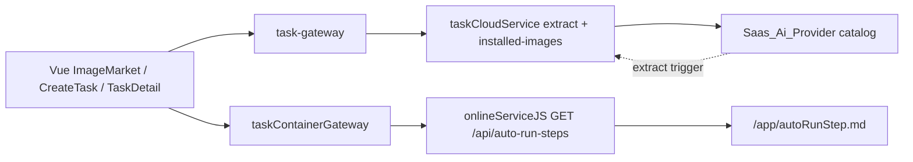

# Application Integration v23 — autoRunStep.md

## 架构变迁 v21→v23

- Plateau v21: cloud events/IAM baseline
- Gap: 无 autoRun 说明；容器未起不可展示
- WorkPackage: 镜像真源 + OCI 抽取 + 市场/创建/详情展示
- Plateau v23: auto_run_steps_md 缓存 + live API
