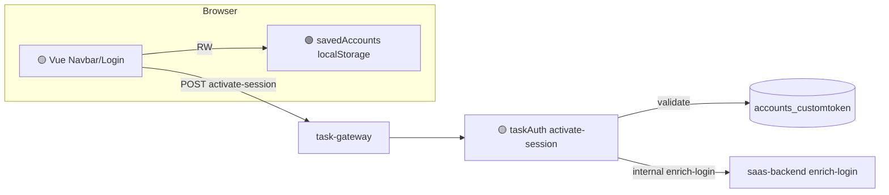

# Application Integration v24 — Navbar Multi-Account Switcher

## Plateau / Gap

- **Plateau v21**: 单会话 Token + 昵称链到 profile
- **Gap**: 无法在导航栏切换多个已登录账号
- **Plateau v24**: 多账号槽 + activate-session + Navbar 下拉
