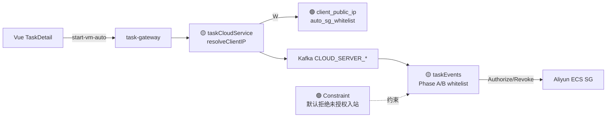

# Application Integration v25 — Auto SG Ingress Whitelist

## Plateau / Gap

- **Plateau v21**: cloud events/IAM 已在 taskCloud；自动 SG 仍全开 `0.0.0.0/0`
- **Plateau v24**: 导航栏多账号切换（并行 target，不改 SG 路径）
- **Gap**: 自动创建安全组入站全开；start-vm-auto 未透传用户公网 IP
- **Plateau v25**: 两阶段入网白名单（用户 IP + 服务器 IP）；撤销全开入站；无新服务组件
