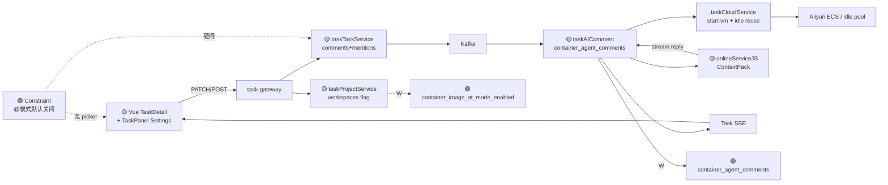

# Application Integration v26 — Container Image @ Mention

## Plateau / Gap

- **Plateau v25**: 自动 SG 入网白名单已交付；无评论 `@` 镜像能力
- **Gap**: 无工作空间 `@` 开关；无镜像 mention 开机器；无 ContainerAgentComment SSE 回写；评论区与 Agent 路径未统一
- **Plateau v26**: 开关 + `@已安装镜像` → idle reuse 开跑 + ContextPack + 容器 Agent 流式回写统一 Feed
