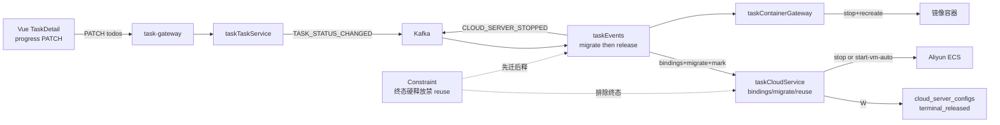

# Application Integration v27 — Terminal Hard Release + Container Migrate

## Plateau / Gap

- **Plateau v25**: archived — 自动 SG 白名单
- **Gap closed**: 终态节点仍可 reuse；共享实例误杀外任务容器；无迁回所属任务
- **Plateau v27 ✅ current**: 硬释放 + `terminal_released`；真实 ECS `start-vm-auto`；mock/reuse 后按原镜像 gateway start
