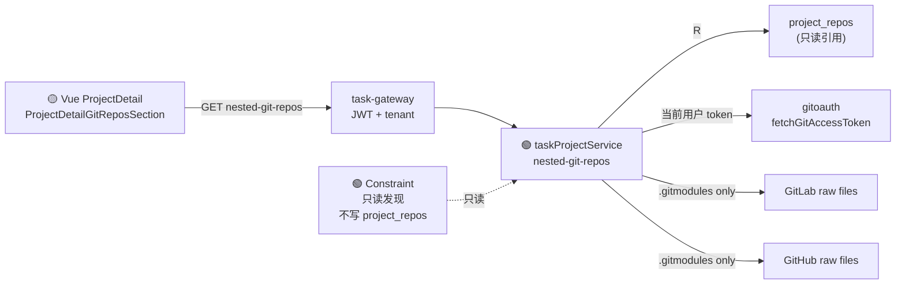

# Application Integration v28 — Project Nested Git Repos

## Plateau / Gap

- **Plateau v27 ✅ current**: 终态硬释放 + 镜像容器迁移
- **Gap closed**: 项目详情仅展示单一父仓 URL，无法发现元仓下嵌套独立 Git 子仓库
- **Plateau v28 🎯 target**: 只读 API + 前端子区块；仅 `.gitmodules` + Git 相对 URL；零 Django 新接口；不写 `project_repos`
