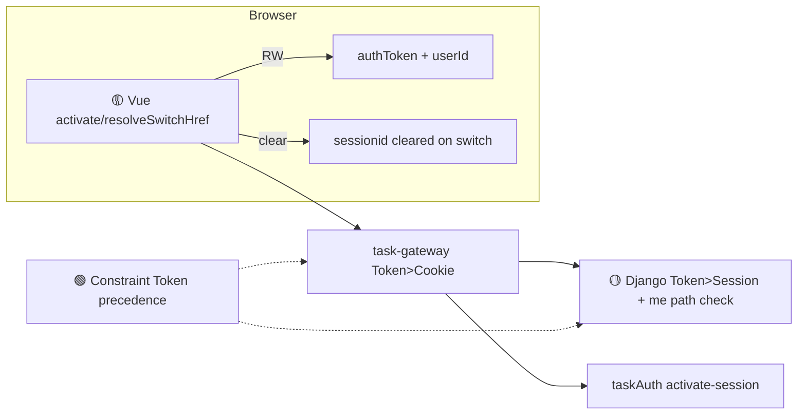

# Application Integration v28 — Multi-Account Isolation

## Plateau / Gap

- **Plateau v24/v27**: 多账号切换已交付，但 Session 可压过 Token；租户 URL 残留
- **Gap**: A→B 切换后 B 仍可见 A 私有资源
- **Plateau v28**: Token 优先 + 清 sessionid + 离开租户 + me() 校验
