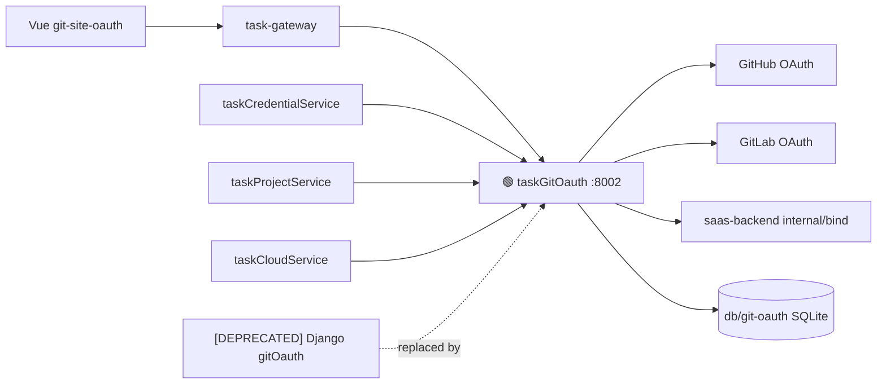

# Application Integration v29 — taskGitOauth Go Migration

## Plateau / Gap

- **Plateau v27 ✅ current**: 终态硬释放基线（并行 v28 nested-git-repos）
- **Gap closed**: gitOauth 仍为 Django，与 Go-first 元规则及运维目标冲突；删除 Python 前置未满足
- **Plateau v29 🎯 target**: `taskGitOauth` Go 直替 :8002；同库同契约；清理 Python `gitOauth`
