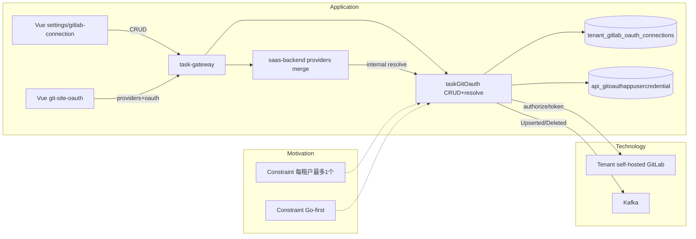
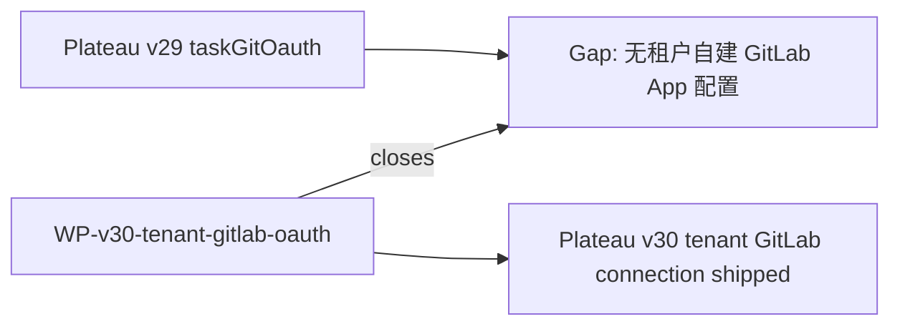

# Application Integration v30 — Tenant GitLab OAuth Connection (shipped)

> 状态：archived（已交付并行切片）。application-integration tip current = v31。

```mermaid
flowchart LR
  subgraph Motivation
    C1[Constraint 每租户最多1个]
    C2[Constraint Go-first]
  end
  subgraph Application
    VA[Vue settings/gitlab-connection]
    VM[Vue git-site-oauth]
    GW[task-gateway]
    GO[taskGitOauth CRUD+resolve]
    DJ[saas-backend providers merge]
    T[(tenant_gitlab_oauth_connections)]
    U[(api_gitoauthappusercredential)]
  end
  subgraph Technology
    GL[Tenant self-hosted GitLab]
    K[Kafka]
  end
  VA -->|CRUD| GW --> GO
  VM -->|providers+oauth| GW
  GW --> DJ
  DJ -->|internal resolve| GO
  GO --> T
  GO --> U
  GO -->|authorize/token| GL
  GO -->|Upserted/Deleted| K
  C1 -.-> GO
  C2 -.-> GO
```

## 架构变迁 v29→v30（已交付）

```mermaid
flowchart LR
  P29[Plateau v29 taskGitOauth] --> Gap[Gap: 无租户自建 GitLab App 配置]
  WP[WP-v30-tenant-gitlab-oauth] -->|closes| Gap
  WP --> P30[Plateau v30 tenant GitLab connection shipped]
```
