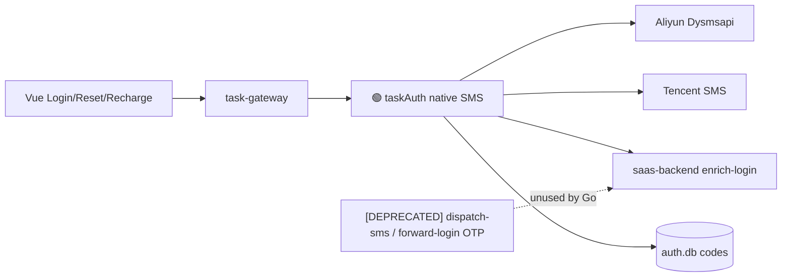

# Application Integration v31 — OTP/SMS 全切 Go

## Plateau / Gap

- **Plateau v29/v30**: 基线服务拓扑
- **Gap closed**: 云短信经 Django 桥；OTP 登录经 forward-login；重置手机码发/验分裂
- **Plateau v31 🎯 target**: taskAuth 原生 SMS；重置手机码本地；phone+code → enrich-login
